# 

## Hack and Hike 2026

Hack & Hike is firmware for the **M5Stack CoreS3 Lite**.

It is written in Rust and runs on the ESP32-S3.

This README is written for people who are still learning Rust. You do not need to know every Rust feature before you start.

The main idea is simple:

> **One application owns the parts of the device that it needs.**

Those parts are called **capabilities**.

Every application is one binary in `src/bin/`. The repository contains three applications that you can build and study:

| Binary | Application | Purpose |
| --- | --- | --- |
| `demo` | Demo | Full Hack & Hike demo with all screens |
| `imu_color` | IMU Color | Small display + IMU example |
| `color_ping` | Color Ping | Display + touch + network + speaker example |

---

## Table of contents

- [Build an application](#build-an-application)
- [Run the tests](#run-the-tests)
- [The architecture in one picture](#the-architecture-in-one-picture)
- [Project folders](#project-folders)
- [Applications and capabilities](#applications-and-capabilities)
- [How startup works](#how-startup-works)
- [CPU0 and CPU1](#cpu0-and-cpu1)
- [Everything is always initialized](#everything-is-always-initialized)
- [The Rust ideas you need](#the-rust-ideas-you-need)
- [How drawing works](#how-drawing-works)
- [Application 1: Demo](#application-1-demo)
- [Application 2: IMU Color](#application-2-imu-color)
- [Application 3: Color Ping](#application-3-color-ping)
- [Create your own application](#create-your-own-application)
- [Add more screens](#add-more-screens)
- [Use background tasks](#use-background-tasks)
- [Memory and large buffers](#memory-and-large-buffers)
- [Common mistakes](#common-mistakes)
- [Where should my code go?](#where-should-my-code-go)
- [Suggested reading order](#suggested-reading-order)
- [Small glossary](#small-glossary)

---

## Build an application

Build one application by naming its binary:

```bash
cargo build --release --bin imu_color
```

```bash
cargo build --release --bin color_ping
```

```bash
cargo build --release --bin demo
```

Without `--bin`, `cargo build --release` builds all of them.

---

## Run the tests

The hardware-independent logic (IMU math, the network protocol and peer table) lives in its own crate, `crates/core`, and has ordinary Rust tests that run on your computer:

```bash
./scripts/test.sh
```

The script exists because the repository's Cargo configuration targets the ESP32-S3. It runs `cargo test` for that one crate with your computer's target instead. Anything you add to `crates/core` can be tested the same way; put unit tests next to the code and scenario tests in `crates/core/tests/`.

---

## The architecture in one picture

The firmware has two main layers:

1. **Capabilities** talk to hardware and provide focused Rust APIs.
2. **One application** decides what the device does.

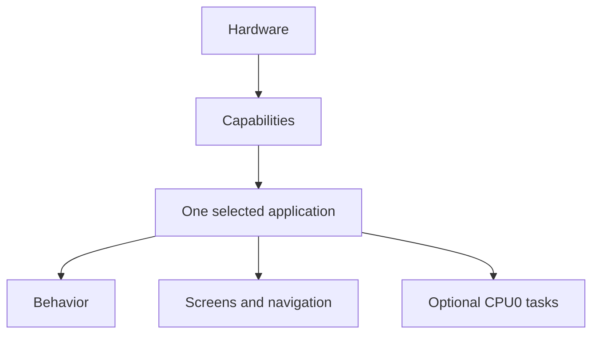

Examples:

- The IMU capability reads the motion sensors and gives the application measurements.
- The display capability owns the LCD and lets the application draw pixels.
- The touch capability reports touches.
- The network capability sends and receives typed application messages.
- The speaker capability accepts PCM audio samples.
- The camera capability gives the application camera frames.

The application should not need to know which I2C register contains a sensor value or which DMA channel is used by the display.

That low-level work stays inside capabilities.

---

## Project folders

The important part of the source tree looks like this:

```text
crates/
└── core/          hardware-independent logic with tests
src/
├── lib.rs
├── bin/
│   ├── demo/
│   ├── imu_color.rs
│   └── color_ping.rs
├── board/
├── capabilities/
│   ├── display/
│   ├── touch/
│   ├── imu/
│   ├── mic.rs
│   ├── speaker.rs
│   ├── network/
│   ├── camera/
│   └── audio/
├── platform/
├── support/
└── ui/
```

### `src/bin/`

This is where device behavior belongs.

An application decides:

- what the device does,
- what a touch means,
- which screen is active,
- when data is updated,
- when pixels are drawn,
- when messages are sent,
- when sounds are played,
- how several capabilities work together.

### `src/capabilities/`

This is where hardware-facing APIs live.

A capability hides low-level hardware work and gives the application useful values and operations.

### `src/board/`

This connects the real board hardware to capabilities.

`Board::init()` powers up the hardware, starts the CPU1 runtimes and returns one handle per capability.

You normally do **not** edit this folder when you make a new application.

### `src/platform/`

This contains facts about the physical CoreS3 Lite board, such as pins, reset lines, power rails, and shared I2C setup.

### `src/ui/`

This contains reusable drawing helpers.

Using it is optional. A small application can draw directly through the display capability.

### `src/support/`

This contains shared support code: logging with an on-device history, and PSRAM memory helpers.

---

## Applications and capabilities

An **application** gives the device its purpose.

A **capability** gives the application access to one hardware function.

The current capabilities are:

| Module | Rust handle | What the application gets |
| --- | --- | --- |
| `display` | `Display` | LCD drawing through bounded `Surface` values |
| `backlight` | `Backlight` | LCD brightness |
| `touch` | `Touch` | Touch points and press/release events |
| `imu` | `Imu` | Motion measurements and orientation |
| `audio` | `Microphone` | Stereo signed 16-bit PCM input |
| `audio` | `Speaker` | Stereo signed 16-bit PCM output |
| `network` | `Network` | ESP-NOW peers and typed messages |
| `camera` | `Camera` | RGB565 camera frames |

Application code should use these APIs instead of raw ESP HAL peripherals, DMA channels, GPIO numbers, or chip registers.

### Example: IMU

Application code can do this:

```rust
if let Some(sample) = imu.latest() {
    let roll = sample.orientation.roll_deg;
    let pitch = sample.orientation.pitch_deg;
    let yaw = sample.orientation.yaw_deg;
}
```

It does not need to know how the BMI270 or BMM150 are configured.

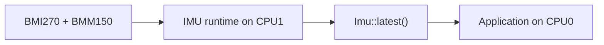

### Example: network

The application owns its own message type:

```rust
use serde::{Deserialize, Serialize};

#[derive(Clone, Copy, Serialize, Deserialize)]
struct Hello {
    number: u32,
}
```

Broadcast it:

```rust
let _ = network.broadcast(&Hello { number: 42 });
```

To reach one device instead, use `network.send_to(peer_id, &message)`.

Receive and decode it:

```rust
while let Some(message) = network.receive() {
    if let Ok(hello) = message.decode::<Hello>() {
        // Use hello.number here.
    }
}
```

The network capability moves the message. The application decides what `Hello` means.

---

## How startup works

Each application is a binary with its own `main`.

The important part is very small:

```rust
#[esp_rtos::main]
async fn main(_spawner: Spawner) -> ! {
    let Board { mut display, mut imu, .. } = Board::init();

    loop {
        // Your application.
    }
}
```

This means:

1. `Board::init()` starts the hardware and the CPU1 runtimes.
2. It returns one handle per capability.
3. Your application keeps the handles it needs and drops the rest.
4. Your loop runs forever.

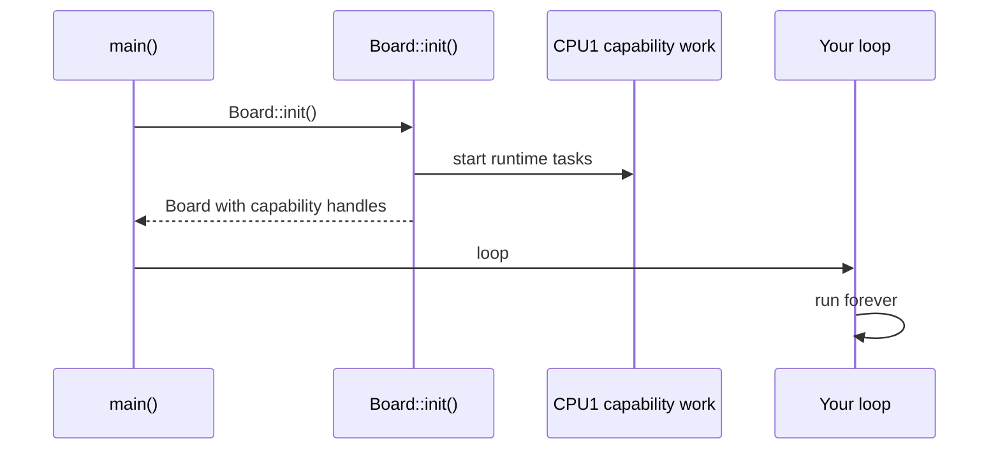

The application takes ownership of `Board` and moves out the handles it needs.

Example:

```rust
let Board {
    mut display,
    mut imu,
    ..
} = Board::init();
```

Now this application owns `display` and `imu`.

---

## CPU0 and CPU1

The ESP32-S3 has two CPU cores.

### CPU0

CPU0 runs the selected application.

This includes application logic, touch decisions, drawing, and optional application tasks.

### CPU1

CPU1 runs timing-sensitive capability work such as:

- IMU acquisition,
- touch polling,
- microphone and speaker audio work,
- ESP-NOW networking,
- display brightness I2C work,
- runtime monitoring.

The camera is special. Camera capture and presentation are coordinated on CPU0 so capture can move forward while display DMA is busy.

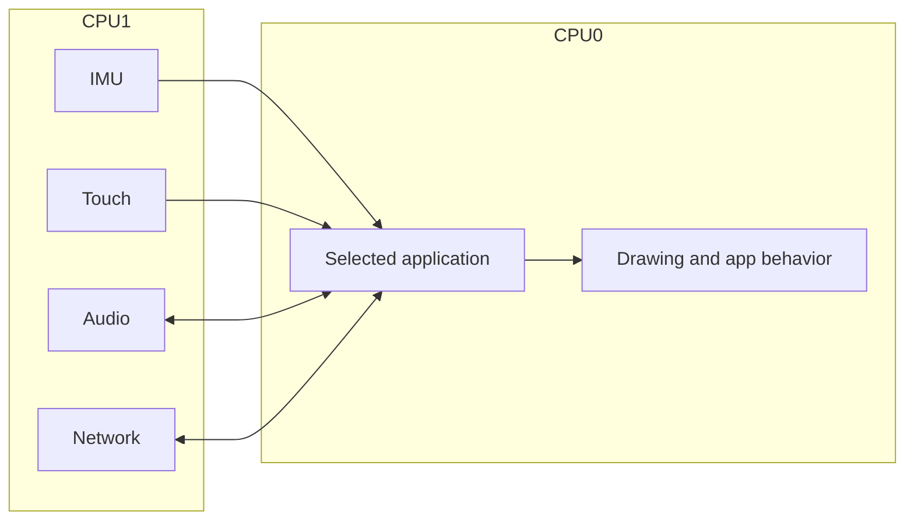

For normal hardware access, use the capability handle. Do not manage CPU1 yourself.

---

## Everything is always initialized

There are no Cargo features to choose. `Board::init()` always brings up the whole board: display, touch, IMU, microphone, speaker, network and camera.

An application simply takes the handles it wants:

```rust
let Board { mut display, mut imu, .. } = Board::init();
```

The `..` drops every other handle. The CPU1 runtimes behind them keep running; that costs nothing you will notice.

A headless application is one that does not take `display`.

---

## The Rust ideas you need

You can work on this project without being a Rust expert.

### Ownership

Rust values have an owner.

Hardware handles also have one clear owner.

```rust
let Board {
    mut display,
    mut imu,
    ..
} = Board::init();
```

After this line, the application owns `display` and `imu`.

### Moving a value

If you pass a handle into another struct, ownership moves with it.

```rust
let model = MyModel::new(network);
```

Now `model` owns `network`.

The old `network` variable cannot also be used.

### Borrowing with `&mut`

Sometimes code only needs temporary access.

```rust
let mut surface = display.surface(region);
```

The `Surface` temporarily borrows the display.

When the surface goes out of scope, the display can be used again.

### `Option<T>`

`Option<T>` means a value may or may not exist.

```rust
if let Some(sample) = imu.latest() {
    // A new sample exists.
}
```

If no new sample exists, `latest()` returns `None`.

### `async` and `.await`

Application `run` functions are async.

```rust
Timer::after(Duration::from_millis(10)).await;
```

An `.await` gives other CPU0 work a chance to run.

Do not create a forever loop that never reaches an `.await`.

### `-> !`

```rust
async fn run(...) -> !
```

The `!` means the function never returns. That is normal for the top-level firmware application.

### `pub(crate)`

`pub(crate)` means code can be used inside this firmware crate but is not exported as a public library API.

### `no_std`

This is embedded firmware, so `main.rs` uses:

```rust
#![no_std]
#![no_main]
```

You can still use normal Rust structs, enums, `Option`, iterators, modules, and async code.

---

## How drawing works

The display capability owns the physical LCD connection.

The application asks it for a rectangular `Surface`.

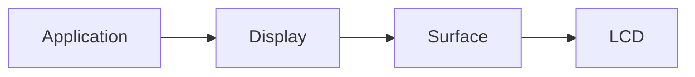

A full-screen region is:

```rust
let full_screen = Region::new(0, 0, WIDTH, HEIGHT);
```

Then draw one row at a time:

```rust
let mut surface = display.surface(full_screen);

surface.render_scanlines(|_y, pixels| {
    pixels.fill(0x001F); // blue RGB565
});
```

A surface cannot draw outside its region.

### Shared GUI helpers

Applications may use `GuiSurface` and the shared GUI helpers from `src/ui/`.

This is optional. Both small example applications draw directly through `Surface`.

---

# Application 1: Demo

Binary:

```text
demo
```

Source:

```text
src/bin/demo/
```

This is the full Hack & Hike demo.

It owns:

- display,
- touch,
- IMU,
- microphone,
- speaker,
- network,
- camera,
- backlight,
- log history,
- navigation,
- all demo screen state.

Its screens include Network, IMU, Microphone, Speaker, Camera, Settings, and Log.

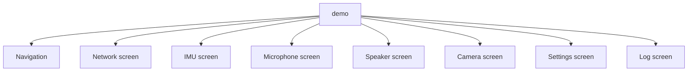

Build it:

```bash
cargo build --release --bin demo
```

This application is useful when you want to see how a larger application owns several views and combines many capabilities.

---

# Application 2: IMU Color

Binary:

```text
imu_color
```

Source:

```text
src/bin/imu_color.rs
```

This is the smallest real graphical example in the repository.

It uses only:

```text
display
imu
```

The application reads the newest IMU sample. It paints the display green while the IMU status is `Running` and red otherwise.

The important shape of the code is:

```rust
#[esp_rtos::main]
async fn main(_spawner: Spawner) -> ! {
    let Board {
        mut display,
        mut imu,
        ..
    } = Board::init();

    let full_screen = Region::new(0, 0, WIDTH, HEIGHT);
    let mut screen_color = 0x0000;

    loop {
        if let Some(sample) = imu.latest() {
            screen_color = if sample.status == Status::Running {
                0x07E0
            } else {
                0xF800
            };
        }

        {
            let mut surface = display.surface(full_screen);
            surface.render_scanlines(|_y, pixels| {
                pixels.fill(screen_color);
            });
        }

        Timer::after(Duration::from_millis(50)).await;
    }
}
```

Follow the data:

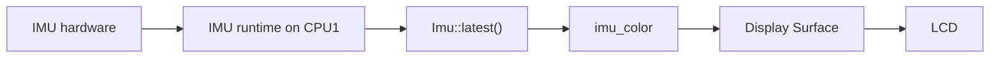

Build it:

```bash
cargo build --release --bin imu_color
```

Use this application as the first template for a new small application.

---

# Application 3: Color Ping

Binary:

```text
color_ping
```

Source:

```text
src/bin/color_ping.rs
```

This example combines:

- display,
- touch,
- network,
- speaker.

The screen is split into four color bands:

| Color | Tone |
| --- | ---: |
| Red | 800 Hz |
| Green | 1000 Hz |
| Blue | 1200 Hz |
| Yellow | 1400 Hz |

When you tap a color:

1. this device selects the color,
2. it broadcasts a typed `ColorPing` message,
3. another device receives the message,
4. the receiving device plays a **300 ms sine tone** for that color.

The sending device does not receive its own radio frame because the network runtime ignores messages from the local physical device.

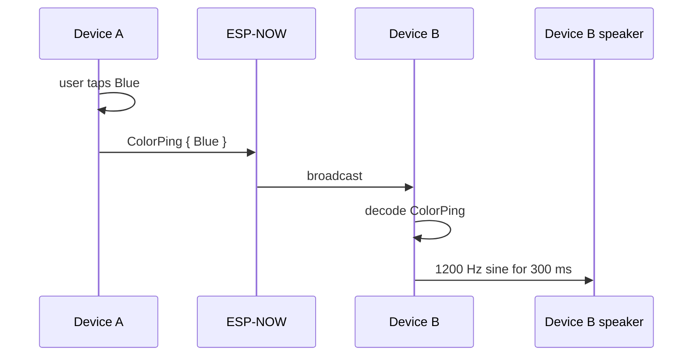

### The application owns the message meaning

Color Ping defines its own schema:

```rust
#[derive(Clone, Copy, Debug, Serialize, Deserialize)]
struct ColorPing {
    color: Color,
}
```

The network capability does not know about colors or pitches.

It only knows how to move typed application messages.

### Touch sends a ping

A press chooses one of four parts of the screen.

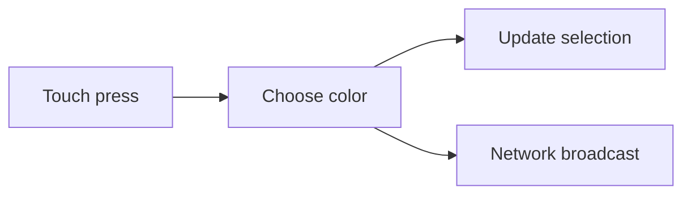

The broadcast call is:

```rust
network.broadcast(&ColorPing { color: selected })
```

### A received ping starts audio

The receiving side does:

```rust
while let Some(message) = network.receive() {
    if let Ok(ping) = message.decode::<ColorPing>() {
        tone.start(ping.color);
    }
}
```

`TonePlayer` maps the color to a frequency and generates 300 ms of stereo sine-wave PCM.

The speaker queue is nonblocking, so the application does not create one giant audio write. It generates and writes small chunks while the main loop continues to handle touch and network input.

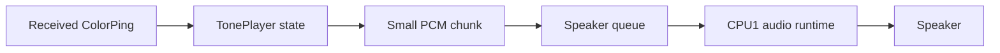

This is a useful embedded pattern:

> Keep long actions as state, then advance them a little on every loop.

Build Color Ping:

```bash
cargo build --release --bin color_ping
```

Flash the same build to at least two devices.

A simple test is:

1. Power both devices.
2. Wait for ESP-NOW discovery.
3. Tap Blue on Device A.
4. Device B should play 1200 Hz for about 300 ms.
5. Tap Yellow on Device B.
6. Device A should play 1400 Hz for about 300 ms.

---

# Create your own application

The easiest way to create an application is to copy `src/bin/imu_color.rs` or `src/bin/color_ping.rs`.

Assume you want a new application called **My Hack**.

## Step 1: create the file

Create `src/bin/my_hack.rs`:

```rust
#![no_std]
#![no_main]

use embassy_executor::Spawner;
use embassy_time::{Duration, Timer};
use hack_and_hike::Board;

esp_bootloader_esp_idf::esp_app_desc!();

#[esp_rtos::main]
async fn main(_spawner: Spawner) -> ! {
    let Board {
        mut display,
        mut touch,
        mut imu,
        ..
    } = Board::init();

    loop {
        // Read input.
        // Update your application state.
        // Draw when needed.

        Timer::after(Duration::from_millis(10)).await;
    }
}
```

The first lines are the same in every application: no standard library, no C-style `main`, an application descriptor for the bootloader, and an async `main` that never returns.

## Step 2: build it

```bash
cargo build --release --bin my_hack
```

That is all. Cargo finds every file in `src/bin/` by itself, and CI builds every binary.

If your application grows, turn it into a folder: `src/bin/my_hack/main.rs` plus sibling modules, like `src/bin/demo/`.

## Step 3: keep application behavior in the application

Good application code includes things such as:

- screen state,
- navigation,
- message types,
- color choices,
- game rules,
- timers,
- mapping sensor values to visuals,
- mapping messages to sounds.

Do not put these rules in hardware capabilities.

A useful test is:

> If the hardware capability could still make sense in a completely different product, the boundary is probably good.

---

## Add more screens

A screen is just application code.

You do not need a screen framework.

A simple application can use an enum:

```rust
enum View {
    Dashboard,
    Compass,
    Settings,
}
```

Store the active screen:

```rust
let mut view = View::Dashboard;
```

Render it with a `match`:

```rust
match view {
    View::Dashboard => render_dashboard(...),
    View::Compass => render_compass(...),
    View::Settings => render_settings(...),
}
```

Touch input can change the enum.

The touch capability does not know what a screen or button is.

---

## Use background tasks

An application can spawn extra CPU0 tasks if that makes the code clearer.

But start with one loop.

Color Ping is intentionally one loop. Touch, networking, audio generation, and drawing can all move forward in small steps without blocking.

A separate task is useful when some behavior has a truly independent loop.

### CPU0 tasks are cooperative

CPU0 async work gets a chance to switch at `.await` points.

Good:

```rust
loop {
    update_some_state();
    Timer::after(Duration::from_millis(10)).await;
}
```

Bad:

```rust
loop {
    expensive_work();
}
```

The second loop never yields.

### Keep display ownership simple

Do not put `Display` behind a global mutex so many tasks can draw whenever they want.

A simpler model is:

1. one application path owns `Display`,
2. other work changes application state,
3. the render path reads that state,
4. the render path borrows a `Surface` and draws.

---

## Memory and large buffers

Embedded devices have much less internal RAM than desktop computers.

The CoreS3 Lite also has PSRAM. This project uses it for large long-lived data such as:

- GUI framebuffers,
- camera frame buffers,
- microphone history,
- demo log history.

### Avoid huge local arrays

A full 320×240 RGB565 image is about 150 KiB.

Do not put that on a normal task stack:

```rust
let frame = [0u8; 320 * 240 * 2];
```

Use existing PSRAM patterns when you need large storage.

Small fixed arrays are fine. Color Ping uses a small 128-frame audio chunk.

---

## Camera path

The camera path is performance-sensitive.

The GC0308 produces QVGA RGB565 frames.

The firmware keeps two PSRAM camera frame buffers.

While one frame is shown, capture of the next frame can move forward during LCD DMA wait time.

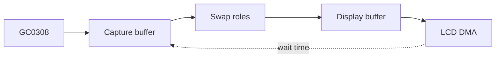

If you make a camera application, reuse the existing `Camera`, `Frame`, and `Surface` APIs before adding another full frame copy.

---

## Common mistakes

### Putting application behavior in a capability

Avoid files such as:

```text
capabilities/network/color_ping.rs
capabilities/speaker/color_to_pitch.rs
```

Those rules describe an application, not generic hardware access.

### Accessing HAL hardware from an application

If your application imports raw ESP HAL peripherals, DMA channels, or board register code, check the design first.

Usually a capability should provide the operation you need.

### Adding a framework too early

You do not need an `Application` trait because several applications have a `run` function.

You do not need a generic `View` trait because several screens can draw.

Prefer normal structs, enums, functions, and `match` until real duplication proves a shared abstraction is useful.

### Never yielding in an async loop

A CPU0 loop that never reaches `.await` can stop other CPU0 tasks from running.

### Sharing one hardware handle everywhere

Start with one clear owner.

If several parts of your application need the same information, share application state where possible instead of sharing the hardware handle itself.

### Putting large data on the stack

Keep large framebuffers and histories out of local task-stack variables.

---

## Where should my code go?

| I want to... | Put it in... |
| --- | --- |
| Create a new device experience | `src/bin/my_app.rs` |
| Change the full demo | `src/bin/demo/` |
| Add a demo screen | `src/bin/demo/screens/` |
| Change demo navigation | `src/bin/demo/navigation.rs` |
| Add a reusable drawing helper | `src/ui/` |
| Expose a new useful hardware operation | matching `src/capabilities/.../` module |
| Change sensor register setup | matching capability |
| Change board pins or power wiring | `src/platform/` |
| Change capability startup wiring | `src/board/` |
| Add logging or memory support | `src/support/` |

A useful rule is:

> If the code describes **what the device should do**, it probably belongs in an application.
>
> If the code describes **how a hardware function works**, it probably belongs in a capability.

---

## Suggested reading order

If this is your first time in the repository, do not start with low-level drivers.

Read in this order:

1. `src/bin/imu_color.rs`
2. `src/bin/color_ping.rs`
3. `src/lib.rs`
4. `src/bin/demo/main.rs`
5. one capability API such as `src/capabilities/imu/mod.rs`
6. `src/capabilities/display/mod.rs`
7. `src/board/mod.rs`
8. low-level drivers only when you need them

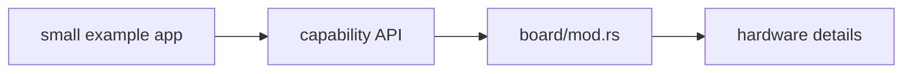

---

## Small glossary

### Application

The top-level firmware behavior selected for a build.

Examples: Demo, IMU Color, Color Ping.

### Capability

A focused hardware/runtime API used by an application.

Examples: `Imu`, `Display`, `Network`, `Speaker`.

### Handle

A Rust value that gives an application access to a capability.

### View / screen

One visual part of an application.

### Ownership

The Rust rule that a value has one owner at a time.

### Borrow

Temporary access to a value without taking ownership.

### `Option<T>`

A value that may be `Some(value)` or `None`.

### Async task

Code that can pause at `.await` so other work can run.

### CPU0

The CPU core that runs the selected application and presentation work.

### CPU1

The CPU core used for timing-sensitive capability runtime work such as sensors, touch, audio, and networking.

### PSRAM

External RAM used for large data such as framebuffers and histories.

### RGB565

The 16-bit pixel format used by the display and camera.

---

## Design rules to keep in mind

1. **One application owns the firmware behavior.**
2. **Applications own the capability handles they use.**
3. **Capabilities hide hardware details.**
4. **Screens and navigation belong to the application.**
5. **Application message schemas belong to the application.**
6. **Shared UI code should stay reusable.**
7. **Application code should not touch HAL peripherals directly.**
8. **Keep ownership clear instead of adding global shared objects.**
9. **Yield regularly in CPU0 async loops.**
10. **Keep large buffers off the stack.**
11. **Prefer simple Rust over a framework until a framework is truly needed.**

When you are unsure where code belongs, ask two questions:

> **What should this device do?** → application
>
> **How do I use this hardware safely?** → capability

Keeping those two questions separate is the core of the architecture.
