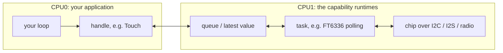
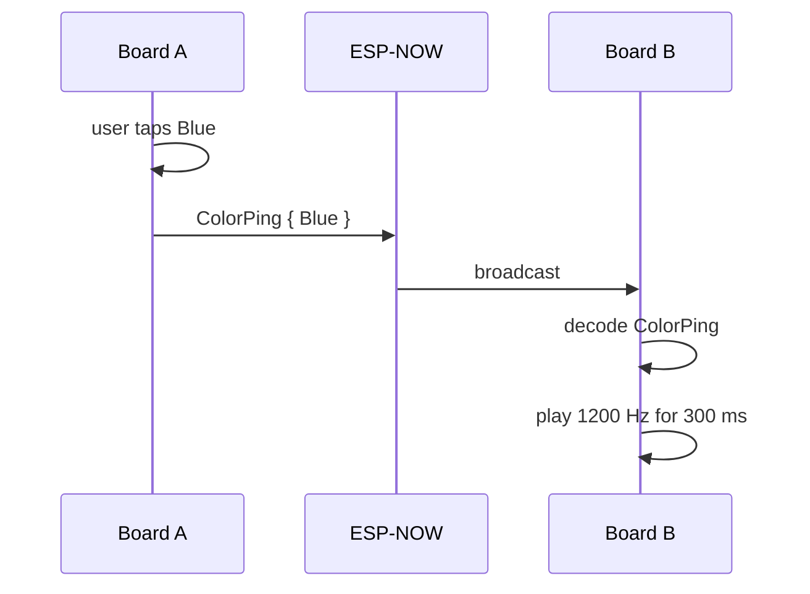

# 

## Hack and Hike 2026

Firmware for the **M5Stack CoreS3 Lite**, written in Rust for the ESP32-S3.

This repository is the starting point for a weekend of hacking. This guide
is for experienced programmers who are new to Rust. Everything you need is
here. You do not need to understand the hardware drivers to build an
application that works.

The main idea:

> **Your application is one file. It takes the hardware it needs and runs a loop.**

The hardware comes as **capabilities**. A capability is a small Rust API for
one function of the board. You use it through a **handle**: a value that
gives your code access to that piece of hardware.

| Capability | Handle | What you get |
| --- | --- | --- |
| Display | `Display` | Draw into a rectangle of the 320x240 screen |
| Backlight | `Backlight` | Set the screen brightness |
| Touch | `Touch` | Press, move and release events with a position |
| IMU (inertial measurement unit: motion and compass sensors) | `Imu` | Roll, pitch, compass heading, acceleration, rotation |
| Microphone | `Microphone` | 16 kHz stereo audio blocks |
| Speaker | `Speaker` | Play 16 kHz stereo audio |
| Network | `Network` | Send your own message types to nearby boards over ESP-NOW (Espressif's protocol for short Wi-Fi messages between boards, without a router) |
| Camera | `Camera` | 320x240 frames in RGB565 (16-bit colour) |
| Light | `Light` | Ambient light in lux |
| Proximity | `Proximity` | How close something is to the front, in percent |
| Log | `LogHistory` | The newest lines your code logged, to show on the screen |

## Contents

- [Setup](#setup)
- [Build](#build)
- [Run the tests](#run-the-tests)
- [The board](#the-board)
- [Your first application](#your-first-application)
- [Create your own application](#create-your-own-application)
- [When your application panics](#when-your-application-panics)
- [How the hardware reaches your loop](#how-the-hardware-reaches-your-loop)
- [The capabilities](#the-capabilities)
- [The built-in applications](#the-built-in-applications)
- [The Rust you will meet](#the-rust-you-will-meet)
- [Ideas for the weekend](#ideas-for-the-weekend)
- [Project folders](#project-folders)
- [Where does my code go?](#where-does-my-code-go)
- [Reading order](#reading-order)
- [Going deeper](#going-deeper)

## Setup

You work inside a development container (Dev Container). The container has
the Rust toolchain for the ESP32-S3 and all other tools. You do not install
them on your computer.

To install all necessary tools for running Dev Containers using the [Rust Dev Environment Setup](https://dev.azure.com/erniegh/ERNI-Rust-Techstack/_git/erni-rust-local-dev-setup).

After installing:

1. Open the repository folder in VS Code.
2. Choose **Reopen in Container** when VS Code asks. You can also run the
   command **Dev Containers: Reopen in Container**.
3. Wait. The first time, VS Code builds the container and downloads all
   dependencies. This takes a while. Later starts are much faster.

## Build

Every application is a binary in `src/bin/`. Build one by name:

```bash
cargo build --release --bin imu_color
```

```bash
cargo build --release --bin color_ping
```

```bash
cargo build --release --bin demo
```

Without `--bin`, `cargo build --release` builds all of them. The first build
takes a few minutes. Later builds take seconds.

To put an application on the board:

1. Build its firmware image. Run this in the repository root; it writes the
   file `firmware.bin` there.

   ```bash
   cargo dist --bin imu_color
   ```

2. Start [autoflash](autoflash/README.md) in a second terminal:

   ```bash
   cd autoflash && cargo run --release
   ```

3. Open <http://localhost:8080> in Chrome or Edge.
4. Connect the board to your computer with a USB cable.
5. Click **Authorize device** and select the board.
6. Click **Choose a .bin file** and select `firmware.bin` in the repository
   folder on your computer. The browser runs on your computer, not in the
   container, but the container shares this folder with your computer.

Autoflash now watches `firmware.bin`. Every time `cargo dist` writes a new
file, autoflash flashes the board again. The board's serial log appears in
the browser.

The library's documentation lists every capability and its methods. To see
it, run:

```bash
./scripts/doc.sh
```

This builds the documentation and serves it at
<http://localhost:8000/hack_and_hike/>. VS Code forwards the port from the
container to your computer, so open that link in your browser. Stop the
server with Ctrl+C.

This shows the public API: the items an application calls. Every private
struct, field and function also has a doc comment. These comments explain
how the firmware works inside. To include them, run:

```bash
./scripts/doc.sh --document-private-items
```

In the editor, move the mouse over any name to read the same comments.

## Run the tests

The crate `crates/core` holds the logic that does not need the hardware:

- the IMU math: sensor fusion and compass calibration
- the network protocol, message types and peer table
- the speaker's ring buffer and an ADPCM (compressed audio) decoder
- the log history
- the light sensor's data decoding, lux formula and proximity scale
- the decoding of the touch controller's report

This code has ordinary Rust tests that run on your computer:

```bash
./scripts/test.sh
```

The repository's Cargo configuration builds for the ESP32-S3, so a plain
`cargo test` does not work. The script runs `cargo test` for that crate with
your computer's target instead.

- Unit tests are next to the code, in a `#[cfg(test)] mod tests` block. See
  `crates/core/src/network/protocol.rs` for an example.
- Tests that combine several modules are files in `crates/core/tests/`.

## The board

```text
                 top edge: camera, +x of the IMU
        ┌──────────────────────────────────────────┐    ▲
        │ (0,0)                             (319,0)│    │
        │                                          │    │
        │                                          │    │
        │                                          │    │
        │                                          │    │
        │         320 x 240 pixels                 │    │
        │         touch = display coordinates      │    │ 240 px
        │                                          │    │
        │                                          │    │
        │                                          │    │
        │                                          │    |
        │ (0,239)                         (319,239)│    |
        └──────────────────────────────────────────┘    ▼
          speaker              microphones (L, R)

        ◀––––––––––––––––––––––––––––––––––––––––––▶
                            320 px
```

- **Screen and touch** use the same coordinates: `Point::new(x, y)`. The
  origin is the top-left corner, `x` grows to the right and `y` grows down.
- **Colours** are `Rgb565`: 16 bits per pixel, 5 for red, 6 for green, 5 for
  blue. `hack_and_hike::ui::theme` has the project colours. After
  `use embedded_graphics::prelude::*;` you can also use `Rgb565::RED`,
  `Rgb565::new(r, g, b)` and the other built-in colours.
- **The IMU** reports how the board is held, in the *screen frame*:
  - `x` points out of the top edge (where the camera looks).
  - `y` points to the right across the screen.
  - `z` points into the screen.
  - When the board lies flat on a table, screen up, roll and pitch are 0.
  - Roll is positive when the right side is lower.
  - Pitch is positive when the top edge is raised.
  - The heading is the direction of the top edge, in degrees clockwise from
    magnetic north.
- **The light sensor** faces the same way as the screen, behind the tinted
  front glass. It reports the ambient light in lux. Because of the glass,
  the values are lower than a light meter shows, so compare values with
  each other instead of trusting the exact number. Typical values: near 0
  in a dark room, tens to a few hundred in a lit room, thousands with a
  flashlight pointed at the board.
- **The proximity sensor** is in the same chip. It sends out infrared light
  from an LED and measures how much comes back. The result is a percentage
  that grows evenly as the distance gets smaller: 0 when nothing is within
  about 20 cm of the front, 50 at about 10 cm, 100 at the glass.
- **Audio** is signed 16-bit stereo at 16 kHz. The samples are interleaved:
  left, right, left, right, ...
- **Every board in the room** uses the same radio channel. Each message
  carries a number made from the name of its type (a 32-bit hash). Your
  application decodes only the messages with its own type names.

## Your first application

`src/bin/imu_color.rs` shows the progress of the compass calibration. The
percentage is in the middle of the screen, and the colour shows the stage:

| Progress | Colour |
| --- | --- |
| below 50 % | red |
| from 50 % | orange |
| from 75 % | yellow |
| 100 %, done | green |

Turn the board slowly in every direction and watch the screen change. The
percentage can also go down: when a calibration attempt fails, part of the
work starts again. When the calibration makes no progress for about two
minutes, it starts over at 0 %.

This is the whole file:

```rust
//! The smallest application: the screen shows how far the compass calibration
//! has come, as a colour and a percentage. Red at the start, orange from
//! 50 %, yellow from 75 % and green once the compass is calibrated. Turn the
//! board slowly in every direction.

#![no_std]
#![no_main]

use core::fmt::Write as _;

use arrayvec::ArrayString;
use embassy_executor::Spawner;
use embassy_time::{Duration, Timer};
use embedded_graphics::{pixelcolor::Rgb565, prelude::*};
use hack_and_hike::{
    Board,
    capabilities::display::{SCREEN, SIZE},
    ui::{Canvas, common, theme},
};

// Writes the application descriptor the bootloader checks before starting
// the firmware. Every application needs this line exactly once.
esp_bootloader_esp_idf::esp_app_desc!();

/// The entry point: wait for IMU samples and redraw when the percentage
/// changes.
#[esp_rtos::main]
async fn main(_spawner: Spawner) -> ! {
    let Board {
        mut display,
        mut imu,
        ..
    } = Board::init();
    let mut canvas = Canvas::new(SIZE);
    let mut shown = None;

    loop {
        if let Some(sample) = imu.latest() {
            let percent = sample.mag_calibration_percent;
            if shown != Some(percent) {
                shown = Some(percent);
                draw(&mut canvas, percent);
                canvas.show(&mut display.surface(SCREEN));
            }
        }

        Timer::after(Duration::from_millis(10)).await;
    }
}

/// Paint the whole picture for `percent` onto the canvas. The canvas works
/// out what changed when it is shown.
fn draw(canvas: &mut Canvas, percent: u8) {
    let (background, text) = colors(percent);
    canvas.clear(background);

    let mut label = ArrayString::<8>::new();
    write!(label, "{percent} %").expect("the label fits its buffer");
    common::centered_text(
        canvas,
        canvas.bounding_box(),
        &label,
        common::TITLE_FONT,
        text,
    );
}

/// One fixed background per stage of the calibration, with a text colour
/// that reads well on it.
fn colors(percent: u8) -> (Rgb565, Rgb565) {
    match percent {
        0..50 => (Rgb565::RED, theme::WHITE),
        50..75 => (Rgb565::new(31, 32, 0), theme::WHITE), // orange
        75..100 => (Rgb565::YELLOW, theme::CHARCOAL),
        _ => (Rgb565::GREEN, theme::CHARCOAL),
    }
}
```

Line by line:

- `#![no_std]` and `#![no_main]`: this is firmware. There is no operating
  system and no standard `main` function. You still have structs, enums,
  `Option`, iterators, closures and modules.
- `esp_app_desc!()` writes a small descriptor that the bootloader expects.
  Every application has this line.
- `#[esp_rtos::main] async fn main(...) -> !` is an async entry point. The
  return type `!` means that the function never returns. The board runs
  your loop forever.
- `Board::init()` starts the whole board and returns one handle per
  capability. The pattern `let Board { mut display, mut imu, .. } = ...`
  keeps the two handles that this application needs and drops the rest.
  Dropping a handle is safe: the sensors keep running on the second CPU core.
- `Canvas::new(SIZE)` creates an image in memory, the size of the screen, to
  draw into. Create it once, before the loop, because its memory is never
  freed.
- `imu.latest()` returns `Some(sample)` when a new sample arrived since the
  last call, and `None` otherwise. It never waits.
- The application redraws the screen only when the percentage changed. The
  IMU publishes about 100 samples per second. Drawing for every sample would
  keep the display busy without a reason.
- `draw` fills the canvas with the colour of the stage and writes the
  percentage in the middle. The text goes into a fixed-size buffer,
  `ArrayString`, because `no_std` code has no `String` by default.
- `canvas.show(...)` sends only the pixels that changed. When the colour
  changed, that is the whole screen. Otherwise it is only the rows of the
  number.
- `Timer::after(...).await` pauses this loop and lets other work on this core
  run. Every loop needs an `.await` somewhere.
- `colors` is a plain function. It uses `match` on ranges of numbers and
  returns a tuple. Rust checks that the ranges cover every value of
  `percent`.

## Create your own application

Copy `src/bin/template.rs` to a new file, for example `src/bin/my_hack.rs`.
The copy builds and runs without changes: a light blue spot follows your
finger on a dark blue screen. Every application has a loop with the same
three steps:

```rust
loop {
    // 1. Read input.
    while let Some(event) = touch.next_event() {
        finger = match event {
            TouchEvent::Pressed(point) | TouchEvent::Moved(point) => Some(point),
            TouchEvent::Released(_) => None,
        };
    }

    // 2. Update your state and draw, but only when something changed.
    if finger != shown {
        shown = finger;
        canvas.clear(theme::DARK_BLUE);
        if let Some(point) = finger {
            let Ok(()) = Circle::with_center(point, SPOT_DIAMETER)
                .into_styled(PrimitiveStyle::with_fill(theme::LIGHT_BLUE))
                .draw(&mut canvas);
        }
        canvas.show(&mut display.surface(SCREEN));
    }

    // 3. Let the rest of the system run. Every loop needs an `.await`.
    Timer::after(Duration::from_millis(10)).await;
}
```

Build it:

```bash
cargo build --release --bin my_hack
```

You do not need to register the file anywhere. Cargo finds every file in
`src/bin/` by itself, and CI (the automatic build on GitHub) builds every
binary. To put it on the board, use `cargo dist --bin my_hack` as described
in [Build](#build).

When the application grows, turn it into a folder: `src/bin/my_hack/main.rs`
plus more modules next to it, like `src/bin/demo/`.

Keep the rules of your application in your application: what a touch means,
what a message means, which colour is which. The capabilities stay general.

## When your application panics

A panic stops the program. Examples of a panic are an `unwrap()` on `None`,
an index past the end of an array, or a `panic!`. The serial log then shows:

- the panic message
- the file and line of the panic
- a backtrace: the chain of function calls that led to the panic, as bare
  memory addresses

```text
====================== PANIC ======================
panicked at src/bin/panic_backtrace.rs:89:5:
index out of bounds: the len is 3 but the index is 3

Backtrace:

0x4209d358
0x4205f584
...
```

The firmware on the board has no debug information, so it cannot turn those
addresses into names. The build in the container has this information, in
the ELF file (the compiled program with debug information) in Cargo's target
folder. Autoflash uses that file: its serial log prints the function, file
and line of each address below the backtrace.

For a log from another place, copy the panic output and run:

```bash
./scripts/backtrace.sh panic_backtrace
```

Paste the output and press Ctrl+D. The script prints the function, file and
line of each address. It also shows the functions that the compiler inlined
(copied into their caller). The example below is shortened: the real output
has absolute paths and more frames below your code.

```text
0x4205f584: panic_backtrace::band_name at src/bin/panic_backtrace.rs:89
 (inlined by) panic_backtrace::on_tap at src/bin/panic_backtrace.rs:78
 (inlined by) ...main_task... at src/bin/panic_backtrace.rs:67
```

Give the script the name of the application that you flashed. Decode the
backtrace before you build that application again: a new build moves the
addresses, and the result is then wrong.

To try this, flash the `panic_backtrace` application and tap its red band.
It panics on purpose.

## How the hardware reaches your loop

Tasks on the second CPU core (CPU1) read from and write to the chips. Your
loop runs on the first core (CPU0). It talks to those tasks through a
handle. A handle reads or writes a queue, or a slot that holds the latest
value. No handle method waits for the hardware.



In the diagram, FT6336 is the touch controller chip. I2C is a two-wire bus
for sensor chips. I2S is a bus for audio samples.

There are two exceptions. They run on your own core and can wait:

- **Drawing** waits until the SPI DMA transfer is finished. (SPI is the bus
  to the display. DMA, direct memory access, sends the pixels without the
  CPU.) The whole screen takes about 31 ms.
- **A camera frame** waits for the sensor, unless the next frame is already
  complete.

This is why the applications draw only when something changed.

## The capabilities

Below is one code example for each capability, with the `use` lines it
needs. The handles come from `Board::init()`.

**Display.** `display.surface(area)` gives you a `Surface`: a rectangle of
the panel to draw into. `SCREEN` is the whole panel. `surface` panics when
the rectangle does not fit on the panel. An empty rectangle on the right or
bottom edge is allowed and draws nothing.

The simplest way to draw is row by row. `row` is a slice of `Rgb565` pixels,
as wide as the surface.

```rust
use embedded_graphics::{pixelcolor::Rgb565, prelude::*};
use hack_and_hike::capabilities::display::{HEIGHT, SCREEN};

display.surface(SCREEN).render_scanlines(|y, row| {
    row.fill(if y < HEIGHT / 2 { Rgb565::BLUE } else { Rgb565::WHITE });
});
```

For text and shapes, draw into a `Canvas` and then show it. A canvas is an
image in memory. Every `embedded-graphics` shape and text style can draw on
it. Create the canvas once, outside the loop.

The canvas remembers what the panel shows, and `show` sends only the pixels
that are different. So you can clear and redraw your whole picture every
time something changes. A changed number still takes only about a
millisecond to show. A full screen takes about 31 ms.

```rust
use embedded_graphics::{
    prelude::*,
    primitives::{Circle, PrimitiveStyle},
};
use hack_and_hike::{
    capabilities::display::{SCREEN, SIZE},
    ui::{Canvas, common, theme},
};

let mut canvas = Canvas::new(SIZE);

canvas.clear(theme::WHITE);
common::text(&mut canvas, "HELLO", Point::new(10, 10), common::TITLE_FONT, theme::DARK_BLUE);
let Ok(()) = Circle::with_center(Point::new(160, 140), 60)
    .into_styled(PrimitiveStyle::with_fill(theme::LIGHT_BLUE))
    .draw(&mut canvas);
canvas.show(&mut display.surface(SCREEN));
```

**Touch.** Events wait in a queue until you read them, in the order they
happened. Only the first finger is reported. Read all waiting events on
every loop iteration, with `while let`.

The queue holds 32 events. When it is nearly full, new events are dropped:

- Moves are dropped first. A slow application then sees jumps in a drag.
- A press is dropped when there is no room for its release behind it. So
  you never get a press without its release.

```rust
use hack_and_hike::capabilities::touch::TouchEvent;

while let Some(event) = touch.next_event() {
    match event {
        TouchEvent::Pressed(point) => log::info!("finger down at {},{}", point.x, point.y),
        TouchEvent::Moved(point) => log::info!("finger at {},{}", point.x, point.y),
        TouchEvent::Released(point) => log::info!("finger up at {},{}", point.x, point.y),
    }
}
```

**IMU.** `imu.latest()` returns the newest sample. New samples come about
100 times per second.

```rust
use hack_and_hike::capabilities::imu::MagStatus;

if let Some(sample) = imu.latest() {
    let roll = sample.attitude.roll_deg;
    let pitch = sample.attitude.pitch_deg;
    let heading = sample.attitude.heading_deg;
    let heading_is_trustworthy = sample.mag_status == MagStatus::Ready;
}
```

The heading is correct only after the compass calibration is done, when
`mag_status` is `MagStatus::Ready`.

**Microphone.** Audio comes in blocks of 32 ms of interleaved stereo samples.
Up to 8 blocks (about 256 ms) wait in a queue. When your application reads
too slowly, the oldest block is dropped, and `info.dropped_blocks` counts it.

```rust
use hack_and_hike::capabilities::audio;

let mut block = [0i16; audio::SAMPLES_PER_BLOCK];
if let Some(info) = microphone.next_block(&mut block) {
    let loudest_left = info.peak_left;
}
```

**Speaker.** The speaker queue holds about 64 ms of audio. Add a little
audio to the queue on every loop iteration. When the queue is empty, the
board plays silence. `SineWave` makes tones.

```rust
use hack_and_hike::{capabilities::audio, synth::SineWave};

let mut tone = SineWave::new(880.0);

let mut chunk = [0i16; 128 * audio::CHANNELS];
let frames = speaker.available_frames().min(128);
for frame in chunk[..frames * audio::CHANNELS].chunks_exact_mut(audio::CHANNELS) {
    frame.fill(tone.next_sample(0.2));
}
speaker.write(&chunk[..frames * audio::CHANNELS]);
```

**Network.** Define your own message type. Give it a name that is unique to
your application. Every board in the room receives every message, but only
messages with that name decode as `Hello`.

```rust
use hack_and_hike::capabilities::network::Message;
use serde::{Deserialize, Serialize};

#[derive(Serialize, Deserialize)]
struct Hello {
    number: u32,
}

impl Message for Hello {
    const NAME: &'static str = "team-otters.hello";
}

if let Err(error) = network.broadcast(&Hello { number: 42 }) {
    log::warn!("not sent: {error}");
}

while let Some(message) = network.next_message() {
    if let Ok(hello) = message.decode::<Hello>() {
        let reply = Hello { number: hello.number + 1 };
        if let Err(error) = network.send_to(message.sender, &reply) {
            log::warn!("reply not sent: {error}");
        }
    }
}
```

Limits of the network:

- A message is at most 224 bytes (`MAX_PAYLOAD`) after encoding. A larger
  one returns `SendError::MessageTooLarge`.
- Delivery is not guaranteed. Send important messages again, or send the
  current state instead of changes.
- `broadcast` and `send_to` return `SendError::QueueFull` when you send
  faster than the radio. Try again on the next loop iteration.
- `send_to` works only for a board in the peer table; otherwise it returns
  `SendError::UnknownPeer`. The table holds up to 10 peers (`MAX_PEERS`).
  Broadcasts reach every board.

**Camera.** `camera` is an `Option`. It is `None` when no camera answered at
boot. You can draw a frame directly on a surface.

```rust
use hack_and_hike::capabilities::display::SCREEN;

if let Some(camera) = camera.as_mut()
    && let Some(mut frame) = camera.begin_frame()
{
    display.surface(SCREEN).render_from(&mut frame);
    frame.finish();
}
```

The sensor sends data all the time. Its DMA buffer holds only a few
milliseconds of data, so something must copy the data out of it often:

- While a frame is drawn, the drawing code copies the data. A frame that
  completes during drawing waits in a spare buffer.
- Between `frame.finish()` and the next `begin_frame()`, nothing copies the
  data. Call `camera.pump()` once per loop iteration there. Do not sleep
  between frames while the camera is running.

Otherwise frames are dropped and a warning is logged.

**Light.** `light` is an `Option` too. `latest()` returns the newest sample,
or `None` when nothing new arrived since the last call. The sensor measures
ten times per second. After the sensor changes its gain (its sensitivity),
the light value is not valid for a few measurements, and no light sample
comes for them.

```rust
if let Some(light) = light.as_mut()
    && let Some(sample) = light.latest()
{
    let dark = sample.lux < 10.0;
}
```

The lux value is an estimate from the sensor's formula, measured behind the
front glass. Compare values with each other; do not trust the exact number.

**Proximity.** `proximity` is also an `Option`. One chip measures both light
and proximity, so `proximity` is `Some` exactly when `light` is `Some`.
`latest()` works the same way. A proximity sample comes every 100 ms, also
while the light value is not valid.

```rust
if let Some(proximity) = proximity.as_mut()
    && let Some(sample) = proximity.latest()
{
    let covered = sample.percent > 50;
}
```

`percent` grows evenly as the distance gets smaller: 0 when nothing is
within about 20 cm, 50 at about 10 cm, 100 at the glass. The sensor's own
count is in `raw`, from 0 to `Sample::RAW_MAX`. `raw` grows with the square
of the closeness, so most of its range is in the last few centimetres. This
is why `percent` exists.

**Backlight.** The brightness is a percentage from 1 to 100; there is no
"off". Use `Brightness::new` for numbers written in the code: it panics
outside 1 to 100. Use `Brightness::try_from(percent)` for a number computed
at run time: it returns an error instead.

```rust
use hack_and_hike::capabilities::backlight::Brightness;

backlight.set(Brightness::new(30));
```

**Log.** Use the `log` macros anywhere, on both cores. They print to the USB
serial port.

- Records at `debug` and `trace` level are filtered out.
- A record longer than 512 bytes is cut.
- `LogHistory` keeps the newest 64 records, each cut to 120 bytes, to show
  on the screen. The demo's Log screen uses it.

```rust
log::info!("button pressed at {}", point.x);
```

## The built-in applications

| Binary | Uses | What it shows |
| --- | --- | --- |
| `imu_color` | display, IMU | The smallest possible application (above) |
| `template` | display, touch | The file to copy: a spot follows your finger |
| `light_meter` | display, light, proximity | Lux and proximity as numbers and a bar; dark colours in the dark |
| `color_ping` | display, touch, network, speaker | One loop that combines four capabilities |
| `panic_backtrace` | display, touch | A deliberate panic, for [reading a backtrace](#when-your-application-panics) |
| `demo` | all capabilities | Several screens with navigation (see below) |

**Color Ping** shows four colour bands below a short text. When you tap a
band, the board broadcasts that colour. Every other board that receives it
plays a 300 ms tone, with a different pitch for each colour. A band lights
up while you hold it, and on the receiving board while its tone plays.
Flash it to two boards and tap.



Color Ping uses one loop on purpose. On every iteration, touch, network,
audio and drawing each do a small part of their work, and nothing blocks.
The whole application is one struct, `ColorPingApp`, that owns its handles
and its state. Copy this pattern when your program becomes too large for
`main`.

**Demo** is the largest application. It has Network, IMU, Microphone,
Speaker, Camera, Proximity (with ambient light), Settings (backlight)
and Log screens, and a navigation rail (a column of icons) to switch between
them. Every screen implements the same small `Screen` trait. To add a
screen, copy `src/bin/demo/screens/settings/`. It has a KDL layout file (a
text file that describes the labels and their positions), a slider, and one
capability handle.

## The Rust you will meet

**Ownership.** Every value has one owner. `let Board { mut display, .. } =
Board::init();` moves the display handle into your function. No other code
can use it. Each handle exists exactly once, so its owner is the only code
that can use that piece of hardware.

**Moving.** When you pass a handle into a struct, the handle moves. After
`SettingsScreen::new(backlight)`, you cannot use the `backlight` variable
any more. To call methods on a handle, keep it in a struct field and write
the methods on the struct, like `ColorPingApp` does.

**Borrowing.** `display.surface(SCREEN)` borrows the display until the
`Surface` goes out of scope. `canvas.show(&mut surface)` borrows the surface
for one call. The compiler checks that a mutable borrow never overlaps
another borrow of the same value.

**`Option<T>`.** A value that can be missing. `imu.latest()` is `None` when
nothing new arrived. `camera` is `None` when no camera answered at boot.
Use `if let Some(x) = ...` and `while let Some(x) = ...` to get the value
out.

**`Result<T, E>`.** `network.broadcast(&msg)` returns `Ok(())` or an error,
for example `SendError::QueueFull`. Handle it with `match` or
`if let Err(e)`. `main` never returns, so you cannot use `?` there.

Drawing onto a `Canvas` cannot fail. Its error type is `Infallible`, a type
with no values, and the compiler knows this. That is why
`let Ok(()) = shape.draw(&mut canvas);` compiles.

**`async` and `.await`.** `main` is async. At every `.await`, other tasks
can run. A loop that never reaches an `.await` blocks all other tasks on
its core.

**`no_std`.** There is no standard library. `String`, `Vec` and `println!`
are not available by default. The applications build text in a fixed-size
buffer instead: `let mut text = ArrayString::<48>::new(); write!(text,
"{} Hz", hz)`. Use the `log` macros instead of `println!`.

**Traits.** `impl Message for Hello { const NAME: &'static str = "..."; }`
tells the network what it needs to know about your type.
`derive(Serialize, Deserialize)` writes the byte encoding for you.

**Visibility.**

- `pub` items are the API that applications use.
- `pub(crate)` items are internal to the library.
- All other items are private to their module.

## Ideas for the weekend

| Idea | Capabilities |
| --- | --- |
| Tilt maze: a ball rolls when you tilt the board (roll and pitch) | display, IMU |
| Reaction game: the screens change colour, and the first board that is tapped wins | display, touch, network |
| Compass search: an arrow points to a heading, and a beep sounds when you face it | display, IMU, speaker |
| Morse messages: tap Morse code on one board and hear it on the others | touch, network, speaker |
| Clap counter: count claps with the microphone peak value | display, microphone |
| Photo booth: tap to freeze a camera frame | display, touch, camera |
| Night light: the brightness changes with how the board is held | backlight, IMU |
| Pocket mode: dim the screen when it is covered or the room is dark | proximity, light, backlight |
| Hand synthesizer: the pitch of a tone changes with how close your hand is | proximity, speaker |

## Project folders

```text
crates/core/        hardware-independent logic with tests
src/
├── lib.rs          the library every application uses
├── bin/            the applications: demo/, imu_color.rs, light_meter.rs, color_ping.rs, panic_backtrace.rs, template.rs
├── board/          the PCB: pins, power rails, I2C bus, PSRAM, Board::init() and CPU1
├── capabilities/   one module per capability: the APIs you call
├── logging.rs      logging with on-device history, memory usage report
├── synth.rs        sine waves and note frequencies for the speaker
└── ui/             canvas, palette, text helpers, slider, embedded-gui glue
```

## Where does my code go?

| I want to... | Put it in... |
| --- | --- |
| Build a new application | `src/bin/my_app.rs` |
| Add a screen to the demo | `src/bin/demo/screens/` |
| Change the demo's navigation rail | `src/bin/demo/navigation.rs` |
| Add a reusable drawing helper or widget | `src/ui/` |
| Expose a new hardware operation | the matching `src/capabilities/...` module |
| Change how a sensor is configured | the matching capability |
| Change pins, power or reset wiring | `src/board/` |
| Change the power-up order | `src/board/` |
| Add logic that should have tests | `crates/core/` |

A simple rule:

> If the code says **what the board should do**, it belongs in an application.
>
> If the code says **how a piece of hardware works**, it belongs in a capability.

## Reading order

1. `src/bin/imu_color.rs` and `src/bin/template.rs`
2. `src/bin/color_ping.rs`
3. `src/lib.rs` and `src/board/mod.rs`
4. `src/bin/demo/main.rs`, then `src/bin/demo/screens/settings/`
5. one capability API, for example `src/capabilities/imu/mod.rs`
6. `src/capabilities/display/mod.rs` and `src/ui/canvas.rs`
7. the drivers and `crates/core`, only when you need them

## Going deeper

[docs/architecture.md](docs/architecture.md) explains how the firmware is
built:

- what happens in `Board::init()`
- what runs on which CPU core
- how drawing and the demo's screens work
- memory and PSRAM (the external memory chip next to the ESP32-S3)
- the camera path
- the network protocol
- common mistakes, a glossary, and the design rules behind the structure
