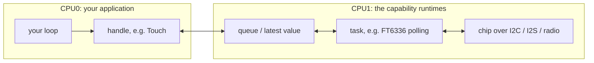
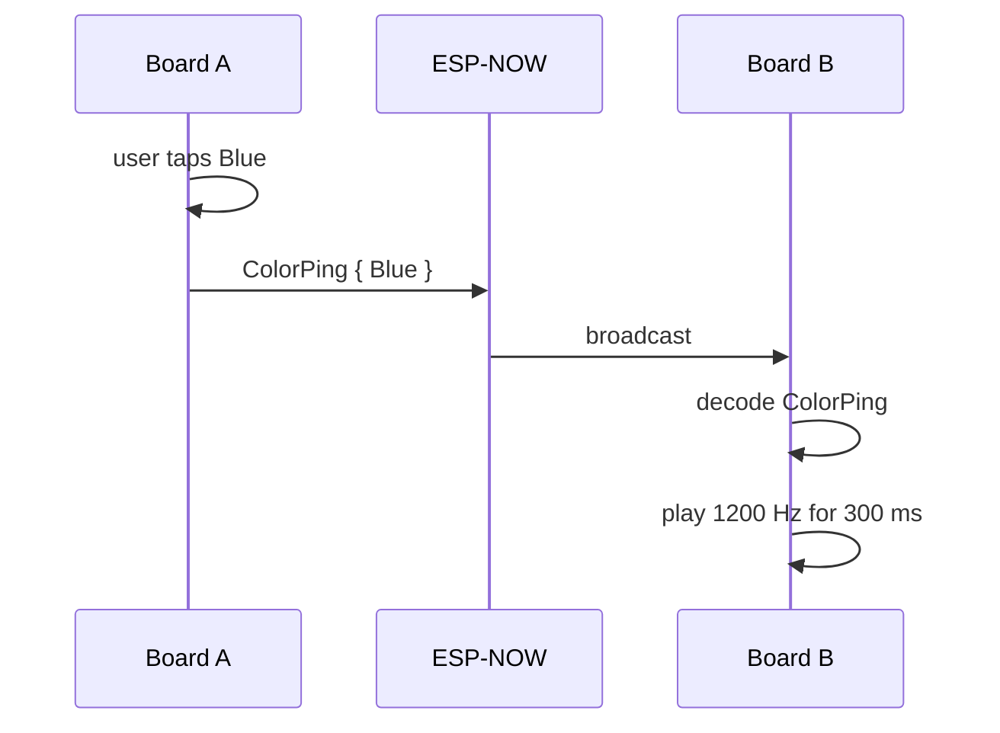

# 

## Hack and Hike 2026

Firmware for the **M5Stack CoreS3 Lite**, written in Rust for the ESP32-S3.

This repository is the starting point for a weekend of hacking. You are an
experienced programmer but new to Rust: everything you need is here, and you do
not have to understand the hardware drivers to build something that works.

The idea is simple:

> **Your application is one file. It takes the hardware it needs and runs a loop.**

The hardware comes as **capabilities**: small Rust APIs, one per function of
the board.

| Capability | Handle | What you get |
| --- | --- | --- |
| Display | `Display` | Draw into a rectangle of the 320x240 screen |
| Backlight | `Backlight` | Set the screen brightness |
| Touch | `Touch` | Press, move and release events with a position |
| IMU | `Imu` | Roll, pitch, compass heading, acceleration, rotation |
| Microphone | `Microphone` | 16 kHz stereo audio blocks |
| Speaker | `Speaker` | Play 16 kHz stereo audio |
| Network | `Network` | Send your own message types to nearby boards (ESP-NOW) |
| Camera | `Camera` | RGB565 frames, 320x240 |
| Light | `Light` | Ambient light in lux and how close something is to the front |
| Log | `LogHistory` | Everything your code logged, for showing on screen |

## Contents

- [Build](#build)
- [Run the tests](#run-the-tests)
- [The board](#the-board)
- [Your first application](#your-first-application)
- [Create your own application](#create-your-own-application)
- [How the hardware reaches your loop](#how-the-hardware-reaches-your-loop)
- [The capabilities](#the-capabilities)
- [The built-in applications](#the-built-in-applications)
- [The Rust you will meet](#the-rust-you-will-meet)
- [Ideas for the weekend](#ideas-for-the-weekend)
- [Project folders](#project-folders)
- [Where does my code go?](#where-does-my-code-go)
- [Reading order](#reading-order)
- [Going deeper](#going-deeper)

## Build

Every application is a binary in `src/bin/`. Build one by name:

```bash
cargo build --release --bin imu_color
```

```bash
cargo build --release --bin color_ping
```

```bash
cargo build --release --bin demo
```

Without `--bin`, `cargo build --release` builds all of them. The first build
takes a few minutes; later builds take seconds.

The library's documentation, with every capability and its methods, is one
command away and opens in your browser:

```bash
cargo doc --open
```

That shows the public API, what an application calls. Every private struct,
field and function has a doc comment too, explaining how the firmware works
inside; include them with:

```bash
cargo doc --document-private-items --open
```

In the editor, hover over any name to read the same comments.

## Run the tests

The hardware-independent logic (the IMU math, the network protocol and peer
table, the audio ring buffer, the log history, the light sensor's lux
formula) lives in the crate
`crates/core` and has ordinary Rust tests that run on your computer:

```bash
./scripts/test.sh
```

The script exists because the repository's Cargo configuration targets the
ESP32-S3; it runs `cargo test` for that crate with your computer's target
instead. Unit tests sit next to the code in a `#[cfg(test)] mod tests`
(see `crates/core/src/network/protocol.rs`); tests that combine several
modules are files in `crates/core/tests/`.

## The board

```text
                 top edge: camera, +x of the IMU
        ┌──────────────────────────────────────────┐
        │ (0,0)                              (319,0)│  ▲
        │                                          │  │ 240 px
        │           320 x 240 pixels               │  │
        │           touch = display coordinates    │  │
        │                                          │  ▼
        │ (0,239)                          (319,239)│
        └──────────────────────────────────────────┘
          speaker              microphones (L, R)
```

- **Screen and touch** share one coordinate system: `Point::new(x, y)` with
  the origin in the top-left corner, `x` to the right, `y` down. Colours are
  `Rgb565`; `hack_and_hike::ui::theme` has the project palette and
  `Rgb565::RED`, `Rgb565::new(r, g, b)` and friends work too.
- **The IMU** reports how the board is held in the *screen frame*: `x` points
  out of the top edge (where the camera looks), `y` to the right across the
  screen, `z` into the screen. Lying flat on a table, screen up, roll and
  pitch are 0. Roll is positive when the right side is lower; pitch is
  positive when the top edge is raised; the heading is where the top edge
  points, in degrees clockwise from magnetic north.
- **The light sensor** faces the same way as the screen. It reports the
  ambient light in lux and a proximity count: 0 with nothing in front of the
  board, a few hundred with a hand a few centimetres away.
- **Audio** is signed 16-bit stereo at 16 kHz, interleaved left, right, left,
  right, ...
- **Every board in the room** talks on the same radio channel. Messages carry
  the name of their type, so your application only decodes its own.

## Your first application

`src/bin/imu_color.rs` shows how far the compass calibration has come: the
screen is red at the start, orange from 50 %, yellow from 75 %, green when it
is done, with the percentage in the middle. Turn the board slowly in every
direction and watch it change. This is the whole file:

```rust
//! The smallest application: the screen shows how far the compass calibration
//! has come, as a colour and a percentage. Red at the start, orange from
//! 50 %, yellow from 75 % and green once the compass is calibrated. Turn the
//! board slowly in every direction.

#![no_std]
#![no_main]

use core::fmt::Write as _;

use arrayvec::ArrayString;
use embassy_executor::Spawner;
use embassy_time::{Duration, Timer};
use embedded_graphics::{pixelcolor::Rgb565, prelude::*};
use hack_and_hike::{
    Board,
    capabilities::display::{SCREEN, SIZE},
    ui::{Canvas, common, theme},
};

// Writes the application descriptor the bootloader checks before starting
// the firmware. Every application needs this line exactly once.
esp_bootloader_esp_idf::esp_app_desc!();

/// The entry point: wait for IMU samples and redraw when the percentage
/// changes.
#[esp_rtos::main]
async fn main(_spawner: Spawner) -> ! {
    let Board {
        mut display,
        mut imu,
        ..
    } = Board::init();
    let mut canvas = Canvas::new(SIZE);
    let mut shown = None;

    loop {
        if let Some(sample) = imu.latest() {
            let percent = sample.mag_calibration_percent;
            if shown != Some(percent) {
                shown = Some(percent);
                draw(&mut canvas, percent);
                canvas.show(&mut display.surface(SCREEN));
            }
        }

        Timer::after(Duration::from_millis(10)).await;
    }
}

/// Paint the whole picture for `percent` onto the canvas. The canvas works
/// out what changed when it is shown.
fn draw(canvas: &mut Canvas, percent: u8) {
    let (background, text) = colors(percent);
    canvas.clear(background);

    let mut label = ArrayString::<8>::new();
    write!(label, "{percent} %").expect("the label fits its buffer");
    common::centered_text(
        canvas,
        canvas.bounding_box(),
        &label,
        common::TITLE_FONT,
        text,
    );
}

/// One fixed background per stage of the calibration, with a text colour
/// that reads well on it.
fn colors(percent: u8) -> (Rgb565, Rgb565) {
    match percent {
        0..50 => (Rgb565::RED, theme::WHITE),
        50..75 => (Rgb565::new(31, 32, 0), theme::WHITE), // orange
        75..100 => (Rgb565::YELLOW, theme::CHARCOAL),
        _ => (Rgb565::GREEN, theme::CHARCOAL),
    }
}
```

Line by line:

- `#![no_std]` and `#![no_main]`: this is firmware. There is no operating
  system and no C-style `main`. You still have structs, enums, `Option`,
  iterators, closures and modules. `esp_app_desc!()` writes a small
  descriptor the bootloader expects; every application has it.
- `#[esp_rtos::main] async fn main(...) -> !` is an async entry point that
  never returns (`!`). The board runs your loop forever.
- `Board::init()` powers up the whole board and returns one handle per
  capability. The pattern `let Board { mut display, mut imu, .. } = ...` keeps
  the two handles this application needs and drops the rest. Dropping a handle
  is fine: the sensors keep running on the second CPU core.
- `Canvas::new(SIZE)` is an image the size of the screen to draw into. It is
  created once, before the loop, because its memory is never freed.
- `imu.latest()` returns `Some(sample)` when a new sample arrived since the
  last call and `None` otherwise. Nothing waits.
- The screen is only redrawn when the percentage changed. The IMU publishes a
  hundred samples per second; drawing on every one would keep the display
  busy for nothing.
- `draw` clears the canvas to the stage's colour and writes the percentage in
  the middle. Text goes through a fixed buffer, `ArrayString`, because there
  is no `String` without an operating system. `canvas.show(...)` sends only
  the pixels that changed: the whole screen when the colour changed,
  otherwise just the rows of the number.
- `Timer::after(...).await` pauses this loop and lets other work on this core
  run. Every loop needs an `.await` somewhere.
- `colors` is a plain function with a `match` over ranges that returns a
  tuple. Rust checks that every value of `percent` is covered.

## Create your own application

Copy `src/bin/template.rs` to a new file, for example `src/bin/my_hack.rs`.
It builds and runs as it is: a light blue spot follows your finger on a dark
blue screen. Its loop is the shape every application has:

```rust
loop {
    // 1. Read input.
    while let Some(event) = touch.next_event() {
        finger = match event {
            TouchEvent::Pressed(point) | TouchEvent::Moved(point) => Some(point),
            TouchEvent::Released(_) => None,
        };
    }

    // 2. Update your state and draw, but only when something changed.
    if finger != shown {
        shown = finger;
        canvas.clear(theme::DARK_BLUE);
        if let Some(point) = finger {
            let Ok(()) = Circle::with_center(point, SPOT_DIAMETER)
                .into_styled(PrimitiveStyle::with_fill(theme::LIGHT_BLUE))
                .draw(&mut canvas);
        }
        canvas.show(&mut display.surface(SCREEN));
    }

    // 3. Let the rest of the system run. Every loop needs an `.await`.
    Timer::after(Duration::from_millis(10)).await;
}
```

Build it:

```bash
cargo build --release --bin my_hack
```

That is all. Cargo finds every file in `src/bin/` by itself, and CI builds
every binary. When the application grows, turn it into a folder,
`src/bin/my_hack/main.rs` plus sibling modules, like `src/bin/demo/`.

Keep the rules of your application (what a touch means, what a message means,
which colour is which) in your application. The capabilities stay generic.

## How the hardware reaches your loop

The chips are read and fed by tasks on the second CPU core. Your loop on the
first core talks to them through a handle, which reads or writes a queue or a
"latest value" slot. Nothing in a handle waits for hardware.



The two exceptions run on your own core: **drawing** waits for the SPI DMA
transfer to finish (about 31 ms for the whole screen) and a **camera
frame** waits for the sensor unless the next frame is already complete. That
is why the applications draw only when something changed.

## The capabilities

One snippet each, with the `use` lines they need. The handles come from
`Board::init()`.

**Display.** The quickest way to draw is row by row; `row` is a slice of
`Rgb565` pixels the width of the surface.

```rust
use embedded_graphics::pixelcolor::Rgb565;
use hack_and_hike::capabilities::display::{HEIGHT, SCREEN};

display.surface(SCREEN).render_scanlines(|y, row| {
    row.fill(if y < HEIGHT / 2 { Rgb565::BLUE } else { Rgb565::WHITE });
});
```

For text and shapes, draw into a `Canvas` (an image in memory that any
`embedded-graphics` primitive can draw on) and show it. Create the canvas
once, outside the loop. It remembers what the panel shows, and `show` sends
only the pixels that differ: clear and redraw your whole picture whenever
something changes, and a changed number still costs only a millisecond,
while a full screen takes about 31 ms.

```rust
use embedded_graphics::{
    prelude::*,
    primitives::{Circle, PrimitiveStyle},
};
use hack_and_hike::{
    capabilities::display::{SCREEN, SIZE},
    ui::{Canvas, common, theme},
};

let mut canvas = Canvas::new(SIZE);

canvas.clear(theme::WHITE);
common::text(&mut canvas, "HELLO", Point::new(10, 10), common::TITLE_FONT, theme::DARK_BLUE);
let Ok(()) = Circle::with_center(Point::new(160, 140), 60)
    .into_styled(PrimitiveStyle::with_fill(theme::LIGHT_BLUE))
    .draw(&mut canvas);
canvas.show(&mut display.surface(SCREEN));
```

**Touch.** Events queue up until you read them, in the order they happened.

```rust
use hack_and_hike::capabilities::touch::TouchEvent;

while let Some(event) = touch.next_event() {
    match event {
        TouchEvent::Pressed(point) => log::info!("finger down at {},{}", point.x, point.y),
        TouchEvent::Moved(point) => log::info!("finger at {},{}", point.x, point.y),
        TouchEvent::Released(point) => log::info!("finger up at {},{}", point.x, point.y),
    }
}
```

**IMU.** The newest sample, about 100 times per second.

```rust
use hack_and_hike::capabilities::imu::MagStatus;

if let Some(sample) = imu.latest() {
    let roll = sample.attitude.roll_deg;
    let pitch = sample.attitude.pitch_deg;
    let heading = sample.attitude.heading_deg;
    let heading_is_trustworthy = sample.mag_status == MagStatus::Ready;
}
```

**Microphone.** 32 ms blocks of interleaved stereo samples.

```rust
use hack_and_hike::capabilities::audio;

let mut block = [0i16; audio::SAMPLES_PER_BLOCK];
if let Some(info) = microphone.next_block(&mut block) {
    let loudest_left = info.peak_left;
}
```

**Speaker.** Queue a little audio on every loop iteration; the board plays
silence when the queue runs empty. `SineWave` makes tones.

```rust
use hack_and_hike::{capabilities::audio, synth::SineWave};

let mut tone = SineWave::new(880.0);

let mut chunk = [0i16; 128 * audio::CHANNELS];
let frames = speaker.available_frames().min(128);
for frame in chunk[..frames * audio::CHANNELS].chunks_exact_mut(audio::CHANNELS) {
    frame.fill(tone.next_sample(0.2));
}
speaker.write(&chunk[..frames * audio::CHANNELS]);
```

**Network.** Define your own message type and give it a name that is unique
to your application. Every board in the room hears every message, and only
messages with that name decode as `Hello`.

```rust
use hack_and_hike::capabilities::network::Message;
use serde::{Deserialize, Serialize};

#[derive(Serialize, Deserialize)]
struct Hello {
    number: u32,
}

impl Message for Hello {
    const NAME: &'static str = "team-otters.hello";
}

if let Err(error) = network.broadcast(&Hello { number: 42 }) {
    log::warn!("not sent: {error}");
}

while let Some(message) = network.next_message() {
    if let Ok(hello) = message.decode::<Hello>() {
        let reply = Hello { number: hello.number + 1 };
        if let Err(error) = network.send_to(message.sender, &reply) {
            log::warn!("reply not sent: {error}");
        }
    }
}
```

**Camera.** `camera` is an `Option`: `None` when no camera answered at boot.
A frame can be drawn directly.

```rust
use hack_and_hike::capabilities::display::SCREEN;

if let Some(camera) = camera.as_mut()
    && let Some(mut frame) = camera.begin_frame()
{
    display.surface(SCREEN).render_from(&mut frame);
    frame.finish();
}
```

The sensor never pauses, and its DMA buffer holds only a few milliseconds.
Drawing the frame drains it, and a frame that completes while the previous
one is still being drawn waits in a spare buffer. Between `frame.finish()`
and the next `begin_frame()`, though, nothing drains it: call `camera.pump()`
once per loop iteration and do not sleep between frames while the camera is
live. Otherwise frames are dropped and a warning is logged.

**Light.** `light` is an `Option` too. `latest()` gives the newest sample,
ten per second, or `None` when nothing new arrived since the last call.

```rust
if let Some(light) = light.as_mut()
    && let Some(sample) = light.latest()
{
    let dark = sample.lux < 10.0;
    let covered = sample.proximity > 200;
}
```

The lux value is an estimate from the sensor's formula; the useful proximity
threshold depends on what comes close, so try a few values.

**Backlight.** `Brightness::new` is for numbers in the code;
`Brightness::try_from(percent)` checks a number computed at run time.

```rust
use hack_and_hike::capabilities::backlight::Brightness;

backlight.set(Brightness::new(30));
```

**Log.** Use the `log` macros anywhere; they print to the USB serial port.
The demo's Log screen shows the history through `LogHistory`.

```rust
log::info!("button pressed at {}", point.x);
```

## The built-in applications

| Binary | Uses | What it shows |
| --- | --- | --- |
| `imu_color` | display, IMU | The smallest possible application (above) |
| `template` | display, touch | The file to copy: a spot follows your finger |
| `light_meter` | display, light | Lux and proximity as numbers and a bar; dark colours in the dark |
| `color_ping` | display, touch, network, speaker | One loop that combines four capabilities |
| `demo` | everything | A screen per capability with navigation |

**Color Ping** splits the screen into four colour bands. Tapping a band
broadcasts that colour; every other board that receives it plays a 300 ms
tone. A band lights up while you hold it, and on the receiving board while
its tone plays. Flash it to two boards and tap.



It is deliberately one loop: touch, network, audio and drawing each advance a
little on every iteration, and nothing blocks. The whole application is one
struct, `ColorPingApp`, that owns its handles and its state. That is the
pattern to copy when a program outgrows `main`.

**Demo** is the full firmware: Network, IMU, Microphone, Speaker, Camera,
Settings and Log screens behind a navigation rail. Every screen implements the
same small `Screen` trait. `src/bin/demo/screens/settings/` is the one to copy
when you add a screen: a KDL layout file, a slider, and one capability handle.

## The Rust you will meet

**Ownership.** Every value has one owner. `let Board { mut display, .. } =
Board::init();` moves the display handle into your function; nobody else can
use it. That is the whole reason the drivers need no locks.

**Moving.** Passing a handle into a struct moves it: after
`SettingsScreen::new(backlight)` the `backlight` variable is gone. If you
want to call methods on something, keep it in a struct field and write the
methods on the struct, like `ColorPingApp` does.

**Borrowing.** `display.surface(SCREEN)` borrows the display until the
`Surface` goes out of scope; `canvas.show(&mut surface)` borrows the surface
for one call. The compiler makes sure two borrows never overlap.

**`Option<T>`.** A value that may be absent. `imu.latest()` is `None` when
nothing new arrived; `camera` is `None` when no camera answered at boot.
`if let Some(x) = ...` and `while let Some(x) = ...` unpack it.

**`Result<T, E>`.** `network.broadcast(&msg)` returns `Ok(())` or an error
such as `SendError::QueueFull`. Handle it with `match` or `if let Err(e)`;
`main` never returns, so `?` is not an option there. Drawing onto a `Canvas`
cannot fail, which is why `let Ok(()) = shape.draw(&mut canvas);` compiles:
the error type is `Infallible`, and the compiler knows.

**`async` and `.await`.** `main` is async; every `.await` is a point where
other tasks may run. A loop that never awaits starves everything else on the
core.

**`no_std`.** No standard library, so no `String`, `Vec` or `println!` by
default. Text is built into a fixed buffer: `let mut text =
ArrayString::<48>::new(); write!(text, "{} Hz", hz)`. The `log` macros
replace `println!`.

**Traits.** `impl Message for Hello { const NAME: &'static str = "..."; }`
gives the network what it needs to know about your type. `derive(Serialize,
Deserialize)` writes the byte encoding for you.

**Visibility.** `pub` items are the API applications use; `pub(crate)` items
are internal to the library; everything else is private to its module.

## Ideas for the weekend

| Idea | Capabilities |
| --- | --- |
| Tilt maze: a ball rolls with roll and pitch | display, IMU |
| Reaction game: the first board to tap after the flash wins | display, touch, network |
| Compass treasure hunt: an arrow to a heading, a beep when you face it | display, IMU, speaker |
| Walkie-beep: Morse code between boards | touch, network, speaker |
| Clap counter: count claps with the microphone peak | display, microphone |
| Photo booth: freeze a camera frame on a tap | display, touch, camera |
| Night light: brightness follows how the board is held | backlight, IMU |
| Pocket mode: dim the screen when it is covered or the room is dark | light, backlight |
| Theremin: pitch follows how close your hand is | light, speaker |

## Project folders

```text
crates/core/        hardware-independent logic with tests
src/
├── lib.rs          the library every application uses
├── bin/            the applications: demo/, imu_color.rs, light_meter.rs, color_ping.rs, template.rs
├── board/          Board::init(): power-up order and the CPU1 runtimes
├── capabilities/   one module per capability: the APIs you call
├── platform/       facts about the PCB: pins, power rails, I2C bus
├── support/        logging with on-device history, PSRAM helpers
├── synth.rs        sine waves and note frequencies for the speaker
└── ui/             canvas, palette, text helpers, slider, embedded-gui glue
```

## Where does my code go?

| I want to... | Put it in... |
| --- | --- |
| Build a new board experience | `src/bin/my_app.rs` |
| Add a screen to the demo | `src/bin/demo/screens/` |
| Change the demo's navigation rail | `src/bin/demo/navigation.rs` |
| Add a reusable drawing helper or widget | `src/ui/` |
| Expose a new hardware operation | the matching `src/capabilities/...` module |
| Change how a sensor is configured | the matching capability |
| Change pins, power or reset wiring | `src/platform/` |
| Change the power-up order | `src/board/` |
| Add logic that should have tests | `crates/core/` |

A rule of thumb:

> If the code says **what the board should do**, it belongs in an application.
>
> If the code says **how a piece of hardware works**, it belongs in a capability.

## Reading order

1. `src/bin/imu_color.rs` and `src/bin/template.rs`
2. `src/bin/color_ping.rs`
3. `src/lib.rs` and `src/board/mod.rs`
4. `src/bin/demo/main.rs`, then `src/bin/demo/screens/settings/`
5. one capability API, for example `src/capabilities/imu/mod.rs`
6. `src/capabilities/display/mod.rs` and `src/ui/canvas.rs`
7. drivers and `crates/core` only when you need them

## Going deeper

[docs/architecture.md](docs/architecture.md) explains how the firmware is put
together: what happens in `Board::init()`, what runs on which CPU core, how
drawing and the demo's screens work, memory and PSRAM, the camera path, the
network protocol, and the design rules behind the layout.
