# 

## Hack and Hike 2026

Hack & Hike is firmware for the **M5Stack CoreS3 Lite**.

It is written in Rust and runs on the ESP32-S3.

This README is written for people who are still learning Rust. You do not need to know every Rust feature before you start.

The main idea is simple:

> **One application owns the parts of the device that it needs.**

Those parts are called **capabilities**.

For example, an application can use the display, touch screen, IMU, microphone, speaker, network, or camera.

---

## Table of contents

- [The short version](#the-short-version)
- [Build the normal firmware](#build-the-normal-firmware)
- [The big picture](#the-big-picture)
- [Project folders](#project-folders)
- [Applications and capabilities](#applications-and-capabilities)
- [How startup works](#how-startup-works)
- [CPU0 and CPU1](#cpu0-and-cpu1)
- [Cargo features](#cargo-features)
- [The Rust ideas you need](#the-rust-ideas-you-need)
- [How drawing works](#how-drawing-works)
- [How the stock application works](#how-the-stock-application-works)
- [Example 1: add a simple IMU application](#example-1-add-a-simple-imu-application)
- [Example 2: Color Ping](#example-2-color-ping)
- [Add more screens](#add-more-screens)
- [Use background tasks](#use-background-tasks)
- [Headless applications](#headless-applications)
- [Memory and large buffers](#memory-and-large-buffers)
- [Common mistakes](#common-mistakes)
- [Where should my code go?](#where-should-my-code-go)
- [Suggested reading order](#suggested-reading-order)
- [Small glossary](#small-glossary)

---

## The short version

The firmware has two main layers:

1. **Capabilities** talk to hardware and provide simple Rust APIs.
2. **The application** decides what the device does.

There is only **one selected application** in a firmware build.

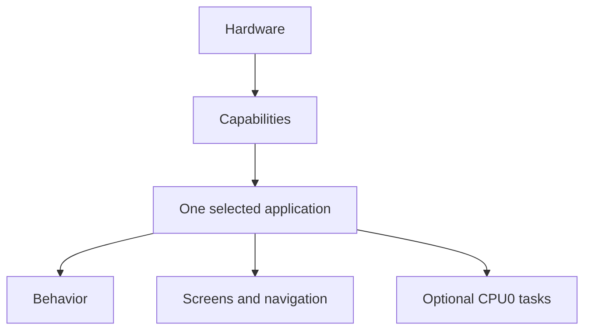

Examples:

- The IMU capability reads the motion sensors and gives the application measurements.
- The display capability owns the LCD and lets the application draw pixels.
- The touch capability gives the application touch points and press/release events.
- The network capability sends and receives typed messages.
- The speaker capability accepts stereo PCM samples.
- The camera capability gives the application camera frames.

The application does not need to know which I2C register contains an accelerometer value or which DMA channel is used by the display.

That low-level work stays inside the capability.

---

## Build the normal firmware

The normal build uses the stock application:

```bash
cargo build --release
```

This is the same as:

```bash
cargo build --release --no-default-features --features app-stock
```

The repository already sets the ESP32-S3 target in `.cargo/config.toml`.

The Rust version is set in `rust-toolchain.toml`.

---

## The big picture

The program starts in `src/main.rs`.

The important part is very small:

```rust
#[esp_rtos::main]
async fn main(cpu0_spawner: Spawner) -> ! {
    let bootstrap = firmware::bootstrap();
    applications::run(cpu0_spawner, bootstrap).await
}
```

This tells the whole story:

1. Start the hardware.
2. Create the enabled capabilities.
3. Give the application-facing handles to the selected application.
4. Run that application forever.

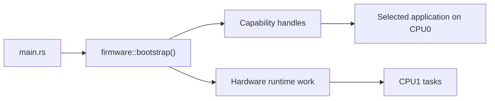

There is no required `Application` trait.

There is no required screen framework.

There is no required navigation system.

Your application can have one screen, many screens, or no screen at all.

---

## Project folders

The main folders are:

```text
src/
├── main.rs
├── applications/
│   ├── mod.rs
│   └── stock/
├── capabilities/
│   ├── display/
│   ├── touch/
│   ├── imu/
│   ├── mic.rs
│   ├── speaker.rs
│   ├── network/
│   ├── camera/
│   └── audio/
├── firmware/
├── platform/
├── support/
└── ui/
```

### `src/applications/`

This is where device behavior belongs.

An application decides:

- what the device does,
- what touch means,
- which screen is active,
- when data is updated,
- when pixels are drawn,
- when messages are sent,
- when sounds are played,
- how several capabilities work together.

### `src/capabilities/`

This is where hardware-facing APIs live.

A capability hides low-level hardware work and gives the application useful values and operations.

### `src/firmware/`

This connects real board hardware to capabilities.

`firmware::bootstrap()` takes ESP32-S3 peripherals, starts the enabled hardware, starts CPU1 work when needed, and returns application-facing handles.

You normally do **not** edit this folder when you make a new application.

### `src/platform/`

This contains facts about the physical board, such as pins, power rails, reset lines, and shared I2C setup.

### `src/ui/`

This contains reusable drawing helpers.

The stock navigation does **not** live here. It belongs to the stock application.

### `src/support/`

This contains shared support code such as logging, memory helpers, diagnostics, and stack/heap monitoring.

---

## Applications and capabilities

An **application** gives the device its purpose.

A **capability** gives the application access to one hardware function.

The current capabilities are:

| Feature | Rust handle | What the application gets |
| --- | --- | --- |
| `display` | `Display` | LCD drawing through bounded `Surface` values |
| `touch` | `Touch` | Touch points and press/release events |
| `imu` | `Imu` | Motion measurements and orientation |
| `mic` | `Microphone` | Stereo signed 16-bit PCM input |
| `speaker` | `Speaker` | Stereo signed 16-bit PCM output |
| `network` | `Network` | ESP-NOW peers and typed messages |
| `camera` | `Camera` | RGB565 camera frames |

The application should use these APIs instead of using raw HAL peripherals, DMA channels, GPIO numbers, or chip registers.

### Example: IMU

Application code can do this:

```rust
if let Some(sample) = imu.latest() {
    let roll = sample.orientation.roll_deg;
    let pitch = sample.orientation.pitch_deg;
    let yaw = sample.orientation.yaw_deg;
}
```

The application does not need to know how the BMI270 or BMM150 are configured.

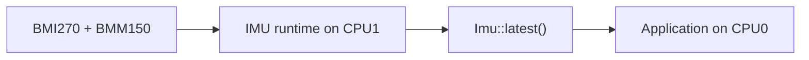

### Example: network

Application code can define its own message type:

```rust
use serde::{Deserialize, Serialize};

#[derive(Clone, Copy, Serialize, Deserialize)]
struct Hello {
    number: u32,
}
```

Then broadcast it:

```rust
let _ = network.send(None, &Hello { number: 42 });
```

`None` means broadcast.

A receiving application can decode it:

```rust
while let Some(message) = network.receive() {
    if let Ok(hello) = message.decode::<Hello>() {
        // Use hello.number here.
    }
}
```

The message schema belongs to the application. The network capability does not need to know what `Hello` means.

---

## How startup works

The startup code is in `firmware::bootstrap()`.

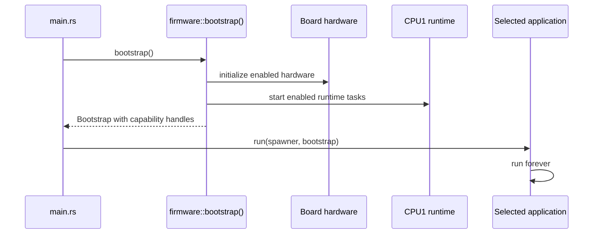

The returned value is called `Bootstrap`.

It contains fields for the capabilities that are enabled by Cargo features.

The selected application takes ownership of it and moves out the handles it needs.

Example:

```rust
let Bootstrap {
    mut display,
    mut imu,
    ..
} = bootstrap;
```

Now the application owns `display` and `imu`.

---

## CPU0 and CPU1

The ESP32-S3 has two CPU cores.

### CPU0

CPU0 runs the selected application.

This includes:

- application logic,
- touch decisions,
- screen updates,
- display drawing,
- camera presentation,
- optional application tasks.

### CPU1

CPU1 runs hardware work that benefits from running separately from the application loop.

Depending on enabled features, this includes:

- IMU acquisition,
- touch polling,
- microphone and speaker audio work,
- ESP-NOW networking,
- display brightness I2C work,
- runtime monitoring.

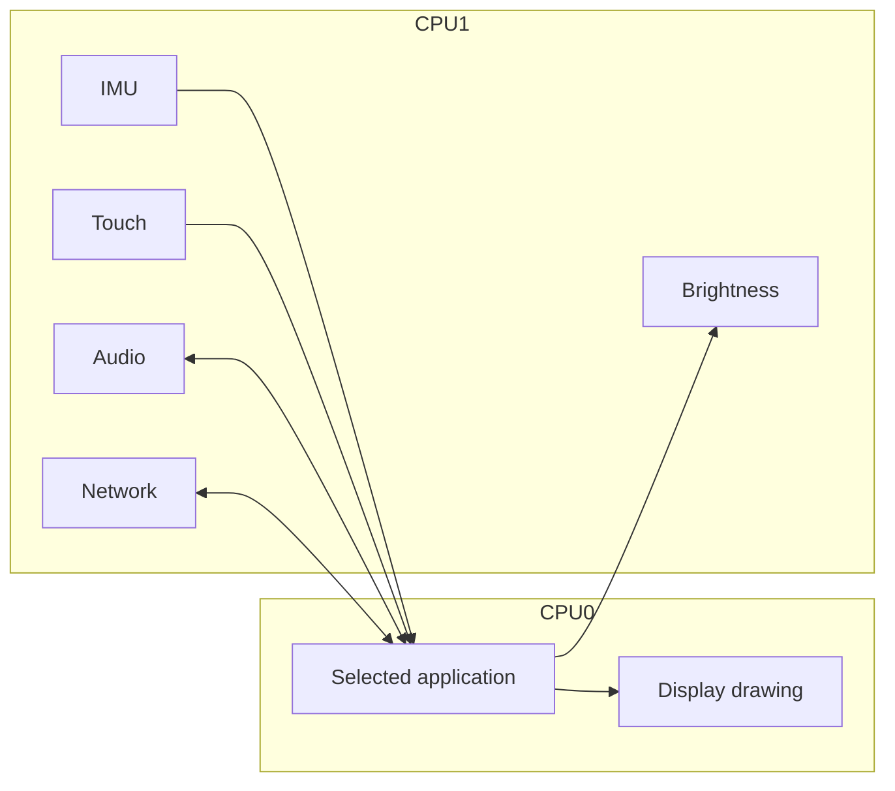

The important rule is:

> Use the capability handle. Do not manage CPU1 yourself for normal hardware access.

---

## Cargo features

Cargo features decide which code and hardware support are included in a build.

Hardware features are:

```text
display
touch
imu
mic
speaker
network
camera
```

There is also:

```text
ui
```

`ui` enables reusable graphical helpers and also enables `display`.

The stock application feature is a bundle:

```toml
app-stock = [
    "ui",
    "touch",
    "imu",
    "mic",
    "speaker",
    "network",
    "camera",
]
```

A custom application should enable only what it needs.

For example:

```toml
app-imu-color = ["display", "imu"]
```

or:

```toml
app-color-ping = ["display", "touch", "network", "speaker"]
```

When you build a custom application, use `--no-default-features` so Cargo does not also enable `app-stock`.

---

## The Rust ideas you need

You can work on this project without being a Rust expert.

### Ownership

Rust values have one owner.

Hardware handles also have one clear owner in this project.

```rust
let Bootstrap { mut display, .. } = bootstrap;
```

After this line, your application owns `display`.

### Moving a value

If you put a handle into another struct, the handle moves there.

```rust
let model = MyModel::new(imu);
```

Now `model` owns `imu`.

### Borrowing with `&mut`

You can temporarily borrow a handle.

```rust
let mut surface = display.surface(region);
```

The `Surface` temporarily borrows the display.

When the surface goes out of scope, the display can be used again.

### `Option<T>`

`Option<T>` means a value may be present or missing.

```rust
if let Some(sample) = imu.latest() {
    // A new sample is available.
}
```

### `async` and `.await`

Application `run` functions are async.

```rust
pub(crate) async fn run(...) -> !
```

An async function can pause at `.await` and let other CPU0 work run.

```rust
Timer::after(Duration::from_millis(10)).await;
```

Do not write a forever loop that never reaches `.await`.

### `-> !`

`-> !` means the function never returns.

That is normal for firmware.

### `pub(crate)`

`pub(crate)` means code can be used by other modules in this firmware crate, but not by outside crates.

### `no_std`

This is embedded firmware, so it does not use the normal desktop Rust standard library.

You can still use normal Rust ideas such as structs, enums, `Option`, iterators, modules, and async code.

---

## How drawing works

The display capability owns the physical LCD connection.

The application asks it for a `Surface`.

A `Surface` is a rectangular part of the screen.

```rust
let region = Region::new(0, 0, WIDTH, HEIGHT);
let mut surface = display.surface(region);

surface.render_scanlines(|_y, pixels| {
    pixels.fill(0x0000);
});
```

A surface cannot draw outside its region.

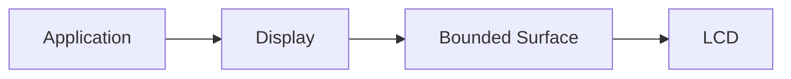

The stock 44-pixel navigation rail is not a global rule. A custom application can use the full 320×240 screen.

---

## How the stock application works

The normal application lives in:

```text
src/applications/stock/
```

It owns:

- the display,
- touch input,
- IMU,
- microphone,
- speaker,
- network,
- camera,
- brightness,
- logs,
- navigation,
- all stock screen state.

The stock screens are parts of one application.

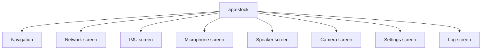

Your application does not have to copy this structure.

Start with one file when that is enough.

---

# Example 1: add a simple IMU application

This is a complete small example.

The application uses:

- `display`,
- `imu`.

It paints the screen green when the IMU is running. It paints the screen red while the IMU is not ready.

The files you will touch are:

```text
Cargo.toml
src/applications/mod.rs
src/applications/imu_color/mod.rs
```

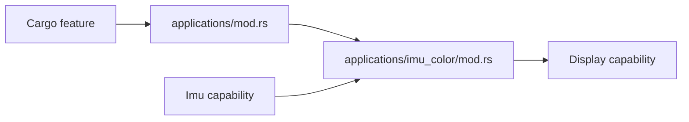

## Step 1: add the feature

Open `Cargo.toml`.

Add this next to the other application features:

```toml
app-imu-color = ["display", "imu"]
```

This means that selecting `app-imu-color` also enables the display and IMU capabilities.

## Step 2: create the application file

Create:

```text
src/applications/imu_color/mod.rs
```

Put this code in it:

```rust
use embassy_executor::Spawner;
use embassy_time::{Duration, Timer};

use crate::{
    capabilities::{
        display::{HEIGHT, Region, WIDTH},
        imu::Status,
    },
    firmware::Bootstrap,
};

pub(crate) async fn run(_spawner: Spawner, bootstrap: Bootstrap) -> ! {
    // Move the two capability handles out of Bootstrap.
    let Bootstrap {
        mut display,
        mut imu,
        ..
    } = bootstrap;

    let full_screen = Region::new(0, 0, WIDTH, HEIGHT);
    let mut screen_color = 0x0000; // black

    loop {
        // Read a new IMU sample if one is available.
        if let Some(sample) = imu.latest() {
            screen_color = if sample.status == Status::Running {
                0x07E0 // green in RGB565
            } else {
                0xF800 // red in RGB565
            };
        }

        // Borrow the display only while drawing.
        {
            let mut surface = display.surface(full_screen);
            surface.render_scanlines(|_y, pixels| {
                pixels.fill(screen_color);
            });
        }

        // Let other CPU0 work run.
        Timer::after(Duration::from_millis(50)).await;
    }
}
```

There is no HAL code here.

There are no GPIO numbers here.

There are no sensor registers here.

That is the point of the capability API.

## Step 3: register the application

Open:

```text
src/applications/mod.rs
```

For one custom application, a concrete version looks like this:

```rust
//! Build-time application selection.

#[cfg(any(
    all(feature = "app-stock", feature = "app-idle"),
    all(feature = "app-stock", feature = "app-imu-color"),
    all(feature = "app-idle", feature = "app-imu-color"),
))]
compile_error!("select exactly one application feature");

#[cfg(feature = "app-stock")]
mod stock;
#[cfg(feature = "app-imu-color")]
mod imu_color;

use embassy_executor::Spawner;
#[cfg(not(any(feature = "app-stock", feature = "app-imu-color")))]
use embassy_time::{Duration, Timer};

use crate::firmware::Bootstrap;

#[cfg(feature = "app-stock")]
pub(crate) async fn run(spawner: Spawner, bootstrap: Bootstrap) -> ! {
    stock::run(spawner, bootstrap).await
}

#[cfg(feature = "app-imu-color")]
pub(crate) async fn run(spawner: Spawner, bootstrap: Bootstrap) -> ! {
    imu_color::run(spawner, bootstrap).await
}

#[cfg(not(any(feature = "app-stock", feature = "app-imu-color")))]
pub(crate) async fn run(_spawner: Spawner, bootstrap: Bootstrap) -> ! {
    let _bootstrap = bootstrap;

    loop {
        Timer::after(Duration::from_millis(100)).await;
    }
}
```

The `compile_error!` is important. It stops an invalid build where two applications are selected at the same time.

The fallback keeps capability-only and `app-idle` builds working.

## Step 4: build it

Run:

```bash
cargo build --release --no-default-features --features app-imu-color
```

Why `--no-default-features`?

The default build selects `app-stock`. Without this option, Cargo would enable both applications.

## Step 5: follow the data

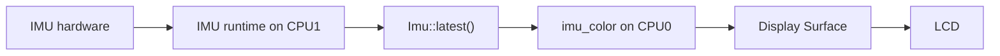

That is a complete application.

You can now grow it by adding touch, more views, networking, or audio.

---

# Example 2: Color Ping

This example combines several capabilities.

It is still one application.

The application uses:

- `display`,
- `touch`,
- `network`,
- `speaker`.

The screen has four color areas:

| Color | Tone |
| --- | ---: |
| Red | 800 Hz |
| Green | 1000 Hz |
| Blue | 1200 Hz |
| Yellow | 1400 Hz |

When you tap a color:

1. this device selects the color,
2. this device broadcasts a typed `ColorPing` message,
3. another Hack & Hike device receives the message,
4. the other device plays a **300 ms sine tone** for that color.

The sending device does not play its own broadcast message. The network runtime ignores frames that came from the same physical device.

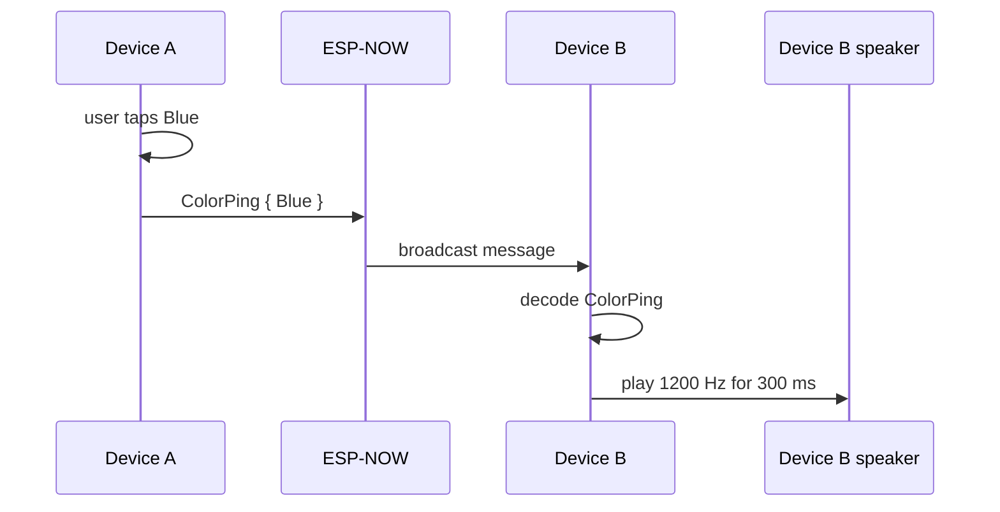

This example shows an important architecture rule:

> The network capability moves bytes. The application decides that a color means a pitch.

## Step 1: add the feature

Add this to `Cargo.toml`:

```toml
app-color-ping = ["display", "touch", "network", "speaker"]
```

The `network` feature already enables `serde` and `postcard`, so the application can use typed messages.

## Step 2: create the application file

Create:

```text
src/applications/color_ping/mod.rs
```

The full example below fits in one file.

```rust
use embassy_executor::Spawner;
use embassy_time::{Duration, Timer};
use serde::{Deserialize, Serialize};

use crate::{
    capabilities::{
        display::{Display, HEIGHT, Region, WIDTH},
        network::Network,
        speaker::{self, Speaker},
        touch::{Touch, TouchEdge},
    },
    firmware::Bootstrap,
};

const TONE_DURATION_MS: u32 = 300;
const AUDIO_CHUNK_FRAMES: usize = 128;
const AUDIO_CHUNK_SAMPLES: usize = AUDIO_CHUNK_FRAMES * speaker::CHANNELS;

#[derive(Clone, Copy, Debug, PartialEq, Eq, Serialize, Deserialize)]
enum Color {
    Red,
    Green,
    Blue,
    Yellow,
}

impl Color {
    fn from_x(x: u16) -> Self {
        let column = usize::from(x) * 4 / WIDTH;
        match column.min(3) {
            0 => Self::Red,
            1 => Self::Green,
            2 => Self::Blue,
            _ => Self::Yellow,
        }
    }

    fn from_column(x: usize) -> Self {
        match (x * 4 / WIDTH).min(3) {
            0 => Self::Red,
            1 => Self::Green,
            2 => Self::Blue,
            _ => Self::Yellow,
        }
    }

    fn rgb565(self) -> u16 {
        match self {
            Self::Red => 0xF800,
            Self::Green => 0x07E0,
            Self::Blue => 0x001F,
            Self::Yellow => 0xFFE0,
        }
    }

    fn frequency_hz(self) -> u32 {
        match self {
            Self::Red => 800,
            Self::Green => 1_000,
            Self::Blue => 1_200,
            Self::Yellow => 1_400,
        }
    }
}

#[derive(Clone, Copy, Debug, Serialize, Deserialize)]
struct ColorPing {
    color: Color,
}

struct TonePlayer {
    phase: u32,
    phase_step: u32,
    frames_left_to_generate: u32,
    pending: [i16; AUDIO_CHUNK_SAMPLES],
    pending_frames: usize,
    pending_offset_frames: usize,
}

impl TonePlayer {
    const fn new() -> Self {
        Self {
            phase: 0,
            phase_step: 0,
            frames_left_to_generate: 0,
            pending: [0; AUDIO_CHUNK_SAMPLES],
            pending_frames: 0,
            pending_offset_frames: 0,
        }
    }

    fn start(&mut self, color: Color) {
        let frequency_hz = color.frequency_hz();

        // One full oscillator turn is the complete u32 range.
        self.phase = 0;
        self.phase_step =
            ((u64::from(frequency_hz) << 32) / u64::from(speaker::SAMPLE_RATE_HZ)) as u32;

        self.frames_left_to_generate =
            speaker::SAMPLE_RATE_HZ * TONE_DURATION_MS / 1_000;

        // A new ping replaces a tone that was still playing.
        self.pending_frames = 0;
        self.pending_offset_frames = 0;
    }

    fn update(&mut self, speaker: &mut Speaker) {
        loop {
            // First finish sending samples that were generated earlier.
            if self.pending_offset_frames < self.pending_frames {
                let first_sample = self.pending_offset_frames * speaker::CHANNELS;
                let last_sample = self.pending_frames * speaker::CHANNELS;

                let written = speaker
                    .try_write_interleaved(&self.pending[first_sample..last_sample]);

                if written == 0 {
                    return;
                }

                self.pending_offset_frames += written;

                if self.pending_offset_frames < self.pending_frames {
                    return;
                }

                self.pending_frames = 0;
                self.pending_offset_frames = 0;
            }

            if self.frames_left_to_generate == 0 {
                return;
            }

            let frames = speaker
                .available_frames()
                .min(AUDIO_CHUNK_FRAMES)
                .min(self.frames_left_to_generate as usize);

            if frames == 0 {
                return;
            }

            // Generate one small piece of the sine tone.
            let mut phase = self.phase;
            let phase_step = self.phase_step;

            for frame in self.pending[..frames * speaker::CHANNELS]
                .chunks_exact_mut(speaker::CHANNELS)
            {
                let sample = sine_sample(phase);
                phase = phase.wrapping_add(phase_step);
                frame.fill(sample);
            }

            self.phase = phase;
            self.frames_left_to_generate -= frames as u32;
            self.pending_frames = frames;
            self.pending_offset_frames = 0;
        }
    }
}

// A small sine lookup table keeps this example no_std and avoids floating point
// trigonometry in the application loop. The output is reduced to a safe level.
fn sine_sample(phase: u32) -> i16 {
    const SINE: [i16; 32] = [
        0, 6393, 12539, 18204, 23170, 27245, 30273, 32137,
        32767, 32137, 30273, 27245, 23170, 18204, 12539, 6393,
        0, -6393, -12539, -18204, -23170, -27245, -30273, -32137,
        -32767, -32137, -30273, -27245, -23170, -18204, -12539, -6393,
    ];

    let index = (phase >> 27) as usize;
    SINE[index] / 6
}

fn draw(display: &mut Display, selected: Color) {
    let full_screen = Region::new(0, 0, WIDTH, HEIGHT);
    let mut surface = display.surface(full_screen);

    surface.render_scanlines(|y, pixels| {
        for (x, pixel) in pixels.iter_mut().enumerate() {
            let color = Color::from_column(x);

            // Draw four vertical color areas.
            *pixel = color.rgb565();

            // Show the current selection with a white bar at the bottom.
            if color == selected && y >= HEIGHT - 12 {
                *pixel = 0xFFFF;
            }
        }
    });
}

fn handle_touch(
    touch: &mut Touch,
    network: &mut Network,
    selected: &mut Color,
    redraw: &mut bool,
) {
    while let Some(edge) = touch.next_edge() {
        if let TouchEdge::Pressed(point) = edge {
            *selected = Color::from_x(point.x);
            *redraw = true;

            let ping = ColorPing { color: *selected };

            // None means broadcast to all devices listening on this network.
            if network.send(None, &ping).is_err() {
                log::warn!("Color Ping send queue is full");
            }
        }
    }
}

fn handle_network(network: &mut Network, tone: &mut TonePlayer) {
    while let Some(message) = network.receive() {
        match message.decode::<ColorPing>() {
            Ok(ping) => tone.start(ping.color),
            Err(_) => log::warn!("Received a network message with another schema"),
        }
    }
}

pub(crate) async fn run(_spawner: Spawner, bootstrap: Bootstrap) -> ! {
    let Bootstrap {
        mut display,
        mut touch,
        mut network,
        mut speaker,
        ..
    } = bootstrap;

    let mut selected = Color::Red;
    let mut redraw = true;
    let mut tone = TonePlayer::new();

    loop {
        handle_touch(
            &mut touch,
            &mut network,
            &mut selected,
            &mut redraw,
        );

        // A received ping starts a tone on this device.
        handle_network(&mut network, &mut tone);

        // Keep the nonblocking speaker queue fed with small chunks.
        tone.update(&mut speaker);

        if redraw {
            draw(&mut display, selected);
            redraw = false;
        }

        Timer::after(Duration::from_millis(5)).await;
    }
}
```

## What the Color Ping code is doing

The file has four small jobs.

### 1. `Color` is application state

`Color` belongs to the application because the hardware does not care about red, green, blue, or yellow.

The application maps each color to:

- a display color,
- a pitch.

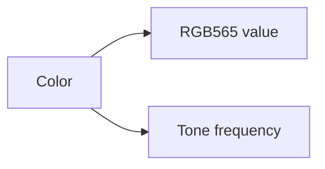

### 2. `ColorPing` is the network message

The message is tiny:

```rust
struct ColorPing {
    color: Color,
}
```

The network capability serializes it with postcard and sends it over ESP-NOW.

The capability still does not know what a color means.

### 3. Touch sends the ping

A press selects one quarter of the 320-pixel screen.

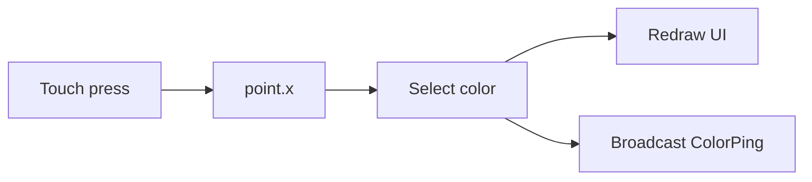

### 4. A received ping starts the tone

The other device decodes the message and calls:

```rust
tone.start(ping.color);
```

The tone is not written as one huge audio buffer.

The speaker capability has a small nonblocking queue, so the application feeds it in small pieces.

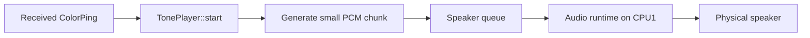

This is a useful pattern for embedded applications:

> Keep long actions as small pieces of state, then advance them a little on every loop.

That keeps touch, network, drawing, and audio responsive at the same time.

## Step 3: register Color Ping

If you are adding **Color Ping instead of the IMU example**, use the same selector pattern but replace `app-imu-color` with `app-color-ping` and `imu_color` with `color_ping`.

The important additions are:

```rust
#[cfg(feature = "app-color-ping")]
mod color_ping;

#[cfg(feature = "app-color-ping")]
pub(crate) async fn run(spawner: Spawner, bootstrap: Bootstrap) -> ! {
    color_ping::run(spawner, bootstrap).await
}
```

The idle fallback condition must also include the new application:

```rust
#[cfg(not(any(feature = "app-stock", feature = "app-color-ping")))]
```

And the compile-time check must reject combinations such as `app-stock + app-color-ping` and `app-idle + app-color-ping`.

If you keep **both tutorial applications** in your source tree, list both application features in the selector and keep them mutually exclusive. Only one is selected in a build.

## Step 4: build Color Ping

Run:

```bash
cargo build --release --no-default-features --features app-color-ping
```

Flash the same build to at least two devices.

Both devices use the same default ESP-NOW channel.

## Step 5: test with two devices

A simple test is:

1. Power both devices.
2. Wait until they have discovered each other.
3. Tap the blue area on Device A.
4. Device A keeps blue selected on its screen.
5. Device B receives `ColorPing { Blue }`.
6. Device B plays a 1200 Hz sine tone for about 300 ms.
7. Tap yellow on Device B.
8. Device A should now play the 1400 Hz tone.

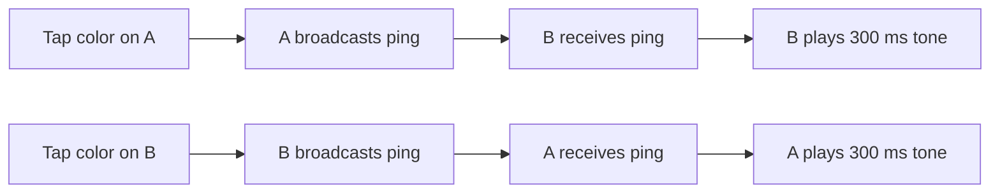

## Why this example belongs in one application

It may be tempting to put the color/pitch mapping inside the network capability or speaker capability.

Do not do that.

These parts are application behavior:

- color buttons,
- color selection,
- `ColorPing`,
- the color-to-pitch mapping,
- the rule that receiving a ping plays a sound.

The capabilities stay generic:

- touch reports touches,
- network moves typed application messages,
- speaker accepts PCM samples,
- display draws pixels.

That is exactly the boundary this architecture is trying to keep.

---

## Add more screens

A screen is just application code.

You do not need a framework trait.

A simple application can use an enum:

```rust
enum View {
    Dashboard,
    Compass,
    Settings,
}
```

Then store the active view:

```rust
let mut view = View::Dashboard;
```

And render with a `match`:

```rust
match view {
    View::Dashboard => render_dashboard(...),
    View::Compass => render_compass(...),
    View::Settings => render_settings(...),
}
```

Touch decides when the enum changes.

The display capability does not know what a screen is.

---

## Use background tasks

An application can spawn extra CPU0 tasks if that makes the code clearer.

But start with one loop.

The Color Ping example is intentionally one loop because touch, networking, audio generation, and drawing can all be advanced quickly without blocking.

A separate task becomes useful when some behavior has a truly independent loop.

### CPU0 tasks are cooperative

A CPU0 task gets a chance to run when another task reaches `.await`.

Good:

```rust
loop {
    update_some_state();
    Timer::after(Duration::from_millis(10)).await;
}
```

Bad:

```rust
loop {
    expensive_work();
}
```

The second loop never yields.

### Keep display ownership simple

Do not put `Display` behind a global mutex so many tasks can draw whenever they want.

A simpler model is:

1. one application path owns `Display`,
2. other work changes application state,
3. the render path reads that state,
4. the render path borrows a `Surface` and draws.

---

## Headless applications

An application does not need a display.

A headless application simply leaves `display` out of its feature list.

For example:

```toml
app-sensor-node = ["imu", "network"]
```

It can read IMU samples and send messages without drawing anything.

The existing idle application can also be combined with capabilities for composition checks:

```bash
cargo build --release --no-default-features --features app-idle,imu,network
```

---

## Memory and large buffers

Embedded devices have much less internal RAM than desktop computers.

The CoreS3 Lite also has PSRAM. This project uses it for large long-lived data such as:

- GUI framebuffers,
- camera frame buffers,
- microphone history,
- log history.

### Avoid huge local arrays

A full 320×240 RGB565 image is about 150 KiB.

Do not put that on a normal task stack:

```rust
let frame = [0u8; 320 * 240 * 2];
```

Use the existing PSRAM patterns when you need large storage.

Small fixed arrays are fine. The Color Ping example uses only a 128-frame audio chunk.

---

## Camera path

The camera path is performance-sensitive.

The GC0308 produces QVGA RGB565 frames.

The firmware keeps two PSRAM camera frame buffers.

While one frame is shown, capture of the next frame can move forward during LCD DMA wait time.

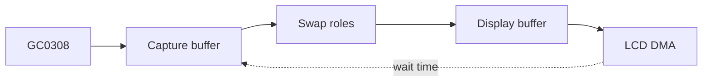

If you make a camera application, reuse the existing `Camera`, `Frame`, and `Surface` APIs before adding another full frame copy.

---

## Common mistakes

### Putting application behavior in a capability

Avoid code like:

```text
capabilities/network/color_ping.rs
capabilities/speaker/color_to_pitch.rs
```

Those are application rules, so they belong in the application.

### Accessing HAL hardware from an application

If your application imports raw ESP HAL peripherals, DMA channels, or board register code, check the design first.

Usually the capability should provide the operation you need.

### Forgetting `--no-default-features`

Use:

```bash
cargo build --release --no-default-features --features app-color-ping
```

The default feature selects `app-stock`.

### Selecting two applications

A firmware build should contain one application.

Keep the compile-time check in `src/applications/mod.rs` up to date when you add an application feature.

### Never yielding

Every long-running CPU0 loop needs regular `.await` points.

### Blocking while writing audio

The speaker API is nonblocking.

Do not wait in a tight loop until all audio is accepted.

Keep pending samples as state and continue on the next application loop, like `TonePlayer` does in the Color Ping example.

### Sharing one hardware handle everywhere

Start with one clear owner.

If several screens need the same information, share application state instead of sharing the hardware handle unless there is a strong reason not to.

### Putting large data on the stack

Keep large framebuffers and histories out of local stack variables.

---

## Where should my code go?

| I want to... | Put it in... |
| --- | --- |
| Create a new device experience | `src/applications/my_app/` |
| Add a screen to the stock firmware | `src/applications/stock/views/` |
| Change stock navigation | `src/applications/stock/navigation.rs` |
| Define a message only my app understands | my application |
| Map a color to a sound | my application |
| Add a reusable drawing helper | `src/ui/` |
| Expose a new hardware operation | the matching `src/capabilities/...` module |
| Change sensor register setup | the matching capability |
| Change board pins, resets, or power wiring | `src/platform/` |
| Change how capabilities are wired at boot | `src/firmware/` |
| Add logging or memory support | `src/support/` |

A useful rule is:

> If the code describes **what the device should do**, it probably belongs in an application.
>
> If the code describes **how a hardware function works**, it probably belongs in a capability.

---

## Suggested reading order

If this is your first time in the repository, read in this order:

1. `src/main.rs`
2. this README
3. `src/applications/mod.rs`
4. one of the two tutorial applications above
5. `src/applications/stock/mod.rs`
6. `Cargo.toml`
7. one small capability API, such as `src/capabilities/imu/mod.rs`
8. `src/capabilities/display/mod.rs`
9. `src/firmware/bootstrap.rs`
10. low-level drivers only when you need them

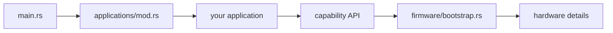

---

## Small glossary

### Application

The top-level firmware behavior selected for a build.

### Capability

A focused hardware/runtime API used by an application.

### Handle

A Rust value that gives the application access to a capability.

### View / screen

One visual part of an application.

### Cargo feature

A compile-time switch that selects capabilities and applications.

### Ownership

The Rust rule that a value has one owner at a time.

### Borrow

Temporary access to a value without taking ownership.

### `Option<T>`

A value that is either `Some(value)` or `None`.

### Async task

Code that can pause at `.await` so other work can run.

### CPU0

The CPU core that runs the selected application and presentation work.

### CPU1

The CPU core used for timing-sensitive capability runtime work such as sensors, touch, audio, and networking.

### PSRAM

Extra external RAM used for large data such as framebuffers and histories.

### RGB565

A 16-bit pixel format used by the display and camera.

### PCM

Raw audio samples. The speaker capability accepts signed 16-bit stereo PCM.

---

## Design rules to keep in mind

1. **One application owns the firmware behavior.**
2. **Applications own the capability handles they use.**
3. **Capabilities hide hardware details.**
4. **Screens and navigation belong to the application.**
5. **Message schemas belong to the application that understands them.**
6. **Shared UI code should stay reusable.**
7. **Application code should not touch HAL peripherals directly.**
8. **Keep ownership clear instead of adding global shared objects.**
9. **Yield regularly in CPU0 async loops.**
10. **Keep large buffers off the stack.**
11. **Prefer simple Rust over a framework until a framework is truly needed.**

The test for a good boundary is simple:

> You should normally be able to add a new application without changing a capability.

If you need a new hardware operation, improve the capability API.

If you only need new behavior, keep the change in the application.

---

## A final mental model

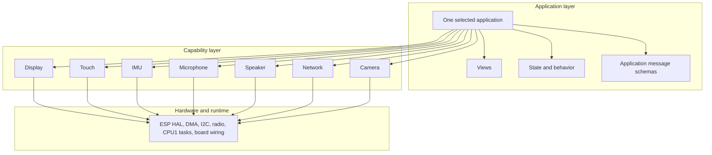

The application answers:

> **What should this device do?**

The capabilities answer:

> **How do I use this piece of hardware safely?**

Keeping those two questions separate is the core of the architecture.
