# 

## Hack and Hike 2026

Hack & Hike is firmware for the **M5Stack CoreS3 Lite**.

It is written in Rust and runs on the ESP32-S3.

This README is written for people who are still learning Rust. You do not need to understand every Rust feature before you start changing the firmware.

The main idea is simple:

> **One application owns the parts of the device that it needs.**

Those parts are called **capabilities**.

For example, an application can use the display, touch screen, IMU, microphone, speaker, network, or camera.

---

## Table of contents

- [The short version](#the-short-version)
- [Build the normal firmware](#build-the-normal-firmware)
- [The big picture](#the-big-picture)
- [Project folders](#project-folders)
- [What is an application?](#what-is-an-application)
- [What is a capability?](#what-is-a-capability)
- [How startup works](#how-startup-works)
- [CPU0 and CPU1](#cpu0-and-cpu1)
- [Cargo features](#cargo-features)
- [The Rust ideas you need](#the-rust-ideas-you-need)
- [How drawing works](#how-drawing-works)
- [How the stock application works](#how-the-stock-application-works)
- [Create your own application](#create-your-own-application)
- [Add more screens to your application](#add-more-screens-to-your-application)
- [Use background tasks](#use-background-tasks)
- [Headless applications](#headless-applications)
- [Memory and large buffers](#memory-and-large-buffers)
- [Common mistakes](#common-mistakes)
- [Where should my code go?](#where-should-my-code-go)
- [Suggested reading order](#suggested-reading-order)
- [Small glossary](#small-glossary)

---

## The short version

The firmware has two main layers:

1. **Capabilities** talk to hardware and provide simple Rust APIs.
2. **The application** decides what the device does.

There is only **one selected application** in a firmware build.

The application owns the capability handles that it needs.

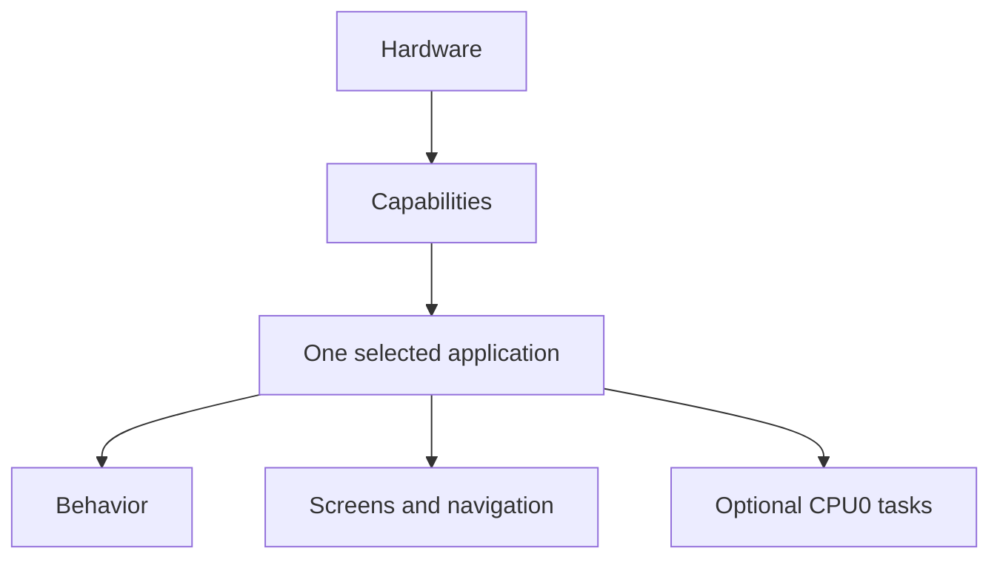

Examples:

- The IMU capability reads the motion sensors and gives the application measurements.
- The display capability owns the LCD and lets the application draw pixels.
- The touch capability gives the application touch points and press/release events.
- The camera capability gives the application camera frames.

The application does not need to know which I2C register contains an accelerometer value or which DMA channel is used by the display.

That low-level work stays inside the capability.

---

## Build the normal firmware

The normal build uses the stock application:

```bash
cargo build --release
```

This is the same as:

```bash
cargo build --release --no-default-features --features app-stock
```

The repository already sets the ESP32-S3 Rust target in `.cargo/config.toml`.

The Rust version used by the project is set in `rust-toolchain.toml`.

---

## The big picture

The program starts in `src/main.rs`.

`main.rs` is deliberately very small:

```rust
#[esp_rtos::main]
async fn main(cpu0_spawner: Spawner) -> ! {
    let bootstrap = firmware::bootstrap();
    applications::run(cpu0_spawner, bootstrap).await
}
```

This tells the whole story:

1. Start the hardware.
2. Create the enabled capabilities.
3. Give them to the selected application.
4. Run that application forever.

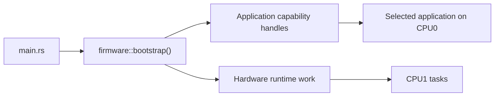

The application is the top-level owner of the device behavior.

There is no global application framework that decides how your application must look.

There is no required `Application` trait.

There is no required navigation system.

Your application can be one screen, many screens, or no screen at all.

---

## Project folders

The most important folders are:

```text
src/
├── main.rs
├── applications/
│   ├── mod.rs
│   └── stock/
│       ├── mod.rs
│       ├── navigation.rs
│       ├── design.rs
│       └── views/
├── capabilities/
│   ├── display/
│   ├── touch/
│   ├── imu/
│   ├── mic/
│   ├── speaker/
│   ├── network/
│   ├── camera/
│   └── audio/
├── firmware/
├── platform/
├── support/
└── ui/
```

### `src/applications/`

This is where device behavior belongs.

An application decides:

- what the device does,
- which screen is active,
- what touch means,
- when to update data,
- when to draw,
- how to combine several capabilities,
- which optional CPU0 tasks it wants to run.

The normal firmware is the `stock` application.

### `src/capabilities/`

This is where hardware-facing APIs live.

A capability hides low-level hardware work and gives the application useful values.

For example, the IMU capability gives values such as acceleration in `m/s²` and angles in degrees. Application code does not read BMI270 registers directly.

### `src/firmware/`

This folder connects real board hardware to capabilities.

`firmware::bootstrap()` takes ESP32-S3 peripherals, starts the required hardware, starts CPU1 when needed, and returns the application-facing handles.

You normally do **not** edit this folder when making a new application.

### `src/platform/`

This folder contains facts about the physical CoreS3 Lite board.

Examples are pins, power rails, reset lines, and shared I2C setup.

Application code should not depend on these details.

### `src/ui/`

This folder contains reusable drawing helpers.

It does **not** own the stock navigation.

A custom graphical application can use these helpers, or it can draw directly through the display capability.

### `src/support/`

This contains shared support code such as logging, memory helpers, diagnostics, and stack/heap monitoring.

---

## What is an application?

An application is the code that gives the device its purpose.

The stock application has several screens:

- Network
- IMU
- Microphone
- Speaker
- Camera
- Settings
- Log

These are **screens inside one application**.

They are not seven separate firmware applications.

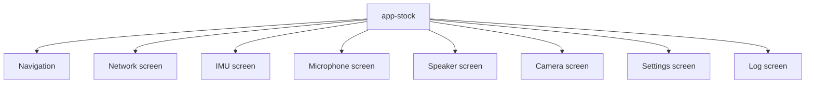

A different application does not have to use these screens or this navigation.

Your application can have a completely different layout.

It can also ignore `src/ui/` and draw pixels directly.

### One application per build

The selected application is chosen when the firmware is compiled.

The normal application feature is:

```toml
app-stock
```

There is also:

```toml
app-idle
```

`app-idle` is a very small application used for simple and headless builds.

If no application feature is selected, the firmware also falls back to the idle behavior. This is useful when checking one capability by itself.

---

## What is a capability?

A capability is a safe and focused way for the application to use one part of the device.

The current capabilities are:

| Feature | Rust handle | What the application gets |
| --- | --- | --- |
| `display` | `Display` | LCD drawing through bounded `Surface` values |
| `touch` | `Touch` | Touch points and press/release events |
| `imu` | `Imu` | Motion measurements and orientation |
| `mic` | `Microphone` | Stereo signed 16-bit PCM audio blocks |
| `speaker` | `Speaker` | Stereo signed 16-bit PCM audio output |
| `network` | `Network` | ESP-NOW peers and typed messages |
| `camera` | `Camera` | RGB565 camera frames |

A capability owns the hard hardware details.

Application code should use the capability API instead of using:

- `esp_hal` peripherals,
- DMA channels,
- raw GPIO numbers,
- chip registers,
- sensor register addresses,
- cross-core queues.

This keeps application code much easier to change.

### Example: IMU

The application sees code like this:

```rust
if let Some(sample) = imu.latest() {
    let roll = sample.orientation.roll_deg;
    let pitch = sample.orientation.pitch_deg;
    let yaw = sample.orientation.yaw_deg;
}
```

The application does not need to know how the BMI270 or BMM150 work.

It does not need to know which CPU reads them.

It does not need to know how the values cross from CPU1 to CPU0.

That is the job of the capability.

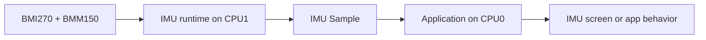

### One owner

Capability handles are normally moved into one application.

This is useful because there is one clear owner.

If several screens inside your application need the same information, your application decides how to share that information.

Do not make the hardware capability know about application screens.

---

## How startup works

The startup code is in `firmware::bootstrap()`.

It performs board setup and creates the enabled capability handles.

A simplified startup looks like this:

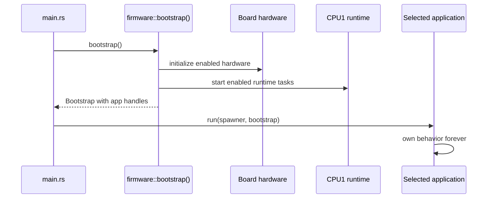

The returned value is called `Bootstrap`.

It contains fields only for capabilities that are enabled by Cargo features.

A stock build contains fields such as:

```rust
Bootstrap {
    display,
    touch,
    imu,
    microphone,
    speaker,
    network,
    camera,
    brightness,
    ..
}
```

The selected application takes ownership of this value.

It can then move each handle into the part of the application that needs it.

---

## CPU0 and CPU1

The ESP32-S3 has two CPU cores.

This firmware uses them for different kinds of work.

### CPU0

CPU0 runs the selected application.

This includes things such as:

- application logic,
- navigation,
- screen updates,
- display rendering,
- camera frame presentation,
- optional application tasks.

### CPU1

CPU1 runs hardware work that benefits from running separately from the UI loop.

Depending on enabled features, this includes:

- IMU acquisition,
- touch polling,
- microphone and speaker audio work,
- ESP-NOW networking,
- display brightness I2C work,
- runtime monitoring.

The camera data path is special. Camera capture and camera presentation are coordinated on CPU0 so camera work can be advanced while display DMA is busy.

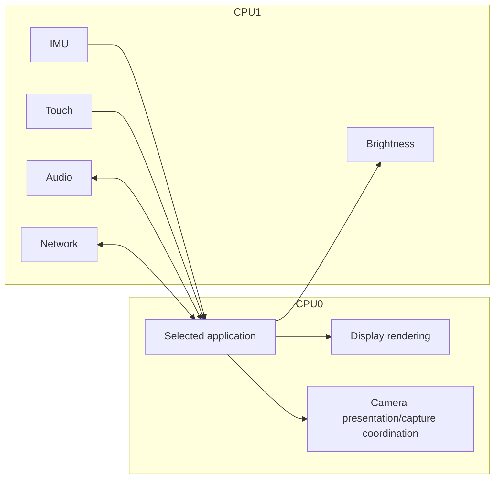

The important rule for application developers is:

> Use the capability handle. Do not try to manage CPU1 yourself for normal hardware access.

---

## Cargo features

Cargo features decide which code and hardware support are included in a build.

The hardware features are:

```text
display
touch
imu
mic
speaker
network
camera
```

There is also:

```text
ui
```

`ui` enables reusable graphical helpers and also enables `display`.

Application features are bundles of the capabilities that an application needs.

The stock application currently looks like this in `Cargo.toml`:

```toml
app-stock = [
    "ui",
    "touch",
    "imu",
    "mic",
    "speaker",
    "network",
    "camera",
]
```

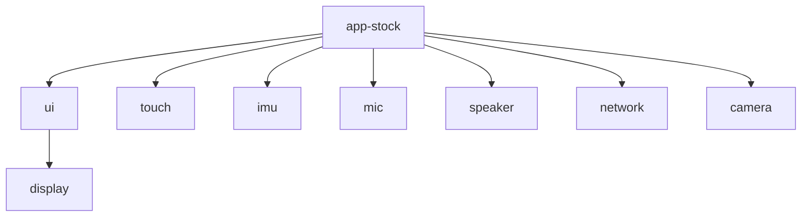

### Why use features?

If your application does not need the camera, you should not need camera hardware setup, camera buffers, or camera code in that build.

A small application can enable only what it needs.

For example:

```toml
app-my-hack = ["display", "imu"]
```

This says:

> My application needs the screen and the IMU. It does not need the other capabilities.

### `#[cfg(...)]`

You will see code like this:

```rust
#[cfg(feature = "imu")]
pub(crate) mod imu;
```

This means:

> Compile this module only when the `imu` feature is enabled.

You do not need to add `cfg` everywhere in application code. The application feature should enable the capabilities that the application always needs.

---

## The Rust ideas you need

You can work on this project without being a Rust expert.

A few ideas are especially important.

### Ownership

Rust values have an owner.

In this project, hardware capability handles also have one clear owner.

For example:

```rust
let Bootstrap { mut display, mut imu, .. } = bootstrap;
```

After this line, the application owns `display` and `imu`.

This is a good fit for hardware. There should not be five unrelated pieces of code all trying to control the same LCD at once.

### Moving a value

When you pass a value to another struct or function, Rust may **move** it.

Example:

```rust
let imu_view = ImuView::new(imu);
```

Now `imu_view` owns the `imu` handle.

The old variable cannot be used again.

That is normal.

### Borrowing with `&mut`

Sometimes code needs temporary access instead of ownership.

Example:

```rust
let mut surface = display.surface(region);
```

The `Surface` temporarily borrows the display.

While that surface exists, other code cannot also use the display mutably.

This prevents two pieces of code from sending conflicting LCD commands at the same time.

When the surface goes out of scope, the application can use the display again.

A small scope is often useful:

```rust
{
    let mut surface = display.surface(region);
    surface.render_scanlines(|_y, pixels| {
        pixels.fill(0x0000);
    });
}

// The Surface borrow ended here.
// `display` can be used again.
```

### `Option<T>`

`Option<T>` means a value may or may not be present.

It has two cases:

```rust
Some(value)
None
```

The IMU uses this pattern:

```rust
if let Some(sample) = imu.latest() {
    // A new sample is available.
}
```

If there is no new sample, `imu.latest()` returns `None`.

### `async` and `.await`

The application `run` function is async:

```rust
pub(crate) async fn run(...) -> !
```

An async function can pause at `.await` and let other work run.

Example:

```rust
Timer::after(Duration::from_millis(50)).await;
```

This is important on CPU0.

Do not write a forever loop that does heavy work and never reaches `.await`.

Bad:

```rust
loop {
    do_lots_of_work();
}
```

Better:

```rust
loop {
    do_a_small_amount_of_work();
    Timer::after(Duration::from_millis(10)).await;
}
```

The stock application also uses a very small yield delay for high-rate camera and IMU screens so other CPU0 tasks still get a chance to run.

### `-> !`

You will see:

```rust
async fn run(...) -> !
```

The `!` means the function never returns.

That is normal for firmware. The main application loop runs for as long as the device is powered.

### `pub(crate)`

You will often see:

```rust
pub(crate)
```

This means the item can be used by other modules inside this firmware crate, but it is not public to outside Rust crates.

### `no_std`

At the top of `main.rs` you will see:

```rust
#![no_std]
#![no_main]
```

This is embedded firmware, so it does not run with the normal desktop Rust standard library and desktop program entry point.

You can still use normal Rust ideas such as structs, enums, `Option`, iterators, modules, and async code.

---

## How drawing works

The display capability owns the physical LCD connection.

The application asks the display for a `Surface`.

A `Surface` is a rectangular part of the screen.

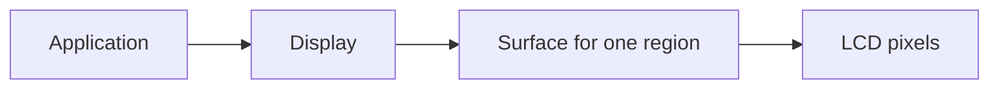

### Regions

A region is created with:

```rust
let region = Region::new(x, y, width, height);
```

The region checks that it fits inside the 320×240 display.

A surface created for that region cannot draw outside it.

This is useful for keeping different parts of a UI separate.

### Draw scanlines directly

The simplest low-level drawing style is:

```rust
let mut surface = display.surface(region);

surface.render_scanlines(|y, pixels| {
    // `pixels` is one row of RGB565 pixels.
    // Fill or change the row here.
});
```

This does not require a full-screen application framebuffer.

### Shared GUI helpers

If an application enables the `ui` feature, it can use `GuiSurface`.

`GuiSurface` owns a fixed RGB565 framebuffer in PSRAM. The application chooses its width and height.

The GUI is then copied into a bounded display surface.

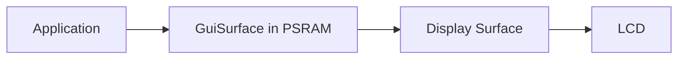

Using the shared GUI layer is optional.

The stock application uses it for several screens.

A small custom application can start with direct `Surface` rendering and add GUI helpers later.

### The stock navigation is not global

The 44-pixel stock navigation rail belongs to `applications/stock`.

A custom application does not have to use it.

You can use the full 320×240 screen if you want.

---

## How the stock application works

The normal application is in:

```text
src/applications/stock/
```

Its main file is:

```text
src/applications/stock/mod.rs
```

It owns:

- the display,
- touch input,
- the IMU handle,
- microphone input,
- speaker output,
- networking,
- camera control,
- brightness control,
- log input,
- navigation,
- all stock screen state.

The stock application moves some capability handles into the screen modules that use them.

For example, the IMU screen owns the IMU application handle.

The stock application keeps the camera handle at the application level because camera capture is tightly connected to display timing.

### Stock screen loop

A simplified stock loop looks like this:

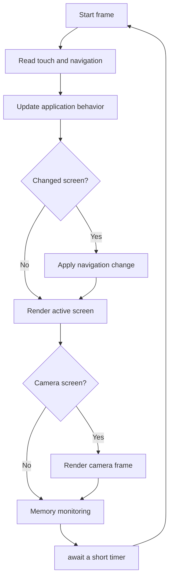

The navigation policy is part of the stock application. It is not part of the display capability and it is not part of a global firmware shell.

---

## Create your own application

This section walks through a small custom application from start to finish.

The example uses:

- the display,
- the IMU.

It fills the screen with one color when the IMU is running and another color while it is not ready.

It is intentionally simple. The goal is to show the architecture, not to build a pretty UI.

### Step 1: choose the capabilities

Ask what your application really needs.

For this example:

```text
display
imu
```

It does not need touch, audio, networking, or camera.

### Step 2: add an application feature

Open `Cargo.toml`.

Add:

```toml
app-my-hack = ["display", "imu"]
```

This application feature turns on both required capabilities.

If your application later needs touch:

```toml
app-my-hack = ["display", "touch", "imu"]
```

If it wants to use the shared GUI helpers:

```toml
app-my-hack = ["ui", "touch", "imu"]
```

Remember that `ui` already enables `display`.

### Step 3: create the application folder

Create:

```text
src/applications/my_hack/mod.rs
```

A small application can start as one file.

Do not create many layers before you need them.

### Step 4: register the application

Open:

```text
src/applications/mod.rs
```

Add the module:

```rust
#[cfg(feature = "app-my-hack")]
mod my_hack;
```

Then add a `run` branch:

```rust
#[cfg(feature = "app-my-hack")]
pub(crate) async fn run(spawner: Spawner, bootstrap: Bootstrap) -> ! {
    my_hack::run(spawner, bootstrap).await
}
```

The idle fallback must only compile when neither real application is selected:

```rust
#[cfg(not(any(feature = "app-stock", feature = "app-my-hack")))]
pub(crate) async fn run(_spawner: Spawner, bootstrap: Bootstrap) -> ! {
    let _bootstrap = bootstrap;

    loop {
        Timer::after(Duration::from_millis(100)).await;
    }
}
```

The `Timer` import needs the same condition:

```rust
#[cfg(not(any(feature = "app-stock", feature = "app-my-hack")))]
use embassy_time::{Duration, Timer};
```

Also extend the compile-time check so two applications cannot be selected together.

For this example:

```rust
#[cfg(any(
    all(feature = "app-stock", feature = "app-idle"),
    all(feature = "app-stock", feature = "app-my-hack"),
    all(feature = "app-idle", feature = "app-my-hack"),
))]
compile_error!("select exactly one application feature");
```

This explicit list is simple on purpose.

There is no application registry and no application trait.

### Step 5: write the application

Put this in:

```text
src/applications/my_hack/mod.rs
```

```rust
use embassy_executor::Spawner;
use embassy_time::{Duration, Timer};

use crate::{
    capabilities::{
        display::{HEIGHT, Region, WIDTH},
        imu::Status,
    },
    firmware::Bootstrap,
};

pub(crate) async fn run(_spawner: Spawner, bootstrap: Bootstrap) -> ! {
    // Take ownership of the capabilities this application needs.
    let Bootstrap {
        mut display,
        mut imu,
        ..
    } = bootstrap;

    let full_screen = Region::new(0, 0, WIDTH, HEIGHT);

    // RGB565 values.
    // 0x0000 = black
    // 0x07E0 = green
    // 0xF800 = red
    let mut screen_color = 0x0000;

    loop {
        // `latest()` gives us a new IMU sample if one arrived since the last read.
        if let Some(sample) = imu.latest() {
            screen_color = if sample.status == Status::Running {
                0x07E0
            } else {
                0xF800
            };
        }

        // Borrow the display only while we draw.
        {
            let mut surface = display.surface(full_screen);
            surface.render_scanlines(|_y, pixels| {
                pixels.fill(screen_color);
            });
        }

        // Give other CPU0 work a chance to run.
        Timer::after(Duration::from_millis(50)).await;
    }
}
```

This small application already follows the main project rules:

- it owns its capabilities,
- it does not access HAL hardware directly,
- it uses the semantic IMU API,
- it borrows the display only while drawing,
- it yields regularly with `.await`,
- it has no dependency on stock navigation.

### Step 6: build only your application

Run:

```bash
cargo build --release --no-default-features --features app-my-hack
```

`--no-default-features` is important here because the default feature selects `app-stock`.

Without it, Cargo would try to enable both the default stock app and your app.

### Step 7: follow the data flow

Your new application now works like this:

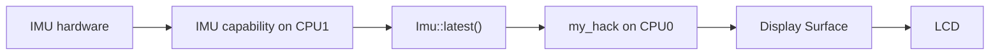

Notice what is missing from `my_hack`:

- no sensor register setup,
- no GPIO numbers,
- no I2C configuration,
- no DMA setup,
- no CPU1 synchronization code.

That is the main reason for the capability boundary.

### Step 8: grow the application slowly

Once the first version works, add structure only when it becomes useful.

A larger application might become:

```text
src/applications/my_hack/
├── mod.rs
├── state.rs
├── navigation.rs
└── views/
    ├── mod.rs
    ├── dashboard.rs
    └── compass.rs
```

This is not required.

Start small.

Split files when one file becomes difficult to read.

---

## Add more screens to your application

A screen is just application code.

You do not need a framework trait.

A simple application can use an enum:

```rust
enum View {
    Dashboard,
    Compass,
    Settings,
}
```

Then store the current view:

```rust
let mut view = View::Dashboard;
```

And render with a `match`:

```rust
match view {
    View::Dashboard => render_dashboard(...),
    View::Compass => render_compass(...),
    View::Settings => render_settings(...),
}
```

This is also how the stock application stays easy to follow: it uses explicit Rust code instead of a generic screen framework.

### Touch can change the view

The touch handle provides:

```rust
touch.next_edge()
```

for press/release events, and:

```rust
touch.take_latest_point()
```

for the latest touch position.

Your application decides what a touch means.

The touch capability does not know about buttons, menus, or screens.

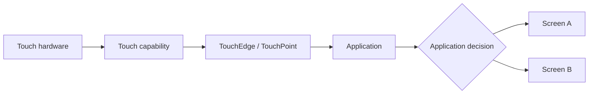

---

## Use background tasks

An application does not have to be one giant loop.

It may spawn extra CPU0 tasks when that makes the code clearer.

For example:

```text
Application main loop
├── rendering and touch
├── optional network behavior task
└── optional sound generation task
```

But do not create one task for every small function or every screen just because tasks exist.

A task is useful when some behavior has its own independent loop.

### Important: CPU0 tasks are cooperative

CPU0 tasks do not magically interrupt each other at any instruction.

They get a chance to run when the current async task reaches an `.await`.

That means every long-running CPU0 loop must yield regularly.

Good:

```rust
loop {
    update_some_state();
    Timer::after(Duration::from_millis(10)).await;
}
```

Be careful with:

```rust
loop {
    expensive_work();
}
```

A loop like that can stop other CPU0 tasks from running.

### Keep display ownership simple

Do not put `Display` behind a global mutex so many tasks can draw whenever they want.

A much simpler model is:

1. one application path owns `Display`,
2. other tasks update application state,
3. the render loop reads that state,
4. the render loop borrows a `Surface` and draws.

This keeps drawing order clear and avoids hard-to-debug display races.

---

## Headless applications

An application does not need a display.

A headless application simply leaves `display` out of its feature list.

For example:

```toml
app-sensor-node = ["imu", "network"]
```

Its application could read IMU samples and send messages without drawing anything.

The existing idle application can also be built with capabilities for composition checks:

```bash
cargo build --release --no-default-features --features app-idle,imu,network
```

CPU1 still runs the enabled hardware runtimes while the idle foreground application keeps ownership of the application-facing handles.

---

## Memory and large buffers

Embedded devices have much less internal RAM than desktop computers.

The CoreS3 Lite also has PSRAM, which this project uses for large long-lived data.

Examples include:

- GUI framebuffers,
- camera frame buffers,
- microphone history,
- log history.

### Avoid huge local arrays

Do not put a very large buffer inside a function as a local variable unless you know it is safe.

For example, a full 320×240 RGB565 image needs about 150 KiB.

That is much too large for a normal task stack.

Bad idea:

```rust
let frame = [0u8; 320 * 240 * 2];
```

The project already denies large stack frames with Clippy because stack space is precious.

If you need large storage, look at existing PSRAM-backed code in `support::memory` and the stock views before inventing a new allocation pattern.

### Small state is fine

Values such as these are normal application state:

```rust
struct State {
    selected_view: View,
    last_roll: f32,
    connected: bool,
}
```

Do not overthink small structs.

---

## Camera path

The camera is worth mentioning because it is the most performance-sensitive display path.

The GC0308 produces QVGA RGB565 frames.

The firmware keeps two PSRAM camera frame buffers.

While one frame is shown, capture of the next frame can move forward during LCD DMA wait time.

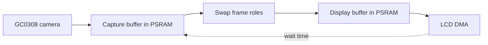

This avoids adding another complete application framebuffer to the camera path.

If you build a custom camera application, start by reusing the existing `Camera`, `Frame`, and display `Surface` APIs. Do not copy the camera data into another full-size frame unless you really need to.

---

## Common mistakes

### Putting application behavior in a capability

Avoid code like:

```text
capabilities/imu/menu.rs
capabilities/network/chat_screen.rs
```

The IMU capability should know about IMU data.

The network capability should know about network data.

Menus and screens belong to the application.

### Accessing HAL hardware from an application

If your application starts importing ESP HAL peripherals, raw GPIO types, DMA channels, or board register code, stop and check the design.

Usually the application should ask a capability to provide the operation it needs.

### Adding a global application framework too early

You do not need an `Application` trait just because several applications have a `run` function.

You do not need a generic `View` trait just because several screens can render.

Simple enums, structs, functions, and `match` statements are preferred until real duplication proves that an abstraction helps.

### Forgetting `--no-default-features`

When building a custom application, use:

```bash
cargo build --release --no-default-features --features app-my-hack
```

The default build selects `app-stock`.

### Never yielding in an async loop

A loop that never reaches `.await` can starve other CPU0 tasks.

Add regular yield points.

### Sharing one hardware handle everywhere

Start with one clear owner.

If several parts of your application need the same information, share **application state** where possible instead of sharing the hardware handle itself.

### Putting large data on the stack

Keep big framebuffers and histories out of local stack variables.

Use the existing PSRAM patterns.

---

## Where should my code go?

Use this guide when you are unsure.

| I want to... | Put it in... |
| --- | --- |
| Create a new device experience | `src/applications/my_app/` |
| Add a screen to the stock firmware | `src/applications/stock/views/` |
| Change stock navigation | `src/applications/stock/navigation.rs` |
| Add a reusable drawing helper | `src/ui/` |
| Expose a new useful hardware operation | the matching `src/capabilities/.../` module |
| Change sensor register setup | the matching capability |
| Change board pins, reset lines, or power wiring | `src/platform/` |
| Change how capabilities are wired at boot | `src/firmware/` |
| Add logging or memory support | `src/support/` |

A useful rule is:

> If the code describes **what the product should do**, it probably belongs in an application.
>
> If the code describes **how a hardware function works**, it probably belongs in a capability.

---

## Suggested reading order

If this is your first time in the repository, do not start by reading every hardware driver.

A better order is:

1. `src/main.rs`
2. `src/applications/mod.rs`
3. `src/applications/stock/mod.rs`
4. `Cargo.toml`
5. one simple capability API, such as `src/capabilities/imu/mod.rs`
6. its application-facing channel file, such as `src/capabilities/imu/channels.rs`
7. `src/capabilities/display/mod.rs`
8. `src/firmware/bootstrap.rs`
9. low-level drivers only when you need them

This lets you understand the shape of the program before reading chip-specific code.

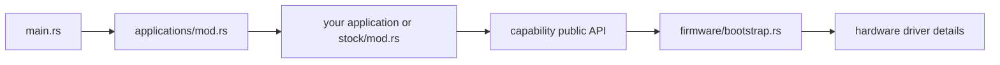

---

## Small glossary

### Application

The top-level firmware behavior selected for a build.

Exactly one application should be active.

### Capability

A focused hardware/runtime API used by an application.

Examples are `Imu`, `Display`, and `Network`.

### Handle

A Rust value that gives your application access to a capability.

Examples are `Imu`, `Touch`, and `Speaker`.

### View / screen

One visual part of an application.

The stock application has several views.

### Cargo feature

A compile-time switch.

Features decide which capabilities and application are included.

### Ownership

The Rust rule that a value has one owner at a time.

This project uses ownership to make hardware access clear.

### Borrow

Temporary access to a value without taking ownership.

A display `Surface` borrows the `Display`.

### `Option<T>`

A value that may be `Some(value)` or `None`.

### Async task

Code that can pause at `.await` so other work can run.

### CPU0

The CPU core that runs the selected application and presentation work.

### CPU1

The CPU core used for timing-sensitive capability runtime work such as sensors, touch, audio, and networking.

### PSRAM

Extra external RAM used for large data such as framebuffers and histories.

### RGB565

A 16-bit pixel format used by the display and camera.

---

## Design rules to keep in mind

The project tries to stay easy to hack on.

The main rules are:

1. **One application owns the firmware behavior.**
2. **Applications own the capability handles they use.**
3. **Capabilities hide hardware details.**
4. **Screens and navigation belong to the application.**
5. **Shared UI code should stay reusable.**
6. **Application code should not touch HAL peripherals directly.**
7. **Keep ownership clear instead of adding global shared objects.**
8. **Yield regularly in CPU0 async loops.**
9. **Keep large buffers off the stack.**
10. **Prefer simple Rust over a framework until a framework is truly needed.**

The test for a good application boundary is simple:

> You should normally be able to add a new application without changing a capability.

If you need a new hardware operation, improve the capability API. If you only need new behavior, keep the change in the application.

---

## A final mental model

When you are lost in the code, come back to this picture:

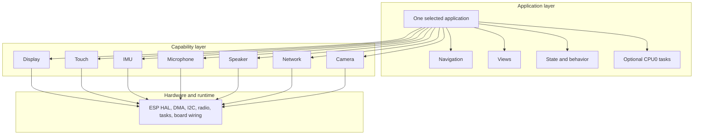

The application answers:

> **What should this device do?**

The capabilities answer:

> **How do I use this piece of hardware safely?**

Keeping those two questions separate is the core of the architecture.
