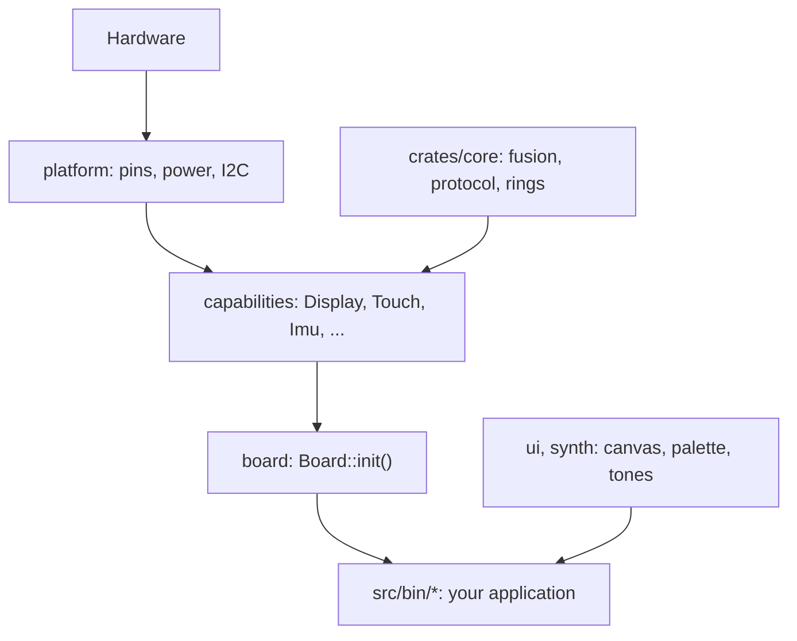
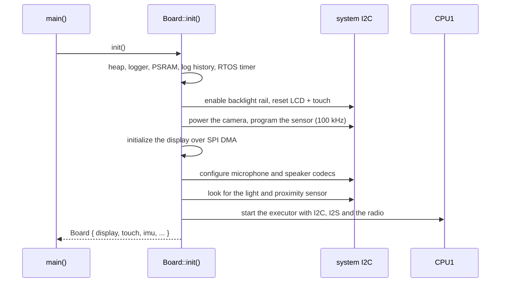
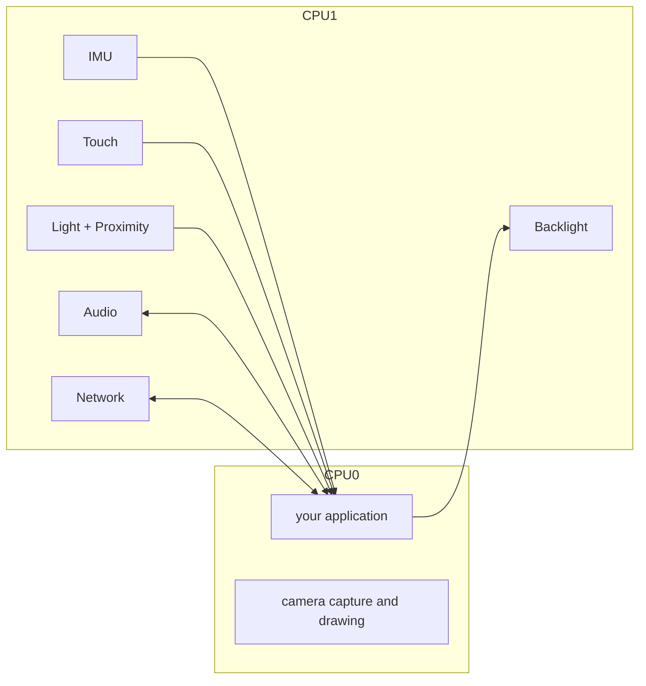
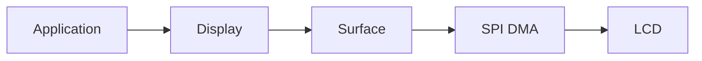
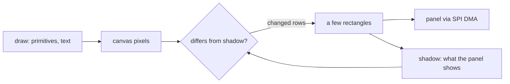
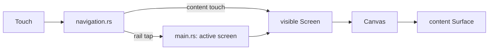
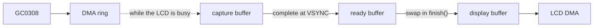

# Architecture

How the Hack & Hike firmware is put together. The [README](../README.md)
gets you building and explains the Rust you will meet; this document explains
the machinery underneath.

- [The layers](#the-layers)
- [What `Board::init()` does](#what-boardinit-does)
- [CPU0 and CPU1](#cpu0-and-cpu1)
- [How a capability is built](#how-a-capability-is-built)
- [Drawing](#drawing)
- [The demo application](#the-demo-application)
- [Cooperative scheduling](#cooperative-scheduling)
- [Memory and PSRAM](#memory-and-psram)
- [The camera path](#the-camera-path)
- [The network protocol](#the-network-protocol)
- [Tests and the core crate](#tests-and-the-core-crate)
- [Common mistakes](#common-mistakes)
- [Glossary](#glossary)
- [Design rules](#design-rules)

## The layers



| Layer | Path | Owns |
| --- | --- | --- |
| Application | `src/bin/` | What the board does: screens, rules, message types |
| Board | `src/board/` | The power-up order and the second CPU core |
| Capabilities | `src/capabilities/` | One hardware function each, behind a small handle |
| Core | `crates/core/` | Math, protocol and buffer code with no hardware dependency, tested on the host |
| Platform | `src/platform/` | Facts about the PCB: pins, power rails, reset lines, the I2C bus, register access |
| Support | `src/support/` | Logging with on-device history, PSRAM allocation helpers |
| UI and synth | `src/ui/`, `src/synth.rs` | Canvas, palette, text helpers, a slider, the `embedded-gui` glue; sine waves |

Dependencies point downwards only. An application never imports `esp_hal`; a
capability never knows what a screen is.

## What `Board::init()` does



The order matters because several chips share one I2C bus and the camera
needs a slower bus during its setup. All of that stays inside `src/board/`
and `camera::bring_up`.

Bring-up fails fast: a chip that does not answer panics with a message naming
it, because the board is unusable without it. The camera and the light and
proximity sensor are the exceptions and come back as `None`.

## CPU0 and CPU1

The ESP32-S3 has two cores.

**CPU0** runs your application: your loop, drawing, and any tasks you spawn.

**CPU1** runs the timing-sensitive work behind the capabilities:

- IMU acquisition and sensor fusion at 100 Hz,
- touch polling,
- ambient light and proximity readings at 10 Hz (one chip, one task, two
  handles),
- microphone capture and speaker playback (I2S DMA),
- ESP-NOW beacons, sending and receiving,
- backlight changes over I2C.



The camera is the one capability that runs on CPU0: its frames are drained
while the display DMA is busy, which only works from the drawing loop. The
sensor streams continuously into a ring of a few milliseconds, so the demo
also calls `camera.pump()` on every iteration and does not pause the loop
while the camera is visible (`Screen::may_idle`).

You never talk to CPU1 directly. Every handle method returns immediately; it
reads from or writes to a queue or a "latest value" slot shared between the
cores. The exceptions are on CPU0 itself: drawing waits for the SPI DMA to
finish, and `frame.finish()` waits for the sensor's next frame unless one
completed while drawing. Both block your loop for milliseconds, which is why
the loop draws only when something changed.

## How a capability is built

Every CPU1 capability has at least these two files (the IMU and the audio
capability add chip drivers next to them):

- `mod.rs`: the public types, the **handle** (`Touch`, `Imu`, ...) that the
  application owns and calls, a `static SERVICE` holding the cross-core
  queues or signals, a `pub(crate) Runtime` (the CPU1 side of the same
  queues), and `endpoints()`, which hands the handle (audio: two, microphone
  and speaker) and the runtime to `Board::init()`.
- `runtime.rs`: `spawn(spawner, hardware, runtime)`, plus configuration
  where the chip needs it, and the task that talks to the chip.

Data crosses the cores in one of two ways:

| Pattern | Used by | Application sees |
| --- | --- | --- |
| Latest value (`Signal`) | IMU, light and proximity samples, network snapshots; in the other direction, backlight requests | `latest()` returns `Some` only once per new value; `set` replaces a request not yet applied |
| Bounded queue (`Channel`) | touch events, network messages, microphone blocks | `next_*()` returns events in order. When a queue is full, the microphone drops its oldest block; touch and network drop the newest event and count it |

The speaker is the reverse direction: the application writes into a
`FrameRing` that CPU1 drains into the DMA buffer. Only the application writes,
so a write of at most `available_frames()` frames is always accepted in full.

The display and the camera are CPU0 capabilities: their handles drive the
hardware directly, with DMA, from the application's own loop.

## Drawing

The display capability owns the LCD. An application borrows a `Surface` for
one `Rectangle` and draws inside it; nothing can escape the rectangle, and a
rectangle outside the panel is a panic at the point where it is used.



There are two ways to draw:

- `surface.render_scanlines(|y, row| ...)` hands you one row of `Rgb565`
  pixels at a time. Cheap and simple for plain fills; the demo's navigation
  rail uses it.
- `surface.render_from(&mut source)` streams rows that already are RGB565
  bytes from a `ScanlineSource`, such as a camera frame. While the DMA
  sends one batch, the source gets a callback in which it can do useful work,
  which is how the camera captures its next frame.

Both go through the same pipeline: rows are sent to the panel in batches of
seven through two alternating DMA buffers, so the CPU prepares the next batch
while the previous one is on the wire. The clock is 40 MHz, which puts a
full frame at about 31 ms; the ESP32-S3 could go to 80 MHz, but this panel
shows noise at that rate. Drawing fast therefore means sending little.

### The `Canvas`

A `Canvas` is the usual way to draw text and shapes. It holds two images in
PSRAM: what the application drew, and a *shadow* of what the panel shows.



`canvas.show(&mut surface)` compares the area touched since the last `show`
with the shadow, groups the rows that changed into a few rectangles and
sends only those. An application can therefore clear and redraw its whole
picture whenever something changes: identical pixels are never sent, and a
changed number costs a millisecond instead of a full frame.
`canvas.clear(color)` with the same colour as last time only repaints what
was drawn since.

The shadow is only right while nothing else draws on the same part of the
panel. After `render_scanlines`, a camera frame or another canvas drew there,
`canvas.invalidate()` makes the next `show` send everything; the demo calls
it whenever the visible screen changes.

### The `ui` module

`src/ui/` is optional:

- `Canvas`: an `embedded_graphics::DrawTarget` in PSRAM that sends only
  changed pixels, described above.
- `theme`: the six palette colours as `Rgb565`.
- `common`: text helpers and the bitmap fonts at native resolution.
- `font`: the same fonts adapted for `embedded-gui`, anchored at the top-left
  corner of their rectangle.
- `widgets::Slider`: a touch-friendly slider.
- `gui`: the `embedded-gui` context type, KDL slots as `Rectangle`s, and the
  forwarding of `TouchEvent`s to buttons.
- `styles`: `embedded-gui` styles in the palette, referenced from KDL files.

## The demo application

`src/bin/demo/` is the full firmware. Its shell (`main.rs`) does three things
per loop iteration: route touches, update every screen, draw the visible one.



Every screen implements one trait:

```rust
pub(crate) trait Screen {
    fn enter(&mut self) {}
    fn leave(&mut self) {}
    fn update(&mut self, _now: Instant) {}
    fn may_idle(&self) -> bool { true }
    fn handle_touch(&mut self, _event: TouchEvent) {}
    fn present(&mut self, canvas: &mut Canvas, surface: &mut Surface<'_>);
}
```

`update` runs for every screen on every iteration, visible or not; that is
how the Speaker screen keeps playing while you look at the Log. `present` runs
only for the visible screen and should return immediately when nothing
changed. After it, the loop pauses for 2 ms unless the visible screen's
`may_idle` says no: the camera screen does, because the sensor's DMA ring
overflows within a few milliseconds. Touches arrive in content coordinates:
the rail's width is already subtracted.

To add a screen: write a type that implements `Screen`, add a field to
`Screens` and a variant to `ViewId` in `navigation.rs` with a 16x16 icon.
Copy `screens/settings/` first; it has a KDL layout, a slider and one handle.

### Layout files (KDL)

A screen describes its static layout in a `.kdl` file next to its code. The
`embedded_gui::include_gui!` macro turns it into Rust at compile time.

```kdl
screen id="Settings" width=276 height=240 {
    grid cols="48px 1fr 48px" rows="20px 20px 52px 18px 20px 1fr" gap=8 padding=12 {
        label id="title" text="SETTINGS" col=0 row=0 col_span=3 style="crate::styles::title()"
        label id="brightness_value" text="" col=0 row=1 col_span=3
        label id="brightness_slider" text="" col=0 row=2 col_span=3
        label id="minimum" text="DIM" col=0 row=3 style="crate::styles::hint()"
        label id="maximum" text="MAX" col=2 row=3 style="crate::styles::hint()"
        label id="hint" text="Tap or drag to adjust" col=0 row=4 col_span=3 style="crate::styles::hint()"
    }
}
```

A button is one more node, for example
`button id="play" text="PLAY" col=0 row=2 style="crate::styles::button()"`
in the Speaker screen. Each screen checks at compile time that its KDL size
matches the content area.

Rules that follow from how `embedded-gui` 0.2.6 works:

- **Labels and buttons come from KDL.** `label` nodes carry their text;
  `button` nodes react to touches. Deliver touches with
  `gui::click_buttons(gui, event, ...)`, which calls you back with the id of
  each clicked button.
- **Text must be a string literal or another `&'static str`.** Change it with
  `gui::set_text(...)`. Numbers that change go into a value label
  (`gui::add_value_label(...)` and `gui::set_value(...)`).
- **Anything dynamic or free-form is drawn by you** into an empty
  `label text=""` slot: the waveform, the peer list, the horizon, the slider.
  `gui::slot(gui, id)` gives you its `Rectangle`.
- **Sliders are ours.** The crate's slider cannot be dragged with a finger, so
  `ui::widgets::Slider` draws into a slot and maps touches itself.
- Styles are referenced as `style="crate::styles::title()"`; the demo
  re-exports `hack_and_hike::ui::styles` under that name because the code
  generator only passes `crate::` paths through verbatim.
- **Fonts come from `ui::font`, not straight from `embedded-graphics`.**
  `embedded-gui` draws an `embedded-graphics` font on its alphabetic baseline,
  which puts the glyphs one ascent above the rectangle they belong to.
  `ui::font::TopAnchored` draws from the top-left corner instead, so widget
  text lines up with everything drawn by `ui::common`.

Each screen's GUI context is allocated once in PSRAM (`gui::context`) because
it is about 20 KiB.

## Cooperative scheduling

CPU0 runs an async executor. Tasks switch only at `.await` points, so a loop
that never awaits starves everything else on the core, including the display.

Good:

```rust
loop {
    update_some_state();
    Timer::after(Duration::from_millis(10)).await;
}
```

Bad:

```rust
loop {
    expensive_work();
}
```

Start with one loop, like Color Ping: touch, network, audio and drawing each
advance a little per iteration. Spawn a separate task only for behaviour with
a truly independent rhythm. Keep the display with one owner; other code changes
state, the drawing code reads it.

## Memory and PSRAM

Internal RAM is small (two heaps of about 72 KiB each) and the CPU1 task
stack is 16 KiB. The board also has megabytes of PSRAM, which the firmware
uses for large long-lived buffers:

- every `Canvas` and the per-screen GUI contexts,
- the three camera frame buffers,
- the log history.

`support::memory::storage` has the two helpers: `leaked_slice` for a buffer
and `leaked_value` for one large object, both living as long as the device.

Do not put a large array on the stack:

```rust
let frame = [0u8; 320 * 240 * 2]; // 150 KiB on a 16 KiB stack
```

Small fixed arrays are fine; Color Ping keeps a 128-frame audio chunk.

## The camera path

The GC0308 sensor delivers QVGA RGB565 frames over an 8-bit parallel bus into
a small internal DMA ring. Three PSRAM buffers decouple sensor timing from
LCD timing: while one frame is shown, the next is drained from the ring during
LCD DMA wait time. Drawing a frame takes longer than the sensor needs to send
one, so a frame often completes while the previous one is still on its way to
the LCD; it waits in the ready buffer and capture continues, because the ring
holds only a few milliseconds and the sensor never pauses.



`camera.begin_frame()` gives you the newest complete frame; drawing it with
`surface.render_from(&mut frame)` pumps the ring; `frame.finish()` swaps in
the frame that completed meanwhile, or waits for the sensor's next VSYNC.
Between `finish` and the next `begin_frame` nothing drains the ring, so call
`camera.pump()` wherever the loop does other work, and do not sleep between
frames. A camera application should reuse this path rather than copying
frames.

## The network protocol

All boards use ESP-NOW on one Wi-Fi channel. Every board broadcasts a beacon
four times a second; boards that hear each other become peers, and a peer
that stays silent for half a second is forgotten.

An application message is the `postcard` encoding of the application's type,
wrapped in a small header: protocol version, sender, optional recipient and
the **message kind**, a 32-bit hash of the name the application gave the type
through `impl Message for T { const NAME: &'static str = "..."; }`. A board
decodes a message only into a type with the same kind, and a payload with
unused trailing bytes is rejected too, so two teams' messages cannot be
confused even when their bytes happen to match.

The format and the peer table live in `crates/core/src/network/` and are
tested there; the radio itself is `src/capabilities/network/runtime.rs`.

## Tests and the core crate

Code that needs no hardware lives in `crates/core`:

| Module | Contents |
| --- | --- |
| `imu` | vector helpers, sensor fusion, magnetometer compensation and calibration |
| `network` | wire protocol, typed messages, peer table |
| `audio` | the speaker's `FrameRing`, the IMA ADPCM decoder |
| `light` | decoding of the light and proximity sensor's data, the lux formula, the proximity scale |
| `lines` | the log history |
| `touch` | decoding of the touch controller's report |

It is a `no_std` library the firmware depends on, and it has ordinary tests:

```bash
./scripts/test.sh
```

The script passes your computer's target to `cargo test` because the repository
targets the ESP32-S3 by default. CI runs it, and clippy, on every push.

## Common mistakes

**Application rules inside a capability.** A `ColorPing` message type or a
"tap means select" rule describes an application, not hardware; it belongs in
`src/bin/`.

**Touching the HAL from an application.** If your application imports
`esp_hal`, a capability is probably missing an operation. Add it there.

**A framework before it is needed.** The demo's `Screen` trait is six methods
and exists because seven screens share them. Two screens do not need a trait.

**A loop without `.await`.** It starves the rest of CPU0.

**Sharing a hardware handle everywhere.** Give it one owner and share state
instead.

**Large arrays on the stack.** Use PSRAM through `support::memory::storage`.

**A message name shared with another team.** The kind is derived from the
name, so two applications with `NAME = "hello"` will decode each other's
bytes. Put your team in the name.

## Glossary

- **Application**: one binary in `src/bin/`; what the board does.
- **Capability**: one hardware function behind a small handle.
- **Handle**: the value an application owns to use a capability.
- **Runtime**: the CPU1 side of a capability; never seen by applications.
- **Screen**: one view of the demo, implementing the `Screen` trait.
- **Surface**: a borrowed rectangle of the display.
- **Canvas**: an image in PSRAM to draw on, then show on a surface.
- **PSRAM**: external RAM for large buffers.
- **RGB565**: the 16-bit pixel format of the display and the camera.
- **ESP-NOW**: connectionless Wi-Fi messaging between nearby boards.
- **Message kind**: the hash of a message type's name, sent with every
  message so that applications only decode their own.
- **KDL**: the small document language the demo uses for screen layouts.

## Design rules

1. An application owns the handles it uses; everything else is dropped.
2. Capabilities hide hardware details and stay generic.
3. Screens, navigation and message types belong to the application.
4. One owner per hardware handle; share state, not handles.
5. Yield regularly in CPU0 loops.
6. Large buffers live in PSRAM, never on a stack.
7. Logic that can be tested on the host lives in `crates/core`.
8. Prefer plain structs, enums and functions; add a trait when several types
   really share it.

When unsure where code belongs, ask two questions:

> **What should this board do?** An application.
>
> **How does this hardware work?** A capability.
