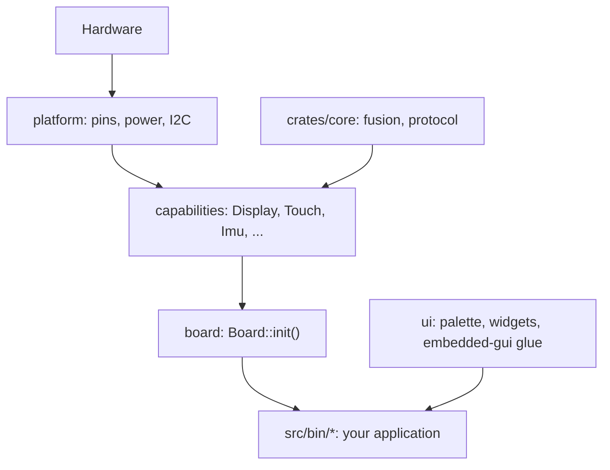
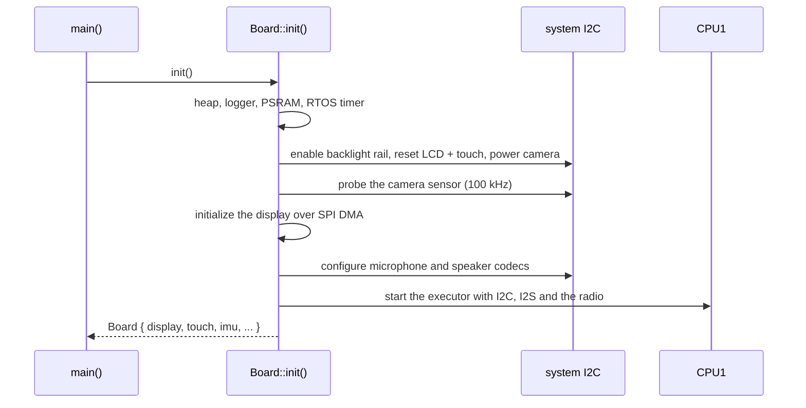
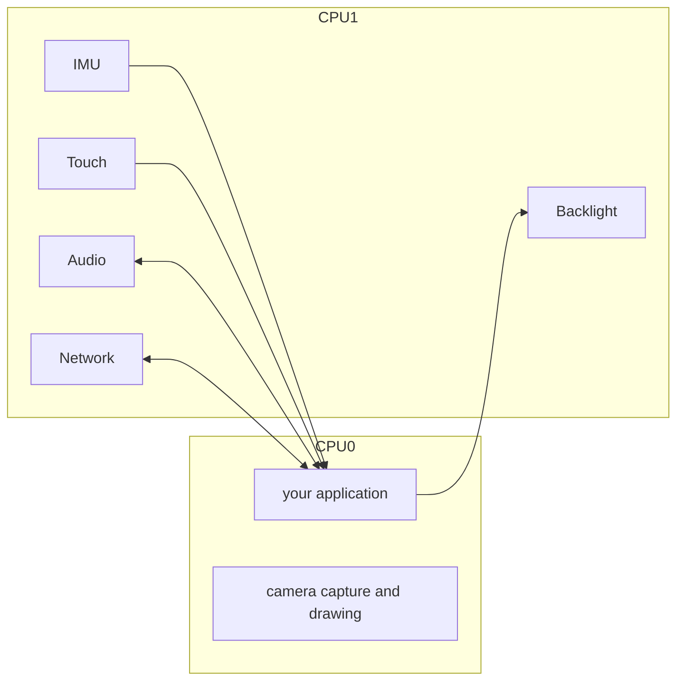
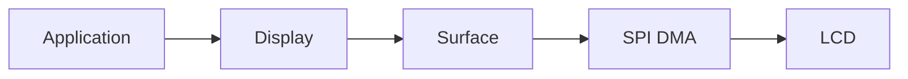
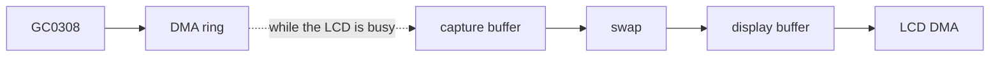

# Architecture

How the Hack & Hike firmware is put together. The [README](../README.md)
gets you building; this document explains the machinery underneath.

- [The layers](#the-layers)
- [What `Board::init()` does](#what-boardinit-does)
- [CPU0 and CPU1](#cpu0-and-cpu1)
- [How a capability is built](#how-a-capability-is-built)
- [Drawing](#drawing)
- [The demo application](#the-demo-application)
- [Cooperative scheduling](#cooperative-scheduling)
- [Memory and PSRAM](#memory-and-psram)
- [The camera path](#the-camera-path)
- [Tests and the core crate](#tests-and-the-core-crate)
- [The Rust ideas you will meet](#the-rust-ideas-you-will-meet)
- [Common mistakes](#common-mistakes)
- [Glossary](#glossary)
- [Design rules](#design-rules)

## The layers



| Layer | Path | Owns |
| --- | --- | --- |
| Application | `src/bin/` | What the device does: screens, rules, message types |
| Board | `src/board/` | The power-up order and the second CPU core |
| Capabilities | `src/capabilities/` | One hardware function each, behind a small handle |
| Core | `crates/core/` | Math and protocol code with no hardware dependency, tested on the host |
| Platform | `src/platform/` | Facts about the PCB: pins, power rails, reset lines, the I2C bus |
| Support | `src/support/` | Logging with on-device history, PSRAM allocation helpers |
| UI | `src/ui/` | Palette, drawing helpers, a slider widget, the `embedded-gui` glue |

Dependencies point downwards only. An application never imports `esp_hal`; a
capability never knows what a screen is.

## What `Board::init()` does



The order matters because several chips share one I2C bus and the camera
needs a slower bus during its setup. All of that stays inside `src/board/`.

Bring-up fails fast: a chip that does not answer panics with a message naming
it, because the board is unusable without it. The camera is the exception and
comes back as `None`.

## CPU0 and CPU1

The ESP32-S3 has two cores.

**CPU0** runs your application: your loop, drawing, and any tasks you spawn.

**CPU1** runs the timing-sensitive work behind the capabilities:

- IMU acquisition and sensor fusion at 100 Hz,
- touch polling,
- microphone capture and speaker playback (I2S DMA),
- ESP-NOW beacons, sending and receiving,
- backlight changes over I2C.



The camera is the one capability that runs on CPU0: its frames are drained
while the display DMA is busy, which only works from the drawing loop.

You never talk to CPU1 directly. Every handle method returns immediately; it
reads from or writes to a queue or a "latest value" slot shared between the
cores. The exceptions are on CPU0 itself: drawing waits for the SPI DMA to
finish, and a camera frame waits for the sensor's VSYNC. Both block your loop
for milliseconds, which is why the loop draws only when something changed.

## How a capability is built

Every capability follows the same shape, documented once in
`src/capabilities/mod.rs`:

- a `static SERVICE` holding the cross-core queues or signals,
- a **handle** (`Display`, `Touch`, `Imu`, ...): the public type the
  application owns and calls,
- a `pub(crate) Runtime`: the CPU1 side that talks to the hardware,
- `endpoints()`, which hands one of each to `Board::init()`.

Data crosses the cores in one of two ways:

| Pattern | Used by | Application sees |
| --- | --- | --- |
| Latest value (`Signal`) | IMU samples, network snapshots, backlight requests | `latest()` returns `Some` only once per new value |
| Bounded queue (`Channel`) | touch events, network messages, microphone blocks | events wait until read; the oldest is dropped when the queue is full |

The speaker is the reverse direction: the application writes into a ring that
CPU1 drains into the DMA buffer. Only the application writes, so a write of at
most `available_frames()` frames is always accepted in full.

## Drawing

The display capability owns the LCD. An application borrows a `Surface` for
one `Region` and draws inside it; nothing can escape the rectangle.



There are two ways to draw:

- `surface.render_scanlines(|y, pixels| ...)` hands you one row of 16-bit
  pixels at a time. Cheap and simple; both small applications use it.
- `surface.render_from(&mut source)` streams rows that already are RGB565
  bytes from a `ScanlineSource`, for example a framebuffer or a camera frame.
  While the DMA sends one batch, the source gets a callback in which it can do
  useful work, which is how the camera captures its next frame.

Rows are sent to the panel in batches through two alternating DMA buffers, so
the CPU prepares the next batch while the previous one is on the wire.

### The `ui` module

`src/ui/` is optional and used by the demo:

- `theme`: the six palette colours, as `Rgb565` and as raw pixels.
- `common`: fill, outline, text helpers on a `Rect`, using the bitmap fonts at
  native resolution.
- `font`: the same fonts adapted for `embedded-gui`, anchored at the top-left
  corner of their rectangle.
- `widgets::Slider`: a touch-friendly slider.
- `gui`: a `GuiSurface` framebuffer the size of the content area, the
  `embedded-gui` context type, and `Pointer` for forwarding touches.
- `styles`: `embedded-gui` styles in the palette, referenced from KDL files.

## The demo application

`src/bin/demo/` is the full firmware. Its shell (`main.rs`) does three things
per loop iteration: route touches, update every screen, draw the visible one.


Every screen implements one trait:

```rust
pub(crate) trait Screen {
    fn enter(&mut self) {}
    fn leave(&mut self) {}
    fn update(&mut self, _now: Instant) {}
    fn handle_pointer(&mut self, _pointer: Pointer) {}
    fn present(&mut self, gui: &mut GuiSurface, surface: &mut Surface<'_>);
}
```

`update` runs for every screen on every iteration, visible or not; that is
how the Speaker screen keeps playing while you look at the Log. `present` runs
only for the visible screen and should return immediately when nothing changed.

To add a screen: write a type that implements `Screen`, add a field to
`Screens` and a variant to `ViewId` in `navigation.rs` with a 16x16 icon.
Copy `screens/settings/` first; it has a KDL layout, a slider and one handle.

### Layout files (KDL)

A screen describes its static layout in a `.kdl` file next to its code. The
`embedded_gui::include_gui!` macro turns it into Rust at compile time.

```kdl
screen id="Settings" width=276 height=240 {
    grid cols="48px 1fr 48px" rows="20px 20px 52px 18px 20px 1fr" gap=8 padding=12 {
        label id="title" text="SETTINGS" col=0 row=0 col_span=3 style="crate::styles::title()"
        label id="brightness_value" text="" col=0 row=1 col_span=3
        label id="brightness_slider" text="" col=0 row=2 col_span=3
        label id="hint" text="Tap or drag to adjust" col=0 row=4 col_span=3 style="crate::styles::hint()"
    }
}
```

A button is one more node, for example
`button id="play" text="PLAY" col=0 row=2 style="crate::styles::button()"`
in the Speaker screen.

Rules that follow from how `embedded-gui` 0.2.6 works:

- **Labels and buttons come from KDL.** `label` nodes carry their text;
  `button` nodes react to touches. Deliver touches with
  `gui::click_buttons(...)`, which calls you back with the id of each clicked
  button.
- **Text must be a string literal or another `&'static str`.** Change it with
  `gui::set_text(...)`. Numbers that change go into a `value_label`
  (`gui.add_value_label(...)` and `gui::set_value(...)`).
- **Anything dynamic or free-form is drawn by you** into an empty
  `label text=""` slot: the waveform, the peer list, the 3-D horizon, the
  slider. `gui::slot(gui, id)` gives you the rectangle.
- **Sliders are ours.** The crate's slider cannot be dragged with a finger, so
  `ui::widgets::Slider` draws into a slot and maps touches itself.
- Styles are referenced as `style="crate::styles::title()"`; the demo
  re-exports `hack_and_hike::ui::styles` under that name.
- **Fonts come from `ui::font`, not straight from `embedded-graphics`.**
  `embedded-gui` draws an `embedded-graphics` font on its alphabetic baseline,
  which puts the glyphs one ascent above the rectangle they belong to.
  `ui::font::TopAnchored` draws from the top-left corner instead, so widget
  text lines up with everything drawn by `ui::common`.

Each screen's GUI context is allocated once in PSRAM (`gui::context`) because
it is about 20 KiB.

## Cooperative scheduling

CPU0 runs an async executor. Tasks switch only at `.await` points, so a loop
that never awaits starves everything else on the core, including the display.

Good:

```rust
loop {
    update_some_state();
    Timer::after(Duration::from_millis(10)).await;
}
```

Bad:

```rust
loop {
    expensive_work();
}
```

Start with one loop, like Color Ping: touch, network, audio and drawing each
advance a little per iteration. Spawn a separate task only for behaviour with
a truly independent rhythm. Keep the display with one owner; other code changes
state, the drawing code reads it.

## Memory and PSRAM

Internal RAM is small (two heaps of about 72 KiB each) and the CPU1 task
stack is 16 KiB. The board also has megabytes of PSRAM, which the firmware
uses for large long-lived buffers:

- the GUI framebuffer and the per-screen GUI contexts,
- the two camera frame buffers,
- the log history.

`support::memory::storage` has the helpers: `leaked_filled_slice` for a
buffer that lives as long as the device, `PsramVec` for a growable one.

Do not put a large array on the stack:

```rust
let frame = [0u8; 320 * 240 * 2]; // 150 KiB on a 16 KiB stack
```

Small fixed arrays are fine; Color Ping keeps a 128-frame audio chunk.

## The camera path

The GC0308 sensor delivers QVGA RGB565 frames over an 8-bit parallel bus into
a small internal DMA ring. Two PSRAM buffers decouple sensor timing from LCD
timing: while one frame is shown, the next is drained from the ring during
LCD DMA wait time.



`camera.begin_frame()` gives you the finished frame; drawing it with
`surface.render_from(&mut frame)` pumps the next capture; `frame.finish()`
waits for the sensor's VSYNC and swaps. A camera application should reuse this
path rather than copying frames.

## Tests and the core crate

Code that needs no hardware lives in `crates/core`: the IMU math (vector
helpers, sensor fusion, magnetometer compensation and calibration) and the
network protocol, messages and peer table. It is a `no_std` library the
firmware depends on, and it has ordinary tests:

```bash
./scripts/test.sh
```

The script passes your computer's target to `cargo test` because the repository
targets the ESP32-S3 by default. CI runs it, and clippy, on every push.

## The Rust ideas you will meet

**Ownership.** Every value has one owner. `let Board { mut display, .. } =
Board::init();` moves the display handle into your function; nobody else can
use it. That is the whole reason the drivers need no locks.

**Moving.** Passing a handle into a struct moves it: after
`SettingsScreen::new(backlight)` the `backlight` variable is gone.

**Borrowing.** `display.surface(region)` borrows the display temporarily; the
`Surface` gives it back when it goes out of scope.

**`Option<T>`.** A value that may be absent. `imu.latest()` is `None` when
nothing new arrived; `camera` is `None` when no camera answered at boot.

**`Result<T, E>`.** `network.broadcast(&msg)` returns `Ok(())` or an error
such as `SendError::QueueFull`. Match on it, or check `.is_err()`, and decide
what to do; `main` never returns, so `?` is not an option there.

**`async` and `.await`.** `main` is async; every `.await` is a point where
other tasks may run.

**`-> !`.** The function never returns. Normal for a firmware `main`.

**`no_std`.** No standard library, so no `String`, `Vec` or `println!` by
default. `core` has slices, iterators, `Option`, `Result`, formatting via
`core::fmt::Write` into a fixed buffer such as `arrayvec::ArrayString`.

**Visibility.** `pub` items are the API applications use; `pub(crate)` items
are internal to the library; everything else is private to its module.

## Common mistakes

**Application rules inside a capability.** A `ColorPing` message type or a
"tap means select" rule describes an application, not hardware; it belongs in
`src/bin/`.

**Touching the HAL from an application.** If your application imports
`esp_hal`, a capability is probably missing an operation. Add it there.

**A framework before it is needed.** The demo's `Screen` trait is five methods
and exists because seven screens share them. Two screens do not need a trait.

**A loop without `.await`.** It starves the rest of CPU0.

**Sharing a hardware handle everywhere.** Give it one owner and share state
instead.

**Large arrays on the stack.** Use PSRAM through `support::memory::storage`.

## Glossary

- **Application**: one binary in `src/bin/`; what the device does.
- **Capability**: one hardware function behind a small handle.
- **Handle**: the value an application owns to use a capability.
- **Runtime**: the CPU1 side of a capability; never seen by applications.
- **Screen**: one view of the demo, implementing the `Screen` trait.
- **Surface**: a borrowed rectangle of the display.
- **PSRAM**: external RAM for large buffers.
- **RGB565**: the 16-bit pixel format of the display and the camera.
- **ESP-NOW**: connectionless Wi-Fi messaging between nearby devices.
- **KDL**: the small document language the demo uses for screen layouts.

## Design rules

1. An application owns the handles it uses; everything else is dropped.
2. Capabilities hide hardware details and stay generic.
3. Screens, navigation and message types belong to the application.
4. One owner per hardware handle; share state, not handles.
5. Yield regularly in CPU0 loops.
6. Large buffers live in PSRAM, never on a stack.
7. Logic that can be tested on the host lives in `crates/core`.
8. Prefer plain structs, enums and functions; add a trait when several types
   really share it.

When unsure where code belongs, ask two questions:

> **What should this device do?** An application.
>
> **How does this hardware work?** A capability.
