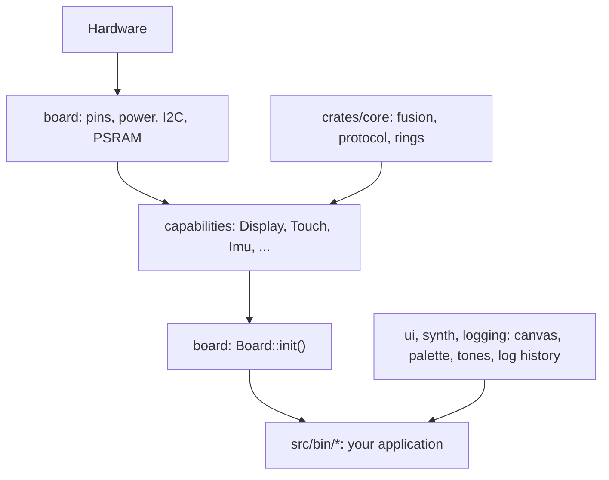
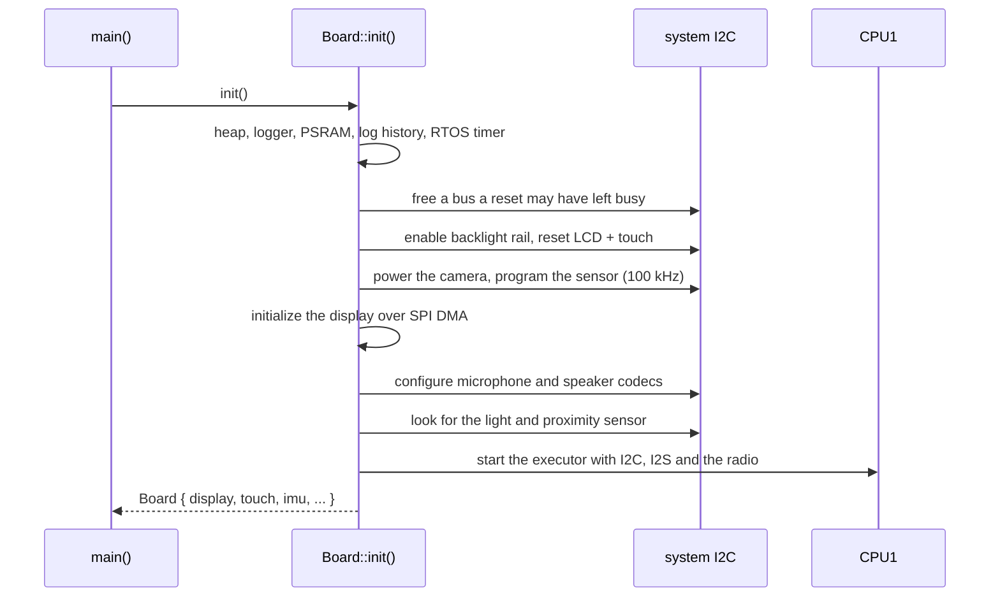
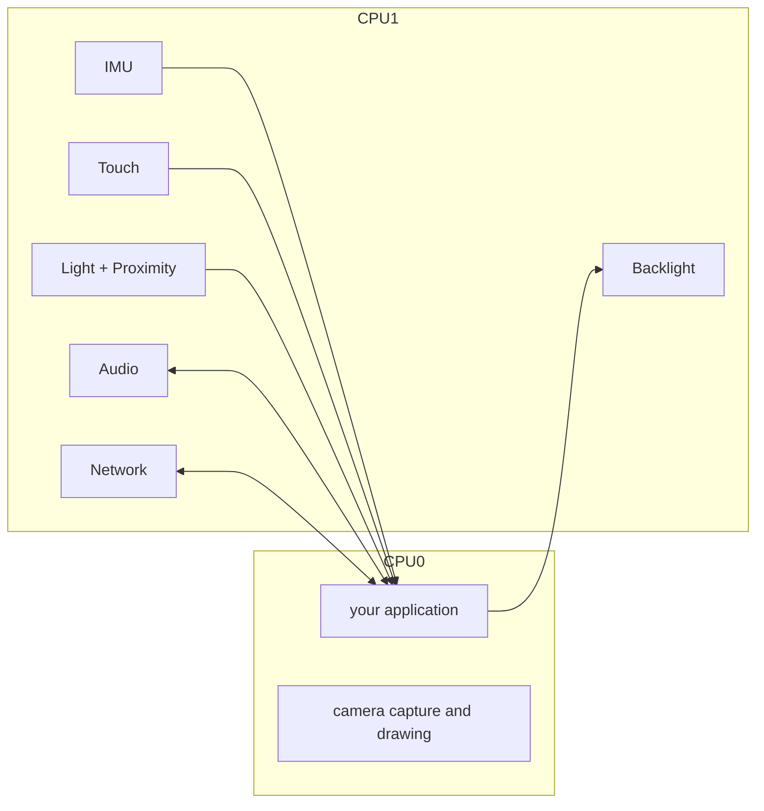
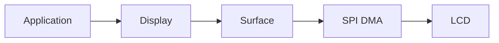
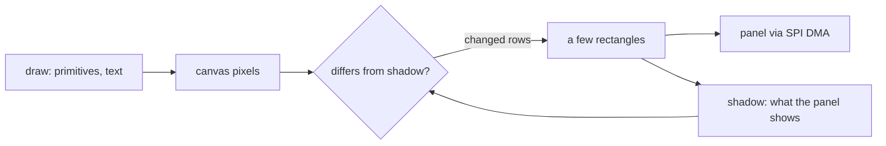
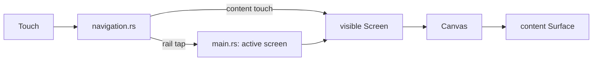
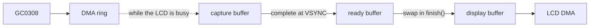

# Architecture

This document explains how the Hack & Hike firmware works inside. The
[README](../README.md) shows how to build the firmware and explains the Rust
you will see. This document goes one level deeper. The
[Glossary](#glossary) at the end explains the technical terms and
abbreviations.

- [The layers](#the-layers)
- [What `Board::init()` does](#what-boardinit-does)
- [CPU0 and CPU1](#cpu0-and-cpu1)
- [How a capability is built](#how-a-capability-is-built)
- [Drawing](#drawing)
- [The demo application](#the-demo-application)
- [Cooperative scheduling](#cooperative-scheduling)
- [Memory and PSRAM](#memory-and-psram)
- [The camera path](#the-camera-path)
- [The network protocol](#the-network-protocol)
- [Tests and the core crate](#tests-and-the-core-crate)
- [Common mistakes](#common-mistakes)
- [Glossary](#glossary)
- [Design rules](#design-rules)

## The layers



| Layer | Path | Owns |
| --- | --- | --- |
| Application | `src/bin/` | What the board does: screens, rules, message types |
| Board | `src/board/` | Facts about the PCB (printed circuit board): pins, power rails, reset lines, the I2C bus, register access, PSRAM. Also the power-up order and the start of the second CPU core |
| Capabilities | `src/capabilities/` | One hardware function each, behind a small handle |
| Core | `crates/core/` | Math, protocol and buffer code that needs no hardware. Its tests run on your computer (the host) |
| Logging | `src/logging.rs` | The `log` backend, the log history on the device, a memory usage report |
| UI and synth | `src/ui/`, `src/synth.rs` | UI (user interface): canvas, palette, text helpers, a slider, the glue code for `embedded-gui`. Synth: sine waves for the speaker |

The diagram and the table use two abbreviations:

- **I2C** (Inter-Integrated Circuit): a slow two-wire bus. Most chips on this
  board share one I2C bus.
- **PSRAM** (pseudo-static RAM): an external 8 MiB memory chip for large
  buffers.

In the diagram, an arrow goes from a part to the part that uses it. So
dependencies point downwards. `board` appears twice:

- Capabilities use its PCB facts.
- `Board::init()` then starts those capabilities.

Both halves live in one folder because both describe the same board.

The diagram leaves out some arrows:

- `logging` keeps its history in `board::psram`, and `Board::init()` installs
  the logger and enables that history. So these two parts use each other.
- The canvas and the `embedded-gui` context also keep their buffers in
  `board::psram`.
- `ui` draws on the display and reads touch events. `synth` uses the
  speaker's sample rate.
- `board` and `logging` also use small parts of `crates/core`.

Two rules follow from the layers. An application never imports `esp_hal`
(the HAL, hardware abstraction layer, of the ESP32-S3). A capability never
knows what a screen is.

## What `Board::init()` does



More terms from the diagram:

- **RTOS timer**: the timer that `esp-rtos` needs. `esp-rtos` (RTOS:
  real-time operating system) runs the async executors and timers.
- **LCD** (liquid crystal display): the 320x240 screen.
- **SPI** (Serial Peripheral Interface): the fast bus to the LCD.
- **DMA** (direct memory access): the hardware copies a buffer to or from a
  peripheral without the CPU. The CPU can do other work during the transfer.
- **I2S** (Inter-IC Sound): the bus that carries audio samples to and from
  the audio codec chips.

The order of the steps matters:

1. Heaps and the logger come first, so all later steps can allocate memory
   and write log messages.
2. PSRAM and the log history, then the RTOS timer.
3. I2C bus recovery. A reset in the middle of an I2C read can leave a chip
   holding the bus. The firmware clocks the bus by hand to free it.
4. The power chip (AXP2101) turns on the backlight power rail. The IO
   expander (AW9523) resets the LCD and the touch controller. Before this
   step, the display, the touch controller and the camera have no power or
   are held in reset.
5. The camera. The power chip turns on the camera's power, and the IO
   expander resets the camera sensor (GC0308). The sensor shares the I2C
   pins, but it is programmed at 100 kHz instead of the normal 400 kHz. So
   this step creates its own short-lived I2C driver for it.
6. The display, over SPI with DMA.
7. The audio codecs, and a check for the light and proximity sensor. Then
   the system I2C bus moves to CPU1.
8. CPU1 starts the IMU, touch, light, audio, radio and backlight tasks.

All of this stays inside `src/board/` and `camera::bring_up`.

Start-up of the hardware (bring-up) stops at once for the chips the board
cannot work without:

- The power chip, the IO expander and the audio codecs must answer on I2C.
  If one does not, `init` panics with a message that names the chip.
- The power chip gets five attempts, 10 ms apart, because it may still be
  starting.

Other chips are optional or are contacted later:

- The camera and the light and proximity sensor are optional. When they do
  not answer, their fields in `Board` are `None`.
- The IMU and the touch controller are first contacted from CPU1. There, a
  failure does not stop the board. The IMU logs the failure and sets itself
  up again: 1 s after a failed setup, or after 10 failed reads in a row.
  Touch does not log it: it skips the failed read and polls again 5 ms
  later.

## CPU0 and CPU1

The ESP32-S3 has two CPU cores, CPU0 and CPU1.

**CPU0** runs your application: your loop, drawing, and any tasks you spawn.

**CPU1** runs the timing-sensitive work behind the capabilities:

- IMU readings and sensor fusion at 100 Hz (IMU: inertial measurement unit,
  here the accelerometer, gyroscope and magnetometer),
- touch polling every 5 ms,
- ambient light and proximity readings at 10 Hz (one chip, one task, two
  handles),
- microphone capture and speaker playback (I2S with DMA),
- ESP-NOW beacons, sending and receiving (ESP-NOW: Espressif's protocol for
  short Wi-Fi messages between boards, without a router),
- backlight changes over I2C.

All CPU1 tasks run on one async executor and share one 16 KiB stack.



The camera is the one sensor that runs on CPU0. The firmware copies camera
data out of its DMA ring while the display's DMA transfer is busy, and that
only works from the drawing loop. The sensor sends data all the time into a
ring buffer that holds only a few milliseconds of data. So the demo also
calls `camera.pump()` on every loop iteration. It also does not pause the
loop while the camera is visible (`Screen::may_idle`).

You never talk to CPU1 directly. Every method of a CPU1 handle returns
immediately. It reads from or writes to a queue or a "latest value" slot
that both cores share.

Some calls on CPU0 do wait:

- Drawing waits until the SPI DMA transfer is finished.
- `frame.finish()` waits for the sensor's next frame, unless a frame
  completed while you were drawing.
- The first `begin_frame()` after boot or after `pause()` waits for a whole
  frame.

Each of these blocks your loop for milliseconds. For this reason, the loop
draws only when something changed.

## How a capability is built

A CPU1 capability has two files. The IMU, audio and light capabilities also
have chip drivers next to them.

- `mod.rs` contains:
  - the public types,
  - the **handle** (`Touch`, `Imu`, ...) that the application owns and
    calls,
  - a `static SERVICE` that holds the queues or signals that both cores
    share,
  - a `pub(crate) Runtime`: the CPU1 side of the same queues,
  - `endpoints()`, which gives the handle and the runtime to
    `Board::init()`. Audio gives two handles: the microphone and the
    speaker.
- `runtime.rs` contains `spawn(spawner, hardware, runtime)`, configuration
  where the chip needs it, and the task that talks to the chip.

One task can feed several handles. The light sensor's task also publishes
for the proximity capability. So proximity has only a `mod.rs`.

Data crosses between the cores in one of two ways:

| Pattern | Used by | What the application sees |
| --- | --- | --- |
| Latest value (`Signal`) | IMU, light and proximity samples; in the other direction, backlight requests | `latest()` returns `Some` only once for each new value. A new value replaces a value that was not read. `set` replaces a request that is not applied yet. `network.snapshot()` works in a similar way, but it returns the newest snapshot on every call. |
| Bounded queue (`Channel`) | touch events, network messages, microphone blocks | `next_*()` returns the items in order. The list below says what happens when a queue is full. |

When a queue is full:

- **Microphone** (8 blocks, about 256 ms): the oldest block is dropped.
  `dropped_blocks` counts it.
- **Touch** (32 events): when fewer than 4 places are free, new `Moved`
  events are dropped. A `Pressed` event is dropped unless its `Released`
  event still fits behind it. So an application that reads slowly sees jumps
  in a drag, but never a press without its release.
- **Incoming network messages** (4 messages): new messages are dropped and
  counted.
- **Outgoing network messages** (4 messages): `broadcast` and `send_to`
  return `SendError::QueueFull`.

Two more details of the CPU1 tasks:

- **Light and proximity.** The task publishes a proximity sample every
  100 ms. After a gain change, the sensor marks its light data as invalid
  for a short time. The task then skips only the light sample. The proximity
  sample is still published.
- **Microphone.** The task builds blocks of 512 stereo frames (32 ms at
  16 kHz) from the bytes in the DMA ring. A stereo frame is one left and one
  right sample. A read from the DMA ring can end in
  the middle of a frame. The task keeps those bytes and completes the frame
  with the next read, so the left and right channels never swap.

The speaker works in the other direction. The application writes into a
`FrameRing` (a ring buffer of 1,024 stereo frames, about 64 ms). CPU1 copies
the frames into the DMA buffer and plays silence when the ring is empty.
Only the application writes into the ring. So a write of at most
`available_frames()` frames is always accepted in full.

The display and the camera are CPU0 capabilities. Their handles drive the
hardware directly, with DMA, from the application's own loop.

## Drawing

The display capability owns the LCD. An application borrows a `Surface` for
one `Rectangle` and draws inside it. Nothing can be drawn outside that
rectangle. `display.surface(...)` panics when the rectangle does not fit on
the panel. An empty rectangle (width or height 0) is allowed, even on the
right or bottom edge of the panel. It draws nothing.



There are two ways to draw:

- `surface.render_scanlines(|y, row| ...)` gives you one row of `Rgb565`
  pixels at a time to fill. It is cheap and simple for plain fills. The
  demo's navigation rail uses it.
- `surface.render_from(&mut source)` sends rows from a `ScanlineSource`.
  These rows are already RGB565 bytes, for example a camera frame. While the
  DMA sends one batch, the source's `while_transferring` callback runs and
  can do useful work. The camera uses it to capture its next frame.

RGB565 is the pixel format of the display and the camera: 16 bits per
pixel, with 5 bits for red, 6 for green and 5 for blue.

Both ways use the same pipeline:

1. The display sets a drawing window on the panel controller (ILI9342C).
2. Rows go to the panel in batches of seven rows.
3. Two DMA buffers take turns. The CPU fills the next batch while the
   previous batch is still being sent.

The SPI clock runs at 40 MHz, so a full frame (153,600 bytes) takes about
31 ms. The ESP32-S3 can clock SPI at 80 MHz, but that does not work on this
board. The panel stays dark when the setup commands use 80 MHz. The picture
shows noise when only the pixel data uses 80 MHz. So fast drawing means
sending few pixels.

### The `Canvas`

A `Canvas` is the usual way to draw text and shapes. It holds two images in
PSRAM:

- the pixels the application drew,
- a *shadow*: a copy of what the panel shows.



`canvas.show(&mut surface)` works like this:

1. It compares the area drawn since the last `show` with the shadow.
2. It groups the changed rows into a few rectangles. Changed rows with up to
   four unchanged rows between them go into the same rectangle, because a
   new drawing window costs more than a few unchanged rows.
3. It sends only those rectangles.

So an application can clear and redraw its whole picture whenever something
changes. Identical pixels are never sent. A changed number costs about a
millisecond instead of a full frame. `canvas.clear(color)` with the same
colour as last time repaints only what was drawn since then.

The shadow is only correct while nothing else draws on the same part of the
panel. Other code may draw there: `render_scanlines`, a camera frame or
another canvas. After that, call `canvas.invalidate()`, so the next `show`
sends everything. The demo calls it every time the visible screen changes.

### The `ui` module

`src/ui/` is optional. An application can also draw on a `Surface` without
it.

- `Canvas`: an `embedded_graphics::DrawTarget` in PSRAM that sends only
  changed pixels (see above).
- `theme`: the six palette colours as `Rgb565`, and `rgb()` to convert a web
  colour such as `0xFF8000`.
- `common`: text helpers and the bitmap fonts at their native size.
- `font`: the same fonts adapted for `embedded-gui`. They are anchored at
  the top-left corner of their rectangle.
- `widgets::Slider`: a slider that works well with a finger.
- `gui`: the `embedded-gui` context type, KDL slots as `Rectangle`s, and the
  code that passes `TouchEvent`s to buttons.
- `styles`: `embedded-gui` styles in the palette colours. KDL files refer to
  them.

## The demo application

`src/bin/demo/` is the full firmware, with seven screens. Its shell
(`main.rs`) does these steps in each loop iteration:

1. Route the touch events.
2. Update every screen.
3. Draw the visible screen.
4. Pause for 2 ms, unless the visible screen does not allow it.



Every screen implements one trait:

```rust
pub(crate) trait Screen {
    fn enter(&mut self) {}
    fn leave(&mut self) {}
    fn update(&mut self, _now: Instant) {}
    fn may_idle(&self) -> bool { true }
    fn handle_touch(&mut self, _event: TouchEvent) {}
    fn present(&mut self, canvas: &mut Canvas, surface: &mut Surface<'_>);
}
```

The methods run like this:

- `handle_touch` runs for the visible screen, once for each touch event.
  Touches arrive in content coordinates: the width of the navigation rail
  (44 pixels) is already subtracted.
- `update` runs for every screen on every iteration, visible or not. This is
  how the Speaker screen keeps playing while you look at the Log. It is also
  how the Network screen reads its messages while it is hidden.
- `present` runs only for the visible screen. It should return immediately
  when nothing changed.
- `may_idle` of the visible screen decides about the 2 ms pause after
  `present`. The camera screen returns `false` when a camera is present,
  because the sensor's DMA ring overflows within a few milliseconds.
- `enter` and `leave` run when a screen becomes visible and when another
  screen takes over.

To add a screen:

1. Write a type that implements `Screen`.
2. In `main.rs`, add a field for it to `Screens`, create it in `main`, and
   add it to `Screens::get_mut`.
3. In `navigation.rs`, add a variant to `ViewId`, add it to `ViewId::ALL`,
   and give it a 16x16 icon in `ViewId::icon`.

Copy `screens/settings/` first. It has a KDL layout, a slider and one
handle.

### Layout files (KDL)

A screen describes its static layout in a `.kdl` file next to its code. KDL
is a small document language. The `embedded_gui::include_gui!` macro turns
the file into Rust code at compile time.

```kdl
screen id="Settings" width=276 height=240 {
    grid cols="48px 1fr 48px" rows="20px 20px 52px 18px 20px 1fr" gap=8 padding=12 {
        label id="title" text="SETTINGS" col=0 row=0 col_span=3 style="crate::styles::title()"
        label id="brightness_value" text="" col=0 row=1 col_span=3
        label id="brightness_slider" text="" col=0 row=2 col_span=3
        label id="minimum" text="DIM" col=0 row=3 style="crate::styles::hint()"
        label id="maximum" text="MAX" col=2 row=3 style="crate::styles::hint()"
        label id="hint" text="Tap or drag to adjust" col=0 row=4 col_span=3 style="crate::styles::hint()"
    }
}
```

A button is one more node, for example
`button id="play" text="PLAY" col=0 row=2 style="crate::styles::button()"`
in the Speaker screen. Every screen with a KDL file checks at compile time
that the size in the file matches the content area (276x240 pixels).

These rules follow from how `embedded-gui` 0.2.6 works:

- **Labels and buttons come from KDL.** `label` nodes carry their text.
  `button` nodes react to touches. Pass touches to them with
  `gui::click_buttons(gui, event, ...)`. It calls your closure with the id of
  each clicked button.
- **Text must be a string literal or another `&'static str`.** Change it
  with `gui::set_text(...)`. Put numbers that change into a value label
  (`gui::add_value_label(...)` and `gui::set_value(...)`).
- **You draw anything dynamic or free-form yourself.** Draw it into an empty
  `label text=""` slot: the waveform, the peer list, the horizon, the
  slider. `gui::slot(gui, id)` returns the slot's `Rectangle`.
- **Sliders are ours.** You cannot drag the crate's slider with a finger,
  and it is too small for a touch screen. So `ui::widgets::Slider` draws into
  a slot and handles touches itself.
- **Styles are referenced as `style="crate::styles::title()"`.** The code
  generator copies only `crate::` paths unchanged. So the demo re-exports
  `hack_and_hike::ui::styles` as `crate::styles`.
- **Fonts come from `ui::font`, not directly from `embedded-graphics`.**
  `embedded-gui` draws an `embedded-graphics` font on its baseline (the line
  the letters sit on). This puts the letters one ascent (the letter height
  above the baseline) above their rectangle. `ui::font::TopAnchored` draws
  from the top-left corner instead. So widget text lines up with text drawn
  by `ui::common`.

Each screen's GUI context is about 20 KiB. So `gui::context` allocates it
once in PSRAM.

## Cooperative scheduling

CPU0 runs an async executor: the part of the async runtime that runs tasks.
A task gives control to other tasks only at an `.await` point. So a loop that
never awaits blocks every other task on CPU0.

Good:

```rust
loop {
    update_some_state();
    Timer::after(Duration::from_millis(10)).await;
}
```

Bad:

```rust
loop {
    expensive_work();
}
```

Start with one loop, like Color Ping. In each iteration, touch, network,
audio and drawing each do a small step, and then the loop awaits a 5 ms
timer. Spawn a separate task only for work with its own, independent timing.
Give the display one owner: other code changes state, and the drawing code
reads that state.

## Memory and PSRAM

Internal RAM is small:

- The firmware has two internal heaps of about 72 KiB each.
- All CPU1 tasks share one stack of 16 KiB.

The board also has an 8 MiB PSRAM chip. It is slower than internal RAM. The
firmware uses it for large buffers that live as long as the device runs:

- every `Canvas` and the GUI context of each screen,
- the three camera frame buffers,
- the log history: the newest 64 log lines,
- the lines that the demo's Log screen shows.

About the log: the serial port shows up to 512 bytes of each log record, and
the history keeps up to 120 bytes of it. A longer record is cut, not
dropped. A cut line in the history ends in `...`.

PSRAM has its own heap. Ordinary allocations stay in fast internal RAM. A
buffer goes into PSRAM only through one of the two helpers in
`hack_and_hike::psram`:

- `leaked_slice` for a buffer,
- `leaked_value` for one large object.

Both allocate once and never free the memory, so it lives as long as the
device runs. Memory that the hardware uses directly (DMA buffers, task
stacks) stays in internal RAM.

Do not put a large array on the stack:

```rust
let frame = [0u8; 320 * 240 * 2]; // 150 KiB; the main stack has about 45 KiB, CPU1 tasks 16 KiB
```

Small fixed arrays are fine. For example, Color Ping fills a 128-frame audio
chunk (512 bytes) on the stack.

## The camera path

The GC0308 sensor sends QVGA frames (320x240 pixels) in RGB565 over an 8-bit
parallel bus. The `LCD_CAM` peripheral of the ESP32-S3 and DMA copy the
bytes into a small DMA ring in internal RAM. The ring holds 40 rows, which
is a few milliseconds of sensor data.

Three PSRAM buffers separate the sensor's timing from the LCD's timing:

- While one frame is shown, the next frame is copied out of the ring. This
  happens while the LCD DMA transfer is busy.
- Drawing a frame takes longer than the sensor needs to send one. So a frame
  often completes while the previous frame is still being sent to the LCD.
- The completed frame waits in the ready buffer, and capture continues into
  the capture buffer. Capture must continue, because the ring holds only a
  few milliseconds of data and the sensor never pauses.



The functions work like this:

- `camera.begin_frame()` gives you the newest complete frame.
- Drawing it with `surface.render_from(&mut frame)` empties the ring while
  the LCD is busy.
- `frame.finish()` swaps in the frame that completed in the meantime. If no
  frame completed, it waits for the sensor's next VSYNC (vertical sync: the
  sensor's signal that marks the end of a frame).
- Between `finish` and the next `begin_frame`, nothing empties the ring. So
  call `camera.pump()` wherever the loop does other work, and do not sleep
  between frames.

Errors do not stop the camera:

- When the ring overflows, the DMA transfer stops and the frame is dropped.
- The first `begin_frame` after boot or `pause` returns `None` when no frame
  arrives within 250 ms.
- `finish` also stops waiting after 250 ms. The next `begin_frame` then
  starts the capture again.
- A dropped frame is logged as a warning: the first one, then every 32nd.

A camera application should use this path and not copy frames.

## The network protocol

All boards use ESP-NOW on one Wi-Fi channel (channel 6):

- Every board sends a beacon (a short "I am here" radio frame) to all boards
  four times a second.
- Boards that hear each other become peers.
- A peer that is silent for more than half a second is forgotten.
- A board tracks up to 10 peers. When the table is full, a new peer replaces
  the peer that was silent for the longest time.

An application message is the `postcard` encoding of the application's
type. (`postcard` is a compact binary format for `serde` types.) The message
travels in one radio frame, after a 26-byte header. The header contains:

- a marker (`HNHN`) and the protocol version,
- the frame type (beacon or application message) and flags,
- the sender and the optional recipient,
- the **message kind**: a 32-bit hash (FNV-1a) of the name that the
  application gives the type with
  `impl Message for T { const NAME: &'static str = "..."; }`,
- the payload length.

The encoded message can be at most 224 bytes (`MAX_PAYLOAD`). A board
decodes a message only into a type with the same kind. It also rejects a
payload with unused bytes at the end. So messages of two teams with
different names are not confused, even when their bytes happen to match.
Delivery is not guaranteed: send again, or send the current state instead of
changes.

The format and the peer table live in `crates/core/src/network/`, and their
tests are there too. The radio code is in
`src/capabilities/network/runtime.rs`.

## Tests and the core crate

Code that needs no hardware lives in `crates/core`:

| Module | Contents |
| --- | --- |
| `imu` | vector helpers, axis conversion between sensor and screen, gyroscope offset learning, sensor fusion, magnetometer compensation and calibration |
| `network` | wire protocol, typed messages, peer table |
| `audio` | the speaker's `FrameRing`, the IMA ADPCM decoder |
| `light` | decoding of the light and proximity sensor's data, the lux formula, the proximity scale |
| `lines` | the log history: a fixed-size ring of text lines |
| `touch` | decoding of the touch controller's report |

It is a `no_std` library: it does not use Rust's standard library, so it
also works on the ESP32-S3. The firmware depends on it. It has ordinary unit
tests, and more tests in `crates/core/tests/`. Run them with:

```bash
./scripts/test.sh
```

The repository builds for the ESP32-S3 by default. So the script passes your
computer's target to `cargo test`.

CI (continuous integration, in `.github/workflows/firmware-build.yml`) runs
on every push to `main`, on every pull request, and when started by hand. It
does these checks:

- clippy and the tests of the core crate on the host,
- a format check (`cargo fmt --check`),
- clippy on the firmware and every application,
- a release build of every application.

## Common mistakes

**Application rules inside a capability.** A `ColorPing` message type or a
"tap means select" rule describes an application, not hardware. It belongs
in `src/bin/`.

**Using the HAL from an application.** If your application imports
`esp_hal`, a capability probably lacks an operation. Add the operation to
the capability.

**A framework before you need it.** The demo's `Screen` trait has six
methods. It exists because seven screens share them. Two screens do not need
a trait.

**A loop without `.await`.** It blocks every other task on CPU0.

**Sharing a hardware handle everywhere.** Give it one owner and share state
instead.

**Large arrays on the stack.** Use PSRAM through `psram::leaked_slice`.

**A message name shared with another team.** The kind comes from the name.
So two applications with `NAME = "hello"` decode each other's bytes. Put your
team name in the message name, for example `"team-otters.hello"`.

## Glossary

- **ADPCM** (adaptive differential pulse-code modulation): a compressed
  audio format with 4 bits per sample. The demo stores its chime sound in
  the IMA ADPCM variant.
- **Application**: one binary in `src/bin/`. It decides what the board does.
- **Beacon**: a short radio frame that every board sends four times a
  second, so that other boards know it is in range.
- **Bring-up**: the start-up of the hardware in `Board::init()`.
- **Canvas**: an image in PSRAM. You draw on it, then show it on a surface.
- **Capability**: one hardware function behind a small handle.
- **CI** (continuous integration): the GitHub Actions workflow that checks
  and builds every push to `main` and every pull request.
- **DMA** (direct memory access): the hardware copies data between memory
  and a peripheral without the CPU. The CPU can do other work during the
  transfer.
- **ESP-NOW**: Espressif's protocol for short Wi-Fi messages between nearby
  boards, without a router and without a connection.
- **Executor**: the part of the async runtime that runs tasks. CPU0 and CPU1
  each have one.
- **Codec**: here a chip that converts between sound and digital samples.
  The ES7210 reads the two microphones, and the AW88298 drives the speaker.
- **Frame**: a word with three meanings in this document. A stereo (audio)
  frame is one left and one right sample. A camera or display frame is one
  image of 320x240 pixels. A radio frame is one ESP-NOW packet of at most
  250 bytes.
- **Gain**: how strongly a sensor amplifies its signal. The light sensor
  changes its gain by itself, so that it works in a dark room and in
  daylight.
- **HAL** (hardware abstraction layer): here `esp_hal`, the crate that
  drives the peripherals of the ESP32-S3.
- **Handle**: the value an application owns to use a capability.
- **I2C** (Inter-Integrated Circuit): a slow two-wire bus to control chips.
  One I2C bus connects the power chip, the IO expander, the audio codecs,
  the IMU, the touch controller, the light and proximity sensor and the
  camera sensor.
- **I2S** (Inter-IC Sound): a bus that carries audio samples between the
  ESP32-S3 and the audio codecs.
- **IMU** (inertial measurement unit): the motion sensors. Here a BMI270
  accelerometer and gyroscope with a BMM150 magnetometer.
- **IO expander**: a chip that adds extra pins, controlled over I2C. Here
  the AW9523 drives reset lines, for example of the LCD, the touch
  controller and the camera.
- **KDL**: a small document language. The demo describes its screen layouts
  in it.
- **LCD** (liquid crystal display): the 320x240 screen.
- **Message kind**: the hash of a message type's name. Every message carries
  it, so applications decode only their own messages.
- **PCB** (printed circuit board): the board that carries the chips and
  connects them.
- **Peer**: another board that this board has heard recently.
- **PSRAM** (pseudo-static RAM): an external 8 MiB RAM chip for large
  buffers. It is slower than internal RAM.
- **QVGA**: an image size of 320x240 pixels.
- **RGB565**: the 16-bit pixel format of the display and the camera: 5 bits
  red, 6 bits green, 5 bits blue.
- **Ring buffer** (or ring): a fixed-size buffer that continues at its start
  when it reaches its end.
- **RTOS** (real-time operating system): here `esp-rtos`. It runs the async
  executors on both cores and provides the timers.
- **Runtime**: the CPU1 side of a capability. Applications never see it.
- **Screen**: one view of the demo. It implements the `Screen` trait.
- **Sensor fusion**: math that combines the gyroscope, accelerometer and
  magnetometer readings into one orientation (roll, pitch and heading).
- **Signal** and **Channel**: `embassy-sync` types that pass data between
  the cores. A `Signal` holds only the newest value. A `Channel` is a
  bounded queue.
- **SPI** (Serial Peripheral Interface): a fast bus. Here it connects the
  ESP32-S3 to the LCD.
- **Surface**: a borrowed rectangle of the display.
- **VSYNC** (vertical sync): the camera sensor's signal that marks the
  boundary between two frames.

## Design rules

1. An application owns the handles it uses and drops the rest.
2. Capabilities hide hardware details and stay generic.
3. Screens, navigation and message types belong to the application.
4. One owner per hardware handle. Share state, not handles.
5. Give control back regularly (`.await`) in CPU0 loops.
6. Large buffers live in PSRAM, never on a stack.
7. Logic that can be tested on the host lives in `crates/core`.
8. Prefer plain structs, enums and functions. Add a trait only when several
   types really share it.

If you are not sure where code belongs, ask two questions:

> **What should this board do?** An application.
>
> **How does this hardware work?** A capability.
